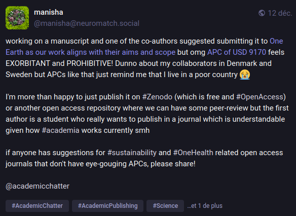

https://neuromatch.social/@manisha/113640465899676293
# APC et voie dorée

La [[Gold OA|voie dorée]] tend de plus en plus à être confondue avec le paiement d'APC. La publication sans frais de publication sur des [[plateformes de recherche]] gérées par des chercheurs est aujourd'hui plutôt qualifiée de [[voie diamant]]

Les APC (article processing charges) sont des frais de publication demandés par un nombre grandissant de revues en [[open access]]. 
Ces frais sont censés couvrir le coût de la publication, mais leur montant est en général bien au delà de ces coûts : 

>Measey estimated that the projected cost for publishing an academic journal article, including a 25% fee for publishing services, would total $270 USD. This amount is, on average, almost six times less than the APCs generally charged currently.

(source: [[@wangArticleProcessingCharges2024]])

Selon une autre estimation, ces coûts de publication seraient estimés au maximum à 1000 $ pour les journaux les plus influents qui ont un taux de sélection de 10%. En moyenne les coûts de publication représentent 400 $ par article. On estime que les frais annuels pour l'hébergement et le support technique d'une revue est de 1000 euros ([[@audreydufourCreerSaRevue2022]]). 

En 2022, les éditeurs Frontiers et [[MDPI]] ont à eux deux représenté un chiffre d'affaires d'un milliard de dollars pour la publication de 500 000 articles en Gold Open Access[[@maisonneuveMDPIFrontiersSiphonnent2023]].

Nature va jusqu'à faire payer la publication d'articles dans ses colonnes à hauteur de 9500 dollars ([[@audreydufourCreerSaRevue2022]] )
D'après une étude récente, ils augmentent 3 fois plus vite que l'[[inflation]]. L'augmentation du montant des APC est corrélée avec l'augmentation du nombre de publications. Pour ce qui concerne la France, une étude de 2022 montre que le coût des APC a été multiplié par 3 entre 2013 et 2020, principalement en raison de l'augmentation du volume d'articles publiés de cette manière. A volume constant, le coût aurait été multiplié par 1,69 ce qui donne tout de même une certaine idée de l'augmentation des prix[[@blanchardRetrospectiveProspectiveStudy2022]]. 

Les secteurs dans lesquels cette évolution est la plus sensible sont les sciences médicales et la biologie. Si pour la France, Elsevier reste l'acteur le plus important sur ce marché, les éditeurs ayant connu leur plus fort taux de valorisation sur ce secteur sont Springer, Wiley et MDPI ([[@blanchardRetrospectiveProspectiveStudy2022]]). 

Le marché des APC est inélastique dans la mesure où ni le choix des auteurs, ni la compétition entre les acteurs de l'édition scientifique ne parviennent à faire baisser ces coûts de publication. En cela, le marché de la publication scientifique ressemble à celui des produits de première nécessité, ou au contraire des produits de luxe : quelque soit leur prix, les acteurs continueront de payer, quitte à se priver de budgets importants pour d'autres fonctions (enseignement par exemple). 
Il est donc important que les décideurs mettent un frein à cette dépense pour limiter cette hyperinflation des APC ([[@khooArticleProcessingCharge2019]]). 

La [[stratégie de publication#voie dorée|voie dorée]] (publication en open access) est majoritairement pratiquée sans dépense d'APC, notamment dans le cas des éditeurs institutionnels (voir [[Diamond Open Access|Voie Diamant]]). Les gros éditeurs privés en revanche facturent des APC qui en moyenne **ont augmenté de 57% entre 2012 et 2022**([[@bassinetArticleProcessingCharges2022]]. )

En majorité, ce sont des [[éditeurs hybrides]] qui font verser des APC ce qui revient à faire payer l'institution de recherche (université, organisme de recherche) deux fois, une fois pour accéder aux textes qui ne sont pas en open access (abonnements), une fois pour publier un article. 
Sur le site Lorrain, le coût moyen des APC était en 2020 de 2041 euros [[@bassinetArticleProcessingCharges2022]]
au niveau national, l'étude de Blanchard, Thiery et Van der Graaf indique un coût moyen de l'APC en 2020 de 2488 euros [[@blanchardRetrospectiveProspectiveStudy2022]]
La même étude montre qu'en 2030, si tous les articles publiés par des auteurs français l'étaient moyennant paiement des frais d'APC (10% Diamond, 90% Gold), la somme totale pour une année s'élèverait à 168 millions d'euros. 

Le paiement d'APC constitue un frein au partage des résultats scientifiques en OpenAccess. Spécifiquement, les chercheurs ne sont pas encore habitués à demander une somme pour couvrir les frais de publication dans leurs réponses aux appels à projet selon une étude menée par Enago ([[@orurkeOpenScienceClosed2023]])

# les critiques à l'égart du modèle auteur-payeur

L'université de Lorraine a fait savoir le 27 mars 2022 qu'elle déconseillait le versement d'APC et qu'elle proscrivait le versement d'APC dans des revues hybrides[[@bassinetArticleProcessingCharges2022]].

Le CNRS à travers son directeur Alain Schuhl fait les mêmes préconisations. Les publications dans des [[éditeurs hybrides|journaux hybrides]] sont fortement déconseillées aux chercheurs du CNRS. Dans un communiqué plus récent (mai 2023) de la revue Informatics Europe, en partie inspiré par Roberto di Cosmo ([[Software Heritage]]), les APC sont présentés comme une impasse.
Les institutions qui remettent en cause les APC font généralement valoir les arguments suivants: 

- ce modèle ne fait tomber les barrières à l'accès aux résultats de la science que pour en ériger de nouvelles à la publication de ces résultats. "it flips the paywall to a play-wall", comme l'exprime Toby Green en 2019 ([[@greenOpenAccessAffordable2019]])  Tout le monde n'a pas accès aux mêmes ressources pour publier, et cela pose un problème d'égalité. Le manque de financement chronique dans certaines institutions scientifiques va avoir comme conséquence que leurs auteurs vont chercher des co-auteurs émanant d'institutions ayant des accords "publish & read" avec ces éditeurs et cela sans aucune cohérence avec le [[projet de recherche]] [^1]. 
- cela nuit à la [[crédibilité de la science]] dans la mesure où cela donne l'impression qu'il suffit désormais de payer pour être publié. De plus en plus d'études attestent qu'en effet le taux d'acceptation des articles chez les éditeurs augmente à mesure que le système auteur-payeur se répand. Des éditeurs comme [[MDPI]] publient de plus en plus dans un nombre exponentiel de "numéros spéciaux" créés chaque année des publications qui ne présentent que peu ou pas d'intérêt scientifique mais pour lesquels des APC ont été versés. Cela permet à ces éditeurs de s'enrichir sans trop nuire à la réputation de leurs numéros conventionnels et aux chercheurs d'augmenter leur nombre de publications dans le paradigme [[productivisme|productiviste]] [[publish or perish]] (source : [[@ansedePublicFundsBeing2023]])
- Cela nuit à la qualité du [[Révision par les pairs|peer reviewing]], dans la mesure où le modèle auteur-payeur incite les éditeurs à publier de plus en plus d'articles dans un même intervalle de temps [^1]. ([[@dicosmoOpenAccessStatus2023]])
- cela nourrit le marché douteux des [[Editeurs prédateurs en open access|predatory_open_access_journals]]
- cela provoque une inflation des coûts qui sont de plus en plus sans rapport avec le service effectivement rendu par l'éditeur ([[@cnrsinfoCNRSEncourageSes2022]]) : 

> les montants d’APC décorrélés du coût du service rendu par l’éditeur ne cessent d’augmenter, année après année, chez la plupart des éditeurs, en particulier ceux qui sont réputés « prestigieux » et ceux qui ont pour objectif principal de faire des profits. En conclusion, il n’y a pas de raison de payer des APC, que l’on pourrait aussi nommer « article prestige charges », pour être publié.

Coût exorbitant des APC, voir article de Martin Clavey du 18 janvier 2023 sur le sujet [[@claveyExorbitantCoutAcces2023]]

[^1]: ...seek co-authors in less economically-challenged institutions on strictly utilitarian, non-scientific grounds (i.e., due to the availability of research funds or to their affiliation with institutions that have the ability to sign transformative agreements
[^1]: The creation of a strong economic incentive for publishers to publish more articles and compress the time of the review process to increase throughput, limiting or foregoing the quality of research  certification, effectively approaching the predatory journal model

# bibliographie

