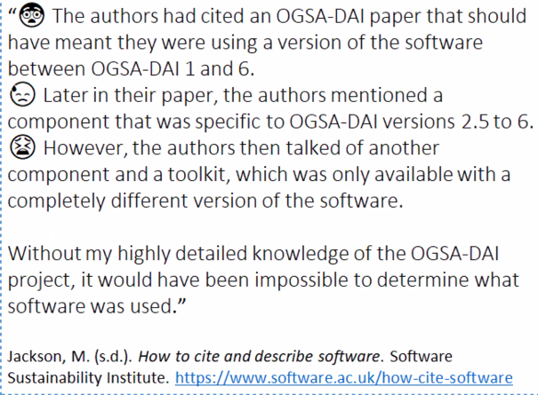
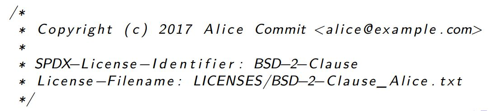
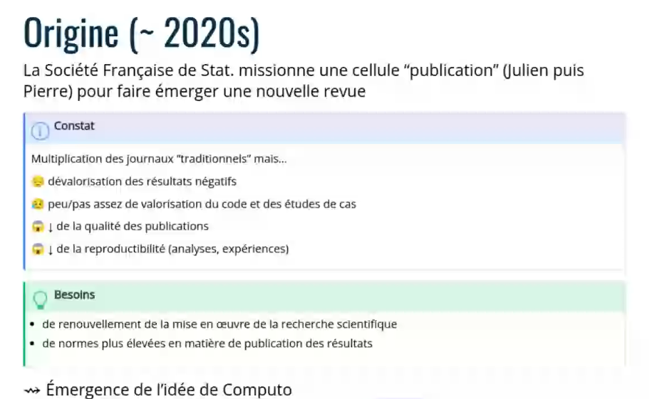
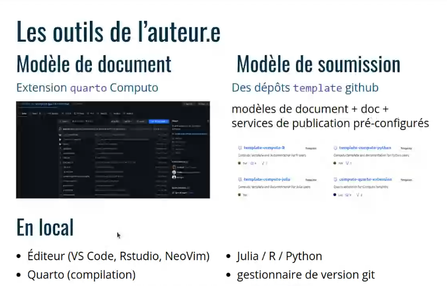
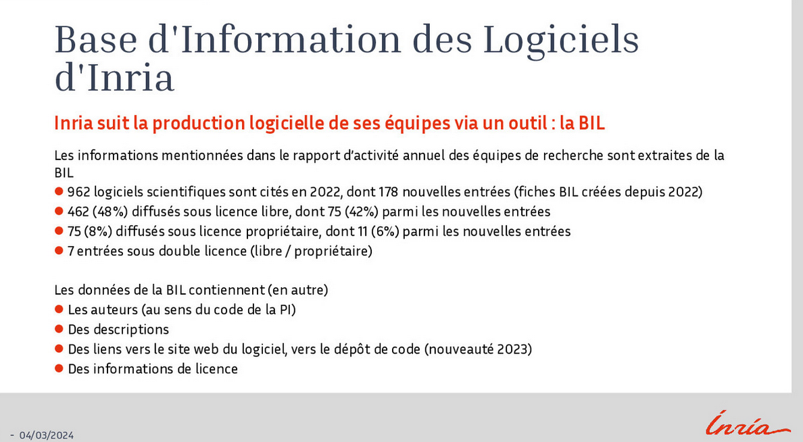
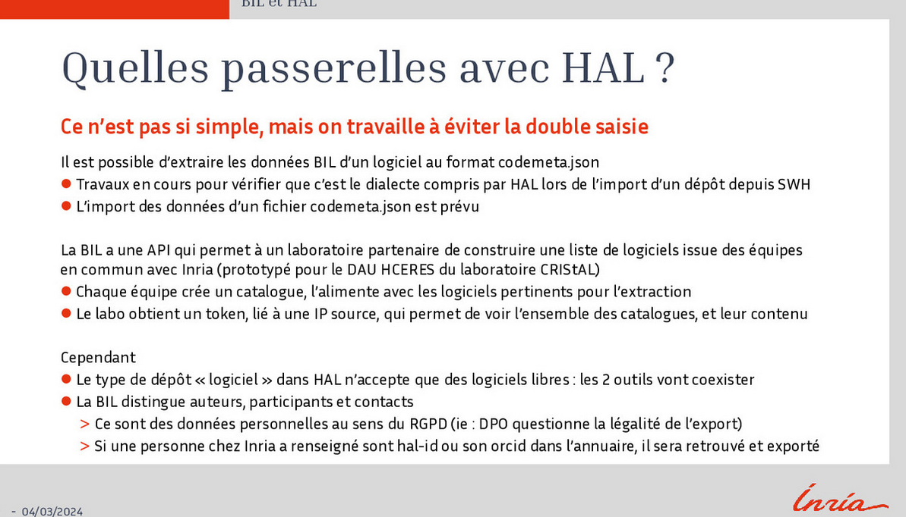

<!-- sent to Camille Maumet and Claire Jolivet on the 22th of December 2023 -->

voir [[production et valorisation des logiciels issus de la recherche publique française]]

voir [[formation_preservation_code_source]]

# 1 Introduction: why it is so important to store and share the research software you have built for your own research

## 1.1 Source code: a definition

- **algorithm** : a mathematical formula which aims at solving a problem  
- **source code** : this formula converted into a human readable language (such as Python, Julia, C++, etc.)  
- **executable** : this source-code converted into a machine readable file (binaries)  
- **software** : an aggregation of the source code, executable, and documentation    
- **build** : a release of the source code converted into an executable with a unique identifier  

## 1.2 who builds source code for their research

3 different possible contexts

- **individual** : a researcher (mostly a PhD student) for his own research  
- **Laboratory scale** : a research team for a research project  
- **community scale** : a research community who needs to develop a software to make it work with new kinds of datasets, who needs to add more features to this software

In this presentation, we will not present the case of a software developed at a community scale, but we will target software made by individual or modest research teams.

### 1.2.1 individual level

- low level of complexity
- very precise use cases
- linked to a single publication (e.g PhD dissertation)
- no copyright from previous work inherited
- should be as reproducible as possible
- for a small community of users (users in the same area, or other researchers of the same team)

**caveats**

- source-code could be easily lost
- documentation is missing (due to lack of time)
- code is dependent to libraries that may be deprecated as time passes (code is not frequently updated after the publication)
- not so easy to add value to this code, to make it known and reusable

### 1.2.2 laboratory scale 

- code produced for a shared research project   
- funders have something to say on the licence with which the code will be made available  
- it becomes necessary to design a process to update the code on the long run   
- complexity level is somewhat higher than for code made by an individual for their own's need   
  
**caveats**

- important to set rules for many contributors  (merges, reviews)  
- At this scale, the use of a Forge becomes highly recommendable  

## 1.3 a matter of reproducibility

Without access to your code, replicating your results will be impossible. Reproducibility is at stake, and beyond, public trust in Science.

## 1.4 Your code as a Common for further inquiries

If you are a researcher, you may not be a developer and with a limited knowledge, your code will not be perfect. Obviously, it could be improved (repetitions of the same functions for example), though as it is, you should consider to share it, not only for reproducibility's sake but also because it could be usefull for anybody who works with the same method on another dataset. 

## 1.5 You may be credited for your code if it is reused

and good things might follow from these citations : citations, job opportunities

A study published in 2016 demonstrates that, in the field of ecology, publications for which source code is made available have a low impact at the beginning but this impact grows faster than the average after years. Though source code sharing is still a not well represented practice (only 6% in the corpus used by this study [[@mislanElevatingStatusCode2016]])

For examples of researchers reluctancy to share their code and data, see Stodden and Zeiler [[@stoddenEmpiricalAnalysisJournal2017]]

# 2 Thinking FAIR from the beginning

Designing your code to be FAIR (Findable, Accessible, Interoperable, Reusable) before you and your partners develop it would be the best option, but most of the time we have to think about it when the code already exists. It's still time to give as many detailled answers as you can to these questions that will help you to give value to your code (value in terms of visibility and academic credit)

FAIR was designed to suit to data, but these days people tend to adopt these principles for open courses as well, or for software. We will try below to adapt its terminology to the code, even if it is not always as suitable as for datasets.

At this time, software management plans (SMP) are not mandatory as data management plans, but still some SMP exists and can be used as templates (see below)

FAIRisation of source code is based on its replication, a *sine qua non* condition to the study reproducibility. Reusing code could be sometimes a bit different than replicating it or just reruning it. So the *R* of *FAIR* could stand in some cases for **Reuse**, and in other instances, for **Replicate** 
In any case, the path to replicate or reuse academic source code is paved by what Ziemann, Poullain et Bora called the *Five pillars of computational reproducibility* (@ziemannFivePillarsComputational2023) : 

- First pillar: **literate programming** : you would better comment your code to make it more understandable
- second pillar: **control version** : you should use a tool to keep control of the different versions of your work (Git for example)
- third pillar: **compute environment control** : use appropriate tools to make it possible for everybody to run your code on a large variety of environments and operating systems. 
- fourth pillar: **FAIR data**. It would be nonsense to reproduce software without the data which it was designed to process. So the data must be FAIR too.
- fifth pillar: **Documentation** How your software can process your data ; explain how somebody must proceed in order to make your code work with your or their own data. 

## 2.1 Findability

Where will you store your software. By storing we do not think of the place where it was first built (i.e on a forge such as [[Gitlab]] or [[Github]]), but where it will be available for all in the ten next years, if not longer. This kind of storage cannot be performed by a Forge but only by an Archive. 
Some people who forgot this in the past spent hard times trying to restore their code when Google Code, BitBucket were closed respectively by Google and Mercurial. (Think also of Gforge discontinued by INRIA).
This Archive will attribute your code with a unique identifier (SWHID for [[SoftWare Heritage]]) which will make it fully citable and findable.

You must be aware of the fact that research code as any code is very fragile and by nature lacks of stability (because it is frequently modified to fix issues met by users)...as long as it is still "alive" of course. As a consequence any unique identifier, obtained through an archive, will only refer to a screenshot of a software (a single version, or a single commit) while the software in the Forge may have evolved a lot since the deposit. 

The Software Heritage Foundation is an archive dedicated to source code which harvest public code through different forges. 
Thanks to a convention with HAL contracted in 2018, you do not have to push your code directly to this Archive, but you just have to upload it on HAL along with your publication. If you prefer to use "the old way" you may also keep on pushing a gitlab or github repository to SH thanks to a browser extension ( @dicosmoHOWTOArchiveReference2022 )
Deposits on SWH are moderated to make sure that all required metadata are provided.
Code citation (as we said, you should be credited for your efforts when you builds research code) is managed by a LaTeX package and a [CFF file](https://citation-file-format.github.io/).
If your software requires more informations to be reused than what is provided in a CFF file, you would take benefit from adding a codemeta file (codemeta.json). This file can be generated online at https://codemeta.github.io/codemeta-generator/

## 2.2 Accessibility 

In order to be accessible, your code must be understandable (see First pillar of computationnal research), which means that you will have to document it enough. 
Open Science makes literate programming highly recommendable.

You should also give a sufficient description of the actions to be taken in order to make your code work with a dataset (see fifth pillar of computational research)

Add a readme file, where you describe how your code should be installed and which dependencies are necessary.

Add a changelog file in order to record the major improvements brought to the code, so that the users have a brief history of how it was designed from the beginning ([[changelog]])

Use simple and explicit names conventions for your repository 

## 2.3 Interoperability 

Open Science needs transparent and accessible code built according widespread and open standards. 

Since your results should replicable, your code should work on quite different environments (see third pillar). If some libraries or packages are missing on the host computer, the user should be warned that they must load these packages or the missing libraries should be embedded into your repository.
Be cautious about the software stack of your solution : detail all the environment needed to replicate your code : which minima version of interpreter or compiler, which minimal version of web browser ou operating system. Sometimes hardware is also part of this solution stack ([[CPU]]/GPU).

Depending on the complexity of your code, you may have to use containers (such as [[Docker]]) to share your code. Some tools for Python, like Conda, may be enough to install softwares and their dependencies across different platforms ([[MacOS]], Windows, Linux,...). Nowaday, Conda does not work only for Python for which it was first designed, but also for C/C++, R and Java.

## 2.4 Reusability

All the decisions you take to make your code more accessible and interoperable will be of course make your code easier to reuse, but there are still some conditions missing to achieve this goal. 

### 2.4.1 Choose a licence

You need to decide under which Licence you will share your code. No licence = copyright, which is not compatible with OpenScience. 
See list of standardized licences : https://spdx.org/licenses/ (also recommended in the Law "Lemaire" : https://www.data.gouv.fr/fr/pages/legal/licences/)

If you want to write the beginning of a Software Management Plan, you may consider explaining your choice : justify why you have chosen an unusual licence or why you have chosen a proprietary licence (or a [[licence double|dual licence]]) : how do you intend to give value to your code?

Algorithm is not submitted to any property law, while big companies often consider them as company business secrets. Software and its documentation are.
If you are a researcher in France, your publication is yours, but your code is your employer's property ; The licence you want to put on your code should be aligned with your laboratory's policy. 

An Author file can help to define who in which extent contributed to this software (different contributions possible) and who has part to the choice of the licence. 

An author can retain the name of an application or source code by recording it through a dedicated agency (in France, [[Agence pour la protection des programmes]])

In the Open Science wold Licences imposed to research code should be free as much as possible. 

Opening the code is better for its reusability. 

> It is also in the nature of software that it can be duplicated and dissected so that not only the results but also parts of the methods itself can serve as the base of new experiments, which is meant by reusability.

[[@fehrBestPracticesReplicability2016]]

(see the 4 freedom of Libre Software by Richard M. Stallman)

|       type       |                                         provisions                                         |              examples               |
| :--------------: | :----------------------------------------------------------------------------------------: | :---------------------------------: |
| without copyleft | original licence does not prevail, free to use and to share but restrictions can be added  |      BSD, Apache Licence 2 MIT      |
|  weak copyleft   | original licence prevails on the initial code, but modifications can be licenced otherwise | GNU Library, General Public Licence |
| strong copyleft  |       original licence prevails, even on the added code (i.e contaminating licence)        |  GNU General Public, Licence EUPL   |

Intégrer la licence choisie en tête de chaque fichier 

source : @louvetLogicielsCodesSources2023
### 2.4.2 tests

 see "[[testing source code]]"
perform tests of the archived code
Open an issue channel on the Forge if the code is still there

### 2.4.3 Which version to use 

Detail which versions (releases) of the code my still be used and which are deprecated. 

the following sums up the current state of the work of the 5th group of ADLD (Ateliers de la donnée)

# 3 How to sum-up these informations in a Software Management Plan

What a SMP could look like ?

See [[Software Management Plan]]

## 3.1 Description

Describe your code by mentioning what it was designed for, to what kind of users it was designed

Is your code already available to all or will it be made available soon, when and by which means?

Could you link this SMP to other documents (source code, publication, dataset)

when did the project start, when was the first version released? 

in which field are we (discipline, sub-discipline)

give some keywords to describe the possible uses of your software (use relevant ontologies such as https://www.loterre.fr/ or https://cran.r-project.org/web/classifications/ACM-2012.html#code:10011445 )

which is the current (linked to this SMP) version number

## 3.2 Tools 

- code repository : Do you use a forge, and which one ?
- continuous integration : workflow including automatic test of the code when a commit is done. How can somebody contribute to your code or test it, under which rules?

## 3.3 Preservation

is your source code present in one of the trusted repo ([[Zenodo]] / [[HAL]]) ? (add links)
is your code archived (and which version) in the Software Heritage archive? (add SWHID)
How should your source code be cited by other researchers (CFF, codemeta)

## 3.4 Legal issues

Which Licence? why?

## 3.5 Valorisation

will the source code be maintained in the future, will it be transfered to other stakeholders
did you use a development methodolgy?
did you use technical specifications for development?

# 4 References

# 5 intervention INRIA sur le partage du code source

## synthèse enquête du MESR sur le logiciel de recherche

https://www.ouvrirlascience.fr/wp-content/uploads/2023/12/Etat-des-lieux-de-la-production-et-de-la-valorisation-des-logiciels-issus-de-la-recherche-publique-fran-aise-30402.pdf

77% des logiciels sont développés entre deux et cinq personnes

50% sont développés à deux personnes

48% de logiciels sont développés depuis plus de 10 ans

62% des logiciels sont diffusés sous licence libre
10% en licence privative avec ou sans accès au code source
7% pas de licence
4% de gens ne savent pas

72% des cas : le code est associé à une publication scientifique

Qu'est-ce qui se passe sur le logiciel en licence non libre. Les modalités de diffusion en libre pouvaient tout à fait cohabiter avec un transfert vers des entreprises commerciales. [[licence double|dual licence]].

## politique de propriété intellectuelle d'INRIA sur les logiciels

logiciel protégé par droit d'auteur, possibilité de protéger le nom à l'INPI. Mais l'INRIA préconise une traçabilité du choix des licences logicielles, il faut que ces choix soient réversibles. Nécessaire d'anticiper au maximum la décision portant sur la licence.
Regarder le lien avec des autres actifs de la propriété intellectuelle. Brevets associés au logiciel ; avant de libérer le logiciel vérifier qu'il n'est pas lié à un brevet. 

utiliser les bonnes forges
utiliser l'archive [[Software Heritage]]
dépôt à l'APP, association française de protection de la propriété logicielle (https://www.app.asso.fr/nos-solutions/deposer)
ce dépôt est de nature juridique (mais les licences dépassent les frontières). Son but est de prévenir les cas d'appropriation par un tiers (logique d'exploitation du logiciel)
Démarche différente mais complémentaire de l'archivage.

Mathurin Massias 2 exemples de valorisation

Computo 

Journal en open access ([[Diamond Open Access|diamond road]]) lancé fin janvier 2021
Le processus de soumission intègre l'exécution du code. On passe du LaTeX à un format plus libre ([[Quarto]]) qui permet de mélanger du texte et du code exécutable. L'article en lui-même est un dépôt [[github]]. On va garantir que le papier est compilé sur un serveur distant (github pages).

dépôt d'un [[package]] Quarto pour computo disponible aux auteurs. 
Possibilité d'utiliser le code source d'openreview.net

8 articles publiés à ce jour. Possibilité d'être relecteur ou auteur en soumettant un texte. 

Benchopt2 (voir [Benchopt](https://benchopt.github.io/)) : permet de faire des benchmarks reproductibles, efficaces et collaboratifs (par exemple benchmarks entre plusieurs algorithmes)

Comment on maintient le code une fois qu'on a publié l'article qui comporte le benchmark (le benchmark évolue dans le temps) ?
Comment on peut faire pour que les benchmarks s'intègrent dans HAL quand ils sont conçus sur Github. 

## Base BIL

base d'information des logiciels d'INRIA (BIL) est l'outil de suivi de la création de code à l'INRIA

Quelle passerelle possible entre BIL INRIA et [[HAL]]
possibilité de publier du logiciel automatiquement de la BIL vers HAL : pas si simple

le fichier [[codemeta|codemeta.json]] pourrait permettre d'envoyer les [[métadonnées]] du code vers HAL. Possibilité de le faire dans les deux sens ? 

limitation liée à la licence du code : seulement 48% du code de la BIL est libre et HAL n'a vocation qu'à héberger du code libre. 
problème aussi en lien avec le [[RGPD]] : les auteurs doivent pouvoir ne pas être connus comme auteurs ou contributeurs à tel ou tel logiciel. 
demande de disparaître de l'historique Git du logiciel.

## logiciel libre et pratiques juridiques

## 

