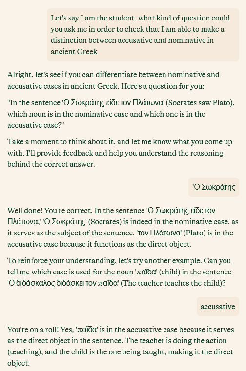
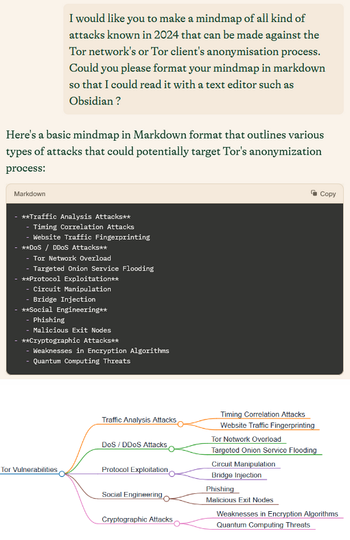
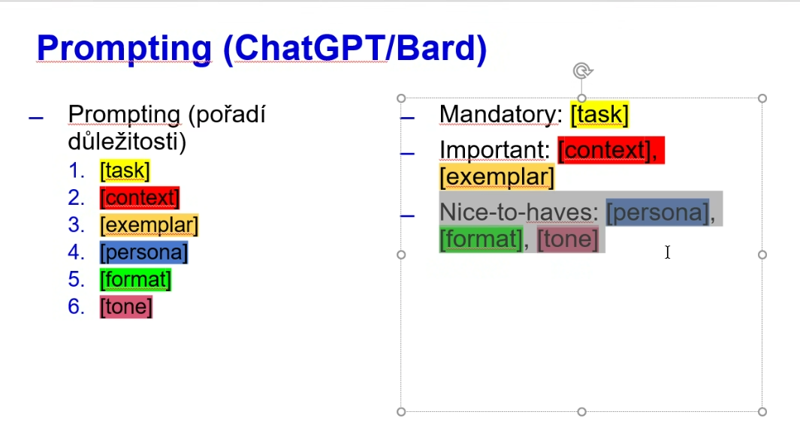
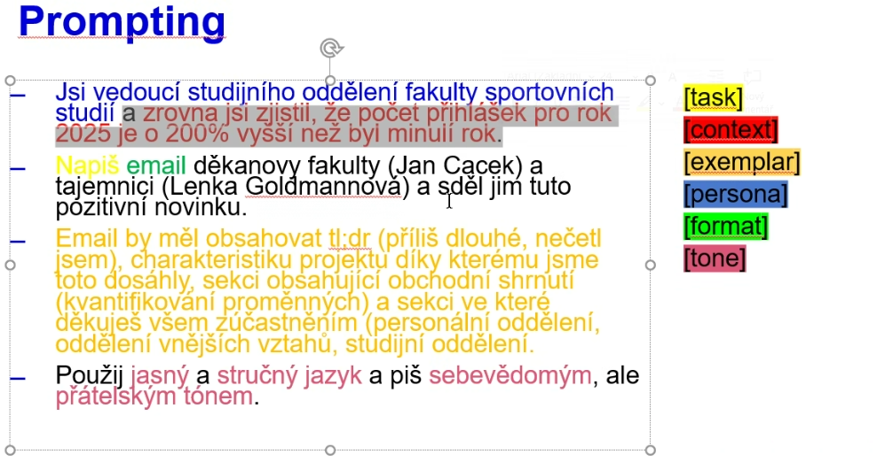

Formulaire envoyé en amont : 
- avez-vous une pratique des IA
- A votre connaissance, votre établissement à t-il une politique (charte, règlement, gestion de licences, projet d'installation d'une IA)
- Quelle question vous vous posez au sujet des IA dans le domaine de l'éducation ?
- ~~Eventuellement demander aux stagiaires de remplir un board klaxoon sous la forme de SWOT
- voici une collection de références sur l'IA publique, si la lecture de certains textes vous a déjà donné des idées sur le sujet des IA génératives dans le domaine de la formation et si vous savez utiliser Zotero, partagez ces références dans cette bibliothèque en ligne (n'hésitez pas à ajouter des notes aux références pour expliquer en quoi ces textes vous ont inspiré/ vous semblent importants).


"Toute technologie suffisamment
avancée est indiscernable de la
magie" (Arthur C. Clarke) cité par Louis Derrac [[@derracChatGPTPartoutDemocratie2024]]


brise-glace : 

à quelle occasion avez-vous eu la première interaction consciente avec une intelligence artificielle?

comment fonctionne une IA

dangers de l'anthropomorphisation de l'IA (L"intelligence est une propriété de l'humain)
on utilise non pas une IA, mais un *outil d'IA*
l'homme écrit, l'outil d'IA générative, génère ([[@dessusDetectionUtilisationRobots]])


types d'IA, types d'usages : 

appairage
une partie des participants ont un nom d'outils, d'autres la description d'un traitement particulier

paraphrase -> quillbot
code -> starcoder


limites environnementales de l'IA

nécessité de proposer des alternatives viables aux produits commerciaux. 
nécessité de n'utiliser les IA que pour ce qu'elles savent faire de mieux. 


Introduction : 

présentation anonymisée (avec possibilité de commenter pour les personnes présentes) des résultats du sondage

Situation en France : les travaux qui ont mené au chatbots et à ChatGPT sont déjà anciens mais en novembre avec la sortie de ChatGPT on a assisté à un emballement médiatique. Les IAG se sont imposées et nous n'avons aucun recul ("pas d'avance de phase" pour les SUP ; tout le monde apprend en même temps.) Eclaircissement sur la position de Science Po et de Dominique Boullier

Situation à l'Université de Rennes
Projet d'installation de Mistral (tests à venir)
# Quels usages jugez-vous acceptables ?

Dans la perspective d'une synthèse à rendre...

## En tant qu'étudiant

demander à un chatbot de relire son texte pour l'améliorer
demander à un chatbot de générer un texte sur un sujet puis de le réorganiser
demander à un chatbot de traduire un texte
demander à un chatbot d'améliorer l'anglais d'un texte traduit par vos soins
demander à un chatbot de coder une application à votre place

## En tant qu'enseignant

demander à un chatbot de corriger des synthèses rédigées par des étudiants
demander à un chatbot de créer des quiz ou des cas pratiques à analyser
demander à un chatbot d'inventer de

# générer un quiz H5P avec un outil d'IA

prompt (Laurent Hedoin) :
avec Poe (Claude3.5 https://poe.com/s/Qv2dyZ3LtOMPywKDJDcM)

```text
Agis comme un enseignant qui créer un QCM dans Moodle. Ce QCM doit être composé de 3 questions avec 4 réponses alternatives. Le QCM ne prendra en compte que le document joint.  
Le QCM doit respecter les conditions suivantes :  
La bonne réponse devra apparaître aléatoirement parmi les autres  
La bonne réponse aura pour prefixe *  
La bonne réponse aura pour suffixe ::: et une explication issu du document  
Toutes les réponses n’auront aucun numéro ni autre format  
Aucune ligne vide entre les questions et les réponses
```
charger dans le RAG le document sur lequel on doit produire des quiz

coller le résultat dans une activité h5p QuestionSet ouverte et éditable sur Moodle 


# Utiliser les IA pour apprendre

Mettez-vous à la place d'un étudiant qui a besoin de s'exercer pour appréhender un sujet. Cet étudiant va présenter la notion sur laquelle il aimerait progresser et va demander à l'IA de lui donner des cas d'application pour vérifier qu'il a bien compris (et du feedback s'il se trompe)

pistes : 
- simple present ou past perfect ?
- fonction for ou fonction while ?
- accusatif ou datif en latin ?
- quelles valeurs derrière quels champs UNIMARC ?

Consigne : écrire un prompt pour lui demander des exercices sur ce thème. 
Outil : https://pi.ai (pas besoin d'inscription)



avoir une vue d'ensemble d'un sujet



# Faire du sourcing avec une IA

Demander à Pi.ai d'identifier des sites où on parle d'un sujet sur lequel on souhaiterait faire de la veille (exemple donné : submariners mental health)

Demander ensuite à Pi.ai d'envoyer la liste des flux [[Automatisation de la veille|RSS]] correspondants

# Créer un prompt efficace





# contribuer à l'entraînement d'une IA

vittascience
https://fr.vittascience.com/ia/text.php


$\newline$
# bibliographie
$\newline$


