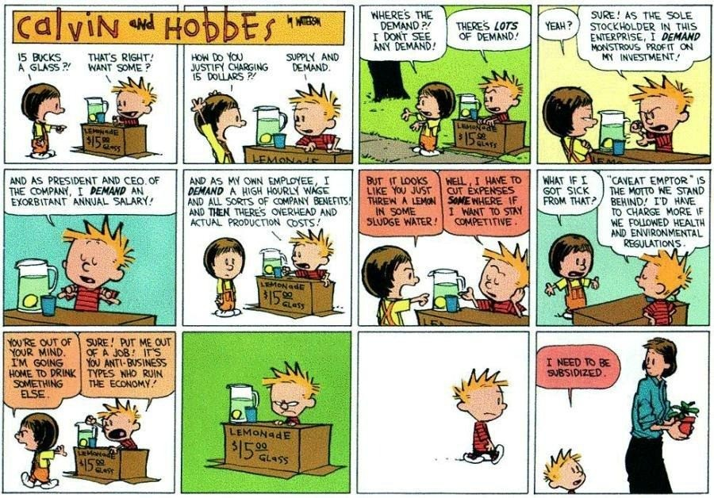
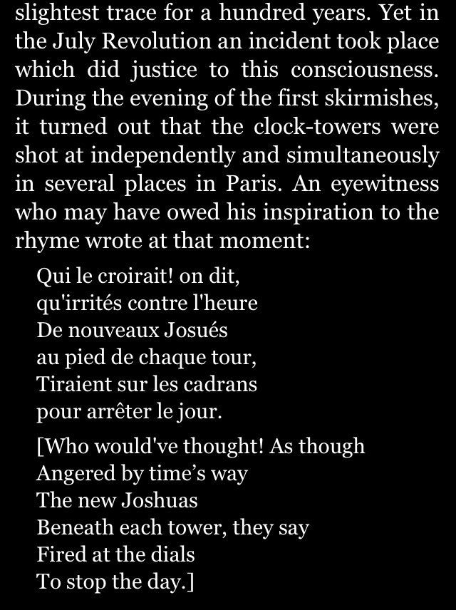

Le capitalisme n'est pas une intention, c'est une force impersonnelle. 

Le capitalisme au XXIème siècle est en mesure de dérégler le climat au point de rendre toute [[civilisation]] impossible et par conséquent de mettre fin au capitalisme. 
Et pourtant comme nous le fait remarquer Jean-Claude Michéa, on arrive davantage à se figurer la fin du monde que la fin du capitalisme.

# Le capital, définition

## la capacité d'un bien à produire un revenu

Le capital est ce qui donne aux propriétaires des moyens de production la possibilité extraire un surplus à partir du travail réalisé par les autres. 

"capacité d'un bien à produire un revenu" ([[Thorstein Veblen]]) ([[@pistorCodeCapitalComment2023]], p29)

## la mine : berceau historique du capitalisme

1492 : Christophe Colomb marié à une héritière propriétaire de plantations à Madère aborde les côtes d'Hispaniola et déclare ces terres espagnoles. Les autochtones qui y vivent sont rapidement exploités ou massacrés. 
La controverse de Valladolid entérine une conception de l'homme noir comme relevant du même niveau que la terre qu'il est chargé en tant qu'esclave d'exploiter pour le bénéfice des colons.
La notion de race qui au Moyen-Âge s'appliquait à la lutte des classes (aristocratiques vs roturières) vient désormais différencier les colons occidentaux des peuples colonisés. La naissance du capitalisme est indissociable de la naissance du racisme contemporain. La colonie promue par le Capital et les Capitalistes a une structure essentiellement raciste : les blancs apportent leurs capitaux et leurs idées pour "mettre en valeur" une terre qu'ils s'approprient. Dans cet échange inégal, les populations autochtones apportent de la main d'oeuvre corvéable à merci. 

La mine et la plantation sont les deux figures originaires du capitalisme.

Le capitalisme est intensivement [[extractiviste]] et considère tout sol, toute culture, comme un magasin à ressources, à l'instar de la mine. 
C'est dans l'industrie minière que le Capitalisme est peu à peu devenu le standard des échanges économiques. ([[@izoardRueeMiniereAu2024]], p225)

> La découverte des contrées aurifères et argentifères de l'Amérique, la réduction des indigènes en esclavage, leur enfouissement dans les mines ou leur extermination, les commencements de conquête et de pillage des Indes Orientales, la transformation de l'Afrique en garenne commerciale pour la chasse aux peaux noires, voilà les procédés idylliques d'accumulation primitive qui signalent l'ère capitaliste à son aurore. 

([[Karl Marx]], Le Capital, cité par Célia Izoard dans [[@izoardRueeMiniereAu2024]], p244)

# Les différents types de capitaux
## capital matériel et immatériel

erreur courante consistant à considérer que le capital est majoritairement matériel. Il peut être dans certains cas plutôt de nature immatérielle ([[capital immatériel]]). Le Droit est le code permettant de convertir des idées et des méthodes en capital (brevets). (Katherina Pistor[[@pistorCodeCapitalComment2023]] p.172) :

> le capital n'a jamais été une chose, mais toujours une question de codage juridique. 

Le capital est peut-être dépendant d'un codage juridique favorable, mais même le capital dit immatériel est en réalité basé sur une réalité très matérielle : le numérique n'existerait sans une intense activité minière qui permet de collecter terres rare et alliages nécessaires à la miniaturisation. Cette tendance du Capital à accumuler des métaux pour ensuite produire des marchandises high-tech, et cela au nom d'une "[[Transition écologique]] qui sert d'alibi" est parfaitement résumée dans les travaux de Jean-Baptiste Fressoz et Célia Izoard. 

Pour les Marxistes, le capital est aussi de nature relationnelle : il forge les relations de domination du propriétaire des moyens de production sur les salariés. 

## La mer, une zone de droit ou de non-droit selon les phases du capitalisme

Dans son ouvrage "Le monde confisqué", paru en 2025, Arnaud Orain, constate un retour à une phase du capitalisme qui a déjà eu lieu deux fois dans le passé. Cette phase de caractérise par un affaiblissement des politiques en faveur de la concurrence et des lois anti-trusts, la reconstitution de monopoles d'Etat ou de firmes privées sur des ressources mais également sur des territoires entiers, le recul du droit international, notamment du respect du droit sur la mer. Cette phase se caractérise généralement par l'idée qu'"il n'y en aura pas pour tout le monde" et qu'un Etat doit arracher aux autres le plus possible de ressources en s'appuyant sur des flottes marchandes militarisées ou des entreprises privées à qui l'Etat délègue des pouvoirs régaliens. 
Selon Arnaud Orain, ces phases d'affrontement sur les mers ont déjà eu lieu à deux reprises avant l'épisode actuel qui débute vers 2010 : fin 17ème siècle et début 18ème siècle, les flottes espagnoles, anglaises et françaises s'affrontent sur les mers ; des tentatives de réguler ces affrontements ont lieu à la fin du 17ème siècle avec la constitution de marges maritimes correspondant aujourd'hui aux mers territoriales et la création de zones de haute mer où les victimes de prédation peuvent transmettre leur plainte à un tribunal. 
A la fin du 19ème siècle et jusqu'en 1945 dans le mouvement qui relance la colonisation en Afrique, et en Asie, les côtes africaines, les Philippines et les archipels polynésiens (Samao) sont le théâtre de luttes et d'intimidations entre flottes nationales (France, Grande-Bretagne, Allemagne, Hollande, Japon), mais aussi avec les flottes locales (Les Allemands liquident une entreprise d'extraction de Coprah menée par des insulaires et qui était concurrente à la leur).
De 1945 à 2010, le commerce sur mer redevient plus libre, le droit de la mer se constitue peu à peu pour ouvrir davantage la mer au commerce et faciliter le libre-échange, jusqu'à sa constitution en un réglement ratifié et signé par une très grande majorité de pays (conférence de Montego Bay en 1982) ; les Etats-Unis ne le ratifient pas, mais jouent le rôle d'arbitre dans les tensions à certains points-clé (golfe persique). 
A partir de 2010, la Chine multiplie ses micro-agressions maritimes à l'égard de ses voisins (Viet-nâm, Philippines, Japon, Taïwan), harcèle les vaisseaux de pêche de ces pays, bâtit des polders pour revendiquer plus de surface. 
La piraterie qui était réapparue dans les années 90 en mer rouge est réappropriée par des Etats comme l'Iran qui par l'intermédiaire des Houthis capture les bateaux supposés ravitailler Israël en armes. Les flottes de guerre arraisonnent de plus en plus des bateaux en dehors de leurs eaux territoriales, la définition de celles-ci tend s'étendre ou à se diluer, laissant le droit au plus fort. Les Etats-Unis qui forts de leur flotte étaient en mesure de jouer leur rôle d'arbitre tend à se constituer des zones d'exclusivité sur les mers pour contrer l'expansionnisme russe sur les bas-fonds. Le libre-échange s'efface progressivement au profit de la constitution de monopoles bâtis sur l'extorsion. 
Cette phase du capitalisme dilue les frontières entre le commerce et la guerre, l'un devenant un mode de l'autre et réciproquement. [[@orainMondeConfisqueEssai2025]]

## Le capital culturel

voir [[capital culturel]]

## Le capital sexuel

voir [[capital sexuel]]

# Le capital social

Le capital social peut avoir deux significations : 

il peut s'incarner dans le "carnet d'adresses" qui permet aux Bourgeois de tirer des avantages de leurs connaissances et d'obtenir de la reconnaissance mutuelle de personnes situées comme eux plutôt en haut de l'échelle. 

Une autre acception du capital social concerne le degré d'intégration d'une société autour de valeurs partagées, de rites sociaux échangés, de solidarité et d'entraide ; le film "Falling down" avec Mickaël Douglas comme acteur principal incarne l'escalade vers la violence d'un travailleur américain qui constate la rapide destruction du capital social de la société américaine dans les années 90. 
[[@thebarkingyearsFallingWasPROPAGANDA2024]]

# le capitalisme est-il une économie de marchés ? 

## le travail comme marchandise

le capitalisme est une société de marchés parmi d'autres. Le marché, antérieur au capitalisme, pourrait survivre au capitalisme. Est-ce que le marché garderait son sens dans une société socialiste ? 
Le marché (échanges codifés) date au moins de l'Antiquité. La codification de ces échanges apparaît sur des tablettes cunéiformes. 
La banque date du Quatrocento. 
Le capitalisme date historiquement des premières sociétés maritimes hollandaises au XVIIème siècle. 
On a été capable de vivre sans le capitalisme, donc le capitalisme n'est pas éternel. 

Economie de marchés : on échange des biens.  Les objets ont des valeurs d'usage qui diffèrent d'une situation ou d'un individu à un autre. Un vêtement de pluie a plus de valeur d'usage en Bretagne qu'au Qatar. 

Le contrat de droit privé est le pivot de l'économie de marché, mais l'inscription dans le droit de privilèges liés à certains biens est le fait du régime capitaliste ([[@pistorCodeCapitalComment2023]], p18)
Kathrina Pistor indique que 

> le capitalisme est plus qu'un échange de biens s'inscrivant dans une économie de marché, c'est une économie de marché au sein de laquelle certains biens bénéficient d'une sorte de dopage juridique. 

[[@pistorCodeCapitalComment2023]], p27

Il faut trouver une manière de comparer deux objets. Une seule chose est commune à tous ces objets : c'est la quantité investie dans la production du bien. 
Le travail est la seule chose qui donne un quantum qui permet de comparer un objet à un autre. Si une paire de chaussures vaut deux chemises, c'est qu'il faut deux fois plus de travail pour produire cette paire que la chemise. 

Valeur d'échange (or). Le prix peut différer de la valeur d'usage. 
Si on produit deux robes qui demandent la même quantité de travail mais les acheteurs préfèrent la bleue à la rouge. Le vendeur de robes bleues va pouvoir augmenter ses prix compte tenu de la demande et le vendeur de robes rouges va devoir baisser les siens.
Remettre en perspective la valeur d'échange par rapport à la valeur d'usage. 

Le capitalisme est une économie de marché qui permet de faire de la plus-value en faisant du travail une marchandise. 

Les [[Intelligence Artificielle|intelligences artificielles]] sont en passe de généraliser la conversion de travail en marchandise (voir [[@pouts-lajusEducationDoitelleAvoir2023]]) 

## la vie comme marchandise

Dans les eaux glacées du capitalisme, tout peut être quantifié, y compris la vie humaine. 
Dans les années 80, Ford a été informé d'un défaut dans le réservoir des Ford Pinto ainsi que du danger à laisser ces voitures circuler. Un calcul a permis de déterminer qu'en cas d'accident mortel suite à l'incendie de ces réservoirs, l'indemnisation par victime ne se monterait qu'à 200 000 dollars et des projections indiquaient que seuls 180 personnes par an mourraient dans un tel accident. Ce chiffre de 36 millions restant toujours inférieur au coût du rappel de ces véhicules (137 millions), Ford a laissé ces accidents se produire. Des gens ont brûlé vif dans ces voitures. Au total après avoir dépensé 1 000 000 euros en avocats, la firme a obtenu de ne payer que 7500 dollars pour chaque partie civile. Une bonne affaire en somme ([[@bantignyEnsauvagementCapital2022]], p28)

Cette insensibilité du capital à la morale traditionnelle qui n'implique aucun prix à la vie humaine est typique du [[néo-libéralisme]], une phase du capitalisme dans laquelle l'économie marchande se fait institutrice de toutes les valeurs. 

## Le contrôle du temps par le capitalisme

contrôle du temps universel pour l'interpérabilité des serveurs

contrôle du temps humain. 
Révolte contre le chronomètre, contre les horloges[^2] des ouvriers soumis aux cadences, des premiers établis mécaniques aux travailleurs d'Amazon soumis à une [[intelligence artificielle]]
## les contradictions de l'accumulation du capitalisme

Le capitalisme a eu un rôle historique important d'étendre la production, mais il a de plus en plus de mal à surmonter ses contradictions. 

il faut maintenir le [[taux de profit]], donc couper dans l'emploi, au bout d'un moment on casse l'outil qui sert à faire du profit. 

> les capitalistes creusent eux-même leur propre tombe

sur une journée de travail sur la valeur produite sert à trois choses : 
1. Payer les machines
2. Payer les salaires
3. Payer le capitaliste

le capitaliste accumule, ce taux de profit va devenir du nouveau capital investi pour payer des machines et des capitalistes. 
On a de plus en plus de capital par rapport 

La seule marchandise qu'on peut arnaquer c'est celle du travail, pas des machines, 

Cette baisse tendancielle du taux de profit peut se terminer par un retour à la [[féodalité]] (cf. Rosa Luxembourg, Socialisme ou Barbarie)

# Le capitalisme comme mode de coopération hiérarchique

Le capitalisme ne serait qu'une variation d'une forme de coopération hiérarchique imposée aux Hommes depuis le Néolithique selon Charles Macdonald [[@Donaldsciencessocialessontelles2021]] : 

> On a par exemple considéré que le capitalisme industriel était une forme nouvelle et radicalement autre de domination sociale. Il n’est en réalité qu’une modalité particulière de la forme hiérarchique qui s’est imposée à la quasi-totalité de la population humaine à partir du néolithique. Il n’a rien inventé de radicalement nouveau, parce qu’à partir du moment où l’on peut s’approprier les forces vives de la personne, comme dans l’esclavage, on peut tout aussi bien et sans grande différence en faire un prolétaire en lui déniant les moyens de vivre sans le travail en usine 

## les deux régimes de la domination : colonisation et capitalisme

Dans les Damnés de la Terre, Frantz Fanon oppose deux formes de domination, la première, celle de la [[colonisation]] assigne à chacun sa place de façon brutale et sans autre médiation que le fait accompli et la violence (coups de crosse et napalm). 
Dans le monde capitaliste, la domination est imposé au dominé à travers toute une série de médiations politiques, intellecturelles, religieuses et sociales.
Cette emprise permet au dominé d'assentir au rapport de soumission que lui impose le capital sans avoir véritablement conscience d'y être soumis.
On peut donc être de fait dominé sans en avoir véritablement conscience. Pour [[Geoffroy de La Gasnerie|Geoffroy de Lagasnerie]], cette situation est emblématique d'une conscience politique inachevée : le vocabulaire politique que nous utilisons faute de mieux trahit notre propre expériences des rapports sociaux ([[@lagasnerieConsciencePolitique2021]], p. 43). 

Ugo Palheta montre également que l'avènement des formes actuelles de la démocratie parlementaire en Métropole est contemporaine de la colonisation de territoires éloignés où des méthodes violentes de soumission sont utilisées contre les autochtones. 
Le capitalisme n'est porté à faire des concessions en termes de libertés civiques que lorsqu'il a en face de lui une résistance puissante et en lui la crainte de nouvelles révolutions (après 1830, 1848, 1871, 1917 en Russie). Là où le risque de soulèvement général est moins vraisemblable, il exerce sa domination sans faire aucun compromis. [[@palhetaCommentFascismeGagne]], p132.

# le codage juridique du capitalisme

D'après Katharina Pistor, ce qui fait la pérennité du Capital, ce qui rend possible son accumulation dans le temps, c'est le [[codage juridique]] du Capital, c'est à dire l'ensemble de règles qui permettent aux capitalistes de faire fructifier des biens de nature très différentes et successives dans le temps. A la base de ce codage juridique, il y  a le droit foncier, puis le travail est devenu une marchandise qui a à son tour fait l'objet de règles, et pour finir les productions de l'esprit (brevets, logiciels), et enfin les assurances, les titres financiers ont été codés juridiquement ce qui a créé le nouveau capitalisme financier à partir des années 70. Ce capitalisme n'est pas si nouveau en réalité, il n'est que l'extension de ces règles juridiques à des biens immatériels comme les titres financiers.  (cf. [[@pistorCodeCapitalComment2023]], p30)

La force du Capital, pour produire et vendre à moindre coût, se nourrit de la compétition des droits nationaux et de la façon dont les capitalistes mettent en concurrence ces droits pour trouver les plus avantageux pour leurs affaires (souvent les moins-disant en terme de protection et rémunération du travailleur)
Voir à ce sujet ce qu'en dit [[Alain Supiot]] dans l'Esprit de Philadelphie. 

Toutefois, pour protéger ses actifs, le capitalisme peut se reposer également sur l'impérialisme juridique des pays du Nord et ses deux principales sources : le droit britannique et le droit de l'Etat de New York. Qui n'assure pas sa compatibilité en matière de droit d'auteur et de droit sur la propriété intellectuelle avec ces deux sources risque de ne plus accéder aux marchés. 
([[@pistorCodeCapitalComment2023]], p194)

Comme le fait remarquer Cory Doctorow, les monopoles des Géants de la Big Tech et autres [[VLOPs]] ne se sont pas faits sur la possibilité que ces géants avaient de fabriquer et vendre des machines et des logiciels conçus pour être non-interopérables avec d'autres (cela n'est pas possible à l'ère de l'informatique du XXIème siècle). Ce qui a assuré la constitution de ces monopoles, c'est uniquement un droit très protecteur à l'égard de tout ce que ces firmes présentent comme "[[secret des affaires]]" : 

> Today’s tech giants have not invented an interop-proof computer. They’ve invented laws that make interoperability illegal unless they give permission for it. A new, complex thicket of copyright, patent, trade secret, noncompete and other IP rights has conjured up a new offense we can think of as “felony contempt of business model”—the right of large firms to dictate how their customers, competitors and even their critics must use their products

(source: [[@doctorowInternetConHow2023]])

## inflation des droits sur le travail intellectuel

voir [[capitalisme cognitif]]

# le capitalisme face aux crises

D'après [[Schumpeter]], le capitalisme surmonte ses crises par de la destruction créatrice. 

> Sous sa forme néolibérale, \[l']idéologie \[du capitalisme] se présente comme libérant les forces de destruction créatrice qui entraînent des innovations technologiques et sociales en accélération constante.

Les gains de productivité se traduisent toujours dans un premier temps par de la destruction d'emploi (cf. remplacement de travailleurs par des robots (cf. [[neo-luddites]])) puis par des [[grands modèles de langage|intelligences artificielles]].

La croyance que les gains de productivité ne s'acquièrent qu'au moyen de la [[disruption]] et d'une innovation qui pousse à la destruction des entreprises les moins performantes est selon Cédric Durand un principe important du consensus de la Silicon Valley (voir [[consensus socio-économique|consensus économique]])

## homéostasie du capitalisme

Le capitalisme a fait la preuve qu'il était capable de récupérer la critique anti-capitaliste pour en faire un marché (t-shirt Che Guevarra). 
L'homéostasie du capitalisme est sa capacité à agréger des symboles et des forces qui lui sont hostiles pour s'en servir afin de se renforcer.
( [[@wuming1CommeQomplotComment2022]], p 148)

## le sort des entreprises qui cherchent à échapper à la logique capitaliste

cf. crédit coopératif

> une économie capitaliste, c'est un peu comme un flipper, on a beau dépenser et investir dans des secteurs propres (souvent peu lucratifs), l'argent retombera tôt ou tard vers le bas, c'est à dire vers les activités les plus lucratives. Les euros dépensés à l'AMAP du coin seront payés en salaires, qui seront utilisés pour couvrir, par exemple des frais d'essence, ou bien épargnés, et donc indirectement investis dans d'autres activités [[extractivisme|extractives]] 

([[@parriqueRalentirOuPerir2022]], p76)

# A l'origine de l'épuisement de la nature et de la crise climatique

## abstraction et extraction

Selon [[Antonio Negri]] et Michael Hardt, le capitalisme se déploie par l'abstraction des moyens de production et l'extraction toujours plus poussée des ressources. 
L'[[extractivisme]] propre au capitalisme s'appuie d'ailleurs sur ses facultés d'abstraction. Lorsqu'on cherche "intelligence artificielle" sur un moteur de recherche, on trouve des images de robots, des écrans d'ordinateur illuminés, mais aucune image ne rappellent : 
- ni les mines de terres rares qui dévastent les paysages et par rejet des produits issus de l'extraction empoisonnent hommes et bêtes environnants
- ni la demande accrue d'énergie et sa production qui est responsable d'une part grandissante de l'effet de serre
- ni l'exploitation des hommes qui soit entraînent ([[digital labor]]) soit obéissent (travailleurs d'Amazon) à ces IA
- ni l'exploitation de l'eau qui est privatisée par des grands centres de calcul comme ceux de Google à The Dalles dans l'Oregon
- ni l'exploitation de l'argent public qui au lieu d'aller dans les formations universitaires ou les services municipaux servent à construire des IA qui vont ensuite être livrés à des multimillionnaires qui vont en vendre l'usage à des Etats de moins en moins légitimes et de plus en plus enclins à étouffer toute contestation par un contrôle accru des populations. 

## le capitalisme épuise la terre et le travailleur

Ajouter le coût écologique. Marx avait conçu que la prédation capitaliste épuisait la nature et le travail. Le travail n'est pas que le travail humain, c'est aussi le travail de la nature. 

Les survivants de la Commune avaient également formé au cours de leur correspondance (Elisée Reclus, William Morris, Kropotkine) les contours d'un eco-socialisme en constatant les ravages opérés par le capitalisme sur la nature ([[@rossFormeCommuneLutteComme2023]], p126)

voir Engels épuisement des sols à Cuba : la production du tabac épuise les sols, favorise la culture sur brûlis et avec le ravalement causé par les pluies rend le sol infertile. Il remarque que les grandes compagnies de tabac s'installent à Saint-Domingue parce qu'ils 'ont épuisé les sols à Cuba. 

Le Capitalisme engendre la crise climatique que nous connaissons, voir [[Capitalocène]]

## la transition écologique : le mirage du capitalisme face aux dégâts climatiques qu'il engendre

La transition écologique postule que les énergies propres se substituent aux énergies sales ou carbonées, mais en réalité leurs usages se cumulent. Toutes les énergies carbone ne sont pas mauvaises en soi, cela dépend de ce qu'elles servent à produire : utiliser du ciment (très émetteur de CO2) pour construire des voies d'adduction d'eau dans des villages où on manque de cette ressource, est un usage responsable de cette ressource ; on ne peut pas en dire autant d'un énième contournement autoroutier d'une ville ou de la construction de logements touristiques à des fins d'exploitation capitaliste.

Pour l'historien Jean-Baptiste Fressoz, le discours autour de la transition écologique est ce que le Capitalisme a trouvé pour se perpétuer au delà de la crise climatique dont il est responsable [[@ernerTransitionEnergetiqueAux2024]], et ce discours qui verse souvent dans le [[solutionnisme technologique|solutionnisme]] (cf. moteurs à hydrogènes), empêche de se poser les vraies questions qui sont : 
- la taille de l'économie (réduire cette taille pour sauver ce qui peut l'être)
- la redistribution des richesses
Dans une logique marxiste on aurait pu ajouter : 
- le contrôle des moyens de production (nécessaire pour réduire la taille de l'économie et l'adapter à la demande sociale plutôt qu'aux lois du marché)

# la crise démocratique du capitalisme

théorie de Wolfgang Streeck, exposée dans *Du temps acheté* (2013) et résumée par [[Chantal Mouffe]] dans *La révolution démocratique verte*[[@mouffeRevolutionDemocratiqueVerte2023]]

Pour Streeck, la fin des années 70 est marquée par le refus des capitalistes de garder le compromis hérité des années 30 avec le travail et de marquer une rupture nette avec ce compromis. Grâce à la révolution conservatrice, le capital l'emporte de plus en plus face au salariat, mais pour autant les capitalistes échouent à maintenir l'accumulation du capital qui était visée. 
Si l'[[inflation]] est maîtrisée et le déficit des années 70 résorbé au moyen de politiques austéritaires (notamment celles insufflées par la commission européenne dans l'ensemble des pays européens), le taux de croissance diminue progressivement pendant que les inégalités sociales s'accroissent. Le début des années 80 marque une divergence de plus en plus grande entre les intérêts du capital et ceux du travail, rendant de plus en plus difficile la conciliation du capitalisme et des institutions démocratiques. Le résultat en est une démocratie de plus en plus formelle, sans réelle alternance et où l'égalité et la [[souveraineté populaire]]s'effacent peu à peu. 
Cette impossibilité grandissante de concilier la logique du capital (qui n'entraîne ni réelle croissance, ni bien-être dans les classes populaires (cf. [[Produit Intérieur Brut#croissance du PIB et croissance du capital]]) et le [[libéralisme politique]] rend nécessaire un virage autoritaire pour imposer les règles économiques portées par le néo-libéraux : renforcement des dispositifs de contrôle et de répression (voir [[répression des manifestations]]) et peu à peu une plongée dans l'[[illibéralisme]]. 
Le néo-libéralisme ne consiste donc pas à affaiblir l'Etat (Reagan : l'Etat n'est pas la solution, c'est le problème), mais au contraire à le renforcer[^1], non pas dans son rôle d'arbitre du marché (il continue de favoriser la dérégulation du marché du travail), mais dans sa capacité à encadrer strictement l'exercice des libertés démocratiques pour éviter l'avènement d'une véritable alternance (d'un "réformisme radical" que Chantal Mouffe appelle de ses voeux et dont elle considère que le [[populisme]] de gauche est le levier)

Ugo Palheta considère quant à lui le capitalisme est continuellement porteur de violence pour imposer sa domination. Lorsqu'il fait des concessions ici, il impose sa loi avec brutalité ailleurs (dans les colonies ou ex-colonies comme en Kanaky ou encore sur les descendants métropolitains des anciens pays colonisés). 
A partir de Reagan et de Thatcher, le capitalisme opère en effet un tournant vers une forme de radicalisation en amoindrissant les médiations entre le Pouvoir et le peuple que constituaient les institutions comme le Parlement, les syndicats, les associations de défense des droits de l'homme, les médias. Ce tournant autoritaire va crescendo depuis Sarkozy jusqu'à Macron. En témoigne le recours de plus en plus fréquent à l'[[état d'urgence]]. 

[^1]: Andrew Gamble : "une économie libre dans un Etat fort", expression de l'auteur pour qualifier l'ambition de Margaret Thatcher (*the free economy and the strong state*)
[^2]: Quand les ouvriers de la Révolution de Juillet tiraient sur les cadrans des horloges à Paris 

# Bibliographie