Veracrypt est un logiciel libre de **chiffrement de partition ou de volume** qui a remplacé **TrueCrypt**. Veracrypt permet de créer des volumes chiffrés sur des clés USB, des ordinateurs ou des disques durs. Ces volumes sont transportables mais doivent être ouvertes avec la seule application Veracrypt.
# Installation et mise en route (GNU/Linux)

Un ppa (Personnal Package Archive) est une archive personnelle gérée par un utilisateur ou une utilisatrice à partir de laquelle on peut télécharger différentes versions de logiciels. Il faut d'abord faire le lien avec ce ppa, avant de télécharger le logiciel qui s'y trouve. 
On peut télécharger le logiciel depuis le ppa de Unit193 (qui se décrit et décrit [son travail en ligne](https://wiki.ubuntu.com/Unit193))

après globalement l'installation se fait comme avec le repository APT (sudo apt install logiciel)

```shell
sudo add-apt-repository ppa:unit193/encryption
sudo apt update
sudo apt install veracrypt
```

# Création d'un volume chiffré avec Veracrypt

## avec l'interface graphique

ouvrir VeraScript 

- Sur Windows, en cliquant sur veracrypt.exe
- Sur Linux : en allant chercher le logiciel dans la liste des applications, ou bien en tapant 
- ```$ veracrypt``` dans le terminal ou bien (voir ci-dessous avec les droits de super-utilisateur ```$ sudo veracrypt```)

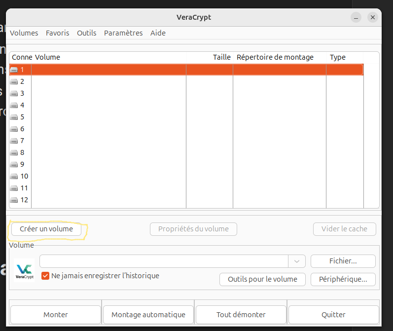
Dans le popup qui apparaît, cliquer sur "créer un volume"

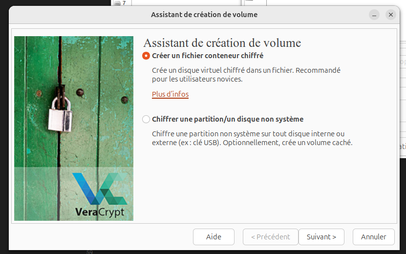
On peut créer un volume chiffré qui va occuper une clé USB ou bien seulement un espace délimité sur son ordinateur. Considérons le premier cas ; sélectionner "créer un fichier conteneur chiffré"

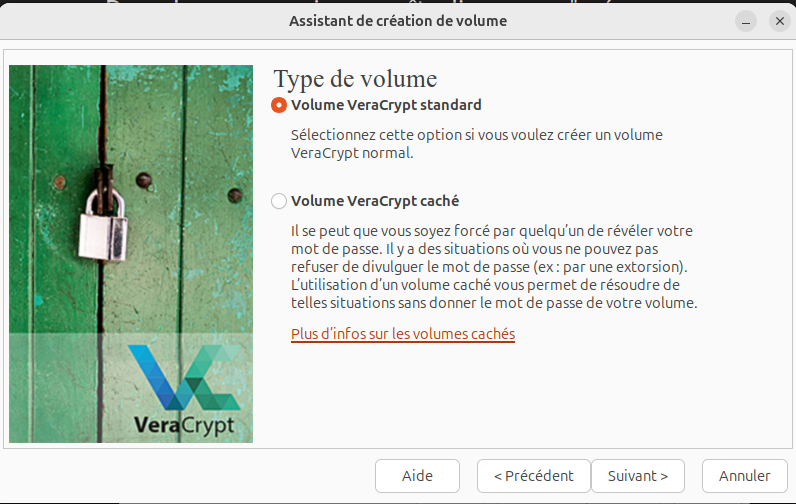

Il est possible de cacher un volume chiffré indétectable sous un autre volume chiffré. Ainsi, si on est obligé de céder son mot de passe à quelqu'un, cette personne accédera au premier volume de données (anodin) et ne verra pas le deuxième volume de données qui ne s'ouvre qu'avec un autre mot de passe ; un peu comme une valise à double fond.
Cette fonctionnalité est utile pour passer les douanes par exemple ; si un douanier nous menace de ne pas nous laisser entrer dans le pays si on ne donne pas le mot de passe du dossier chiffré, on donne ce mot de passe et si le premier volume ne contient que des documents sans importance, le douanier n'a aucun moyen de savoir si ce dossier couvre un autre dossier contenant lui des fichiers importants.

Sélectionnons cette fonctionnalité

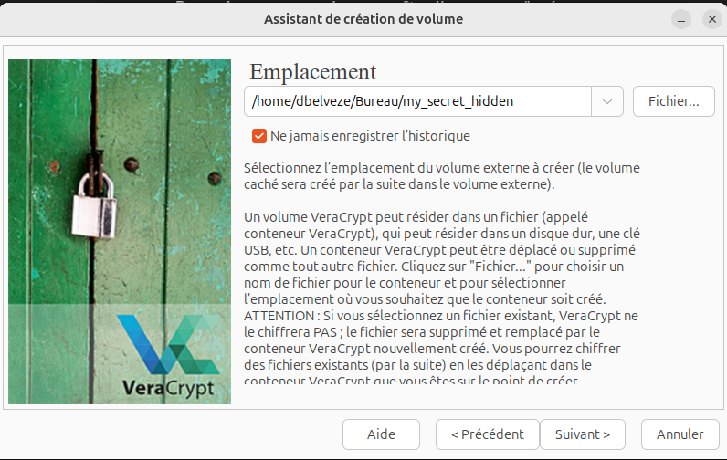

cliquer sur fichier et indiquez un chemin vers un fichier qui n'existe pas encore. Si ce fichier existe, il ne sera pas chiffré mais supprimé et remplacé par l'endroit où se trouvera le volume chiffré. Veracrypt ne chiffre pas des fichiers existants, il constitue des volumes chiffrés dans lesquels on va glisser des fichiers. 

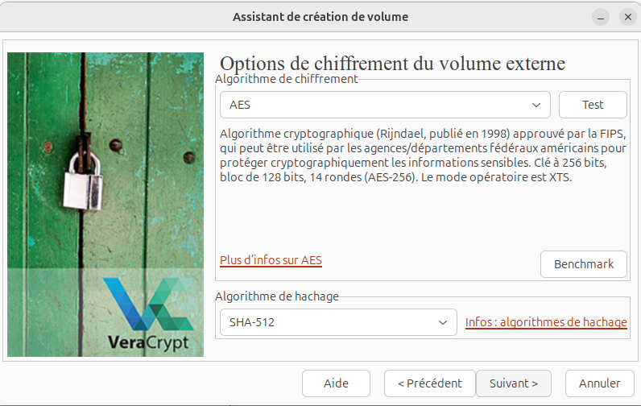
Laisser le protocole de chiffrement AES et l'algorithme de hachage SHA-512 qui constituent un bon compromis entre rapidité d'accès et robustesse. 

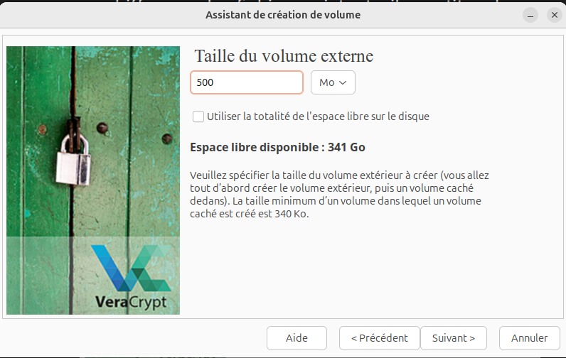
Indiquer un volume pour cette partition chiffrée (en fonction de vos besoins, prévoir une volumétrie des données)
On va d'abord donner un espace au volume extérieur, puis à l'intérieur de celui-ci un espace au volume intérieur (volume caché)

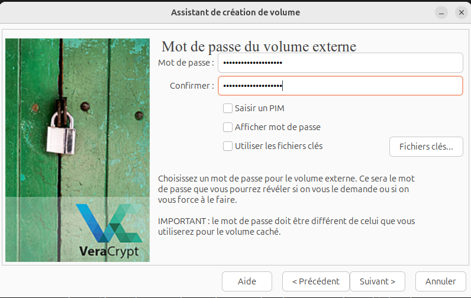
choisir un mot de passe pour le volume extérieur

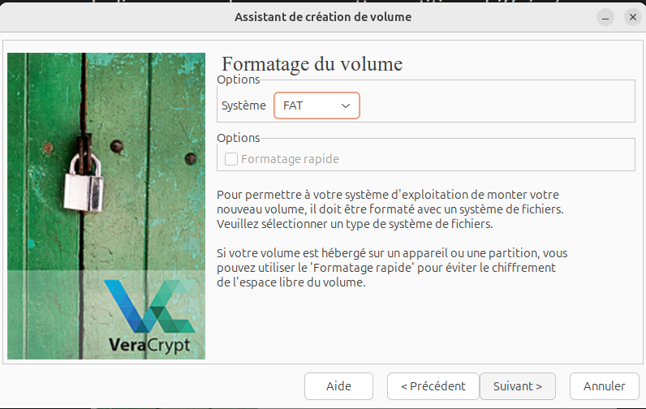
Il faut ensuite choisir la manière dont le volume va être formaté. 
Pour que le système d'exploitation puisse séparer ce volume des autres espaces de stockage de fichiers présents sur l'ordinateur, il est important de lui indiquer comment ce volume est organisé, comment il doit lire et analyser les fichiers qui y seront rangés ; c'est ce qu'on appelle le formatage de volume. 
FAT est un format de volume qui est à l'origine la production de Microsoft mais est reconnu par l'ensemble des OS ; ext2,ext3 et ext4 correspondent à des volumes pour des systèmes Linux. 
Dans le cas où notre partition pourrait se retrouver tant sur une machine Windows que sur une machine Linux, on va choisir FAT (par défaut)

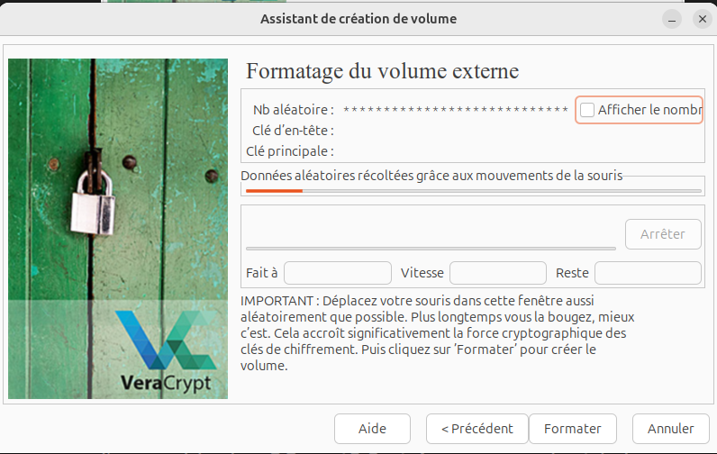
Dans l'étape suivante, on va générer la clé ; pour qu'elle soit unique, il faut y mettre de l'entropie ; faire des gestes de souris aléatoires dans le cadre de cette fenêtre pendant quelques temps, puis cliquer sur "formater"

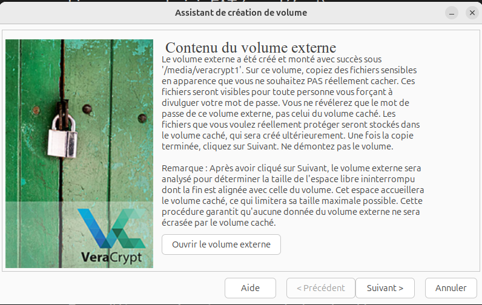
ouvrir le volume externe

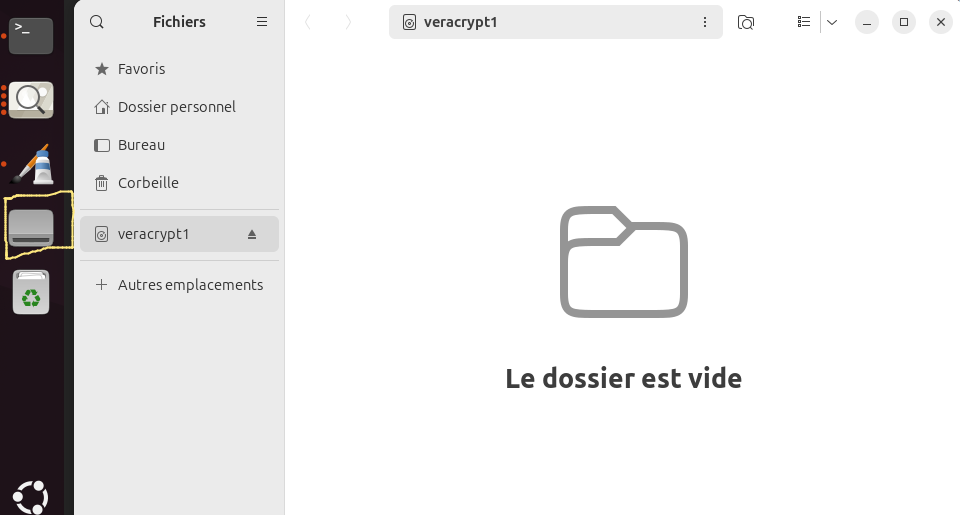
le volume chiffré vient d'être monté
copier des fichiers de données qui ne présentent pas d'intérêt sensible dans ce volume (media/veracrypt1)
fermer la fenêtre où le contenu du volume apparaît avec les nouveaux fichiers que vous y avez mis. 
cliquer sur "suivant"

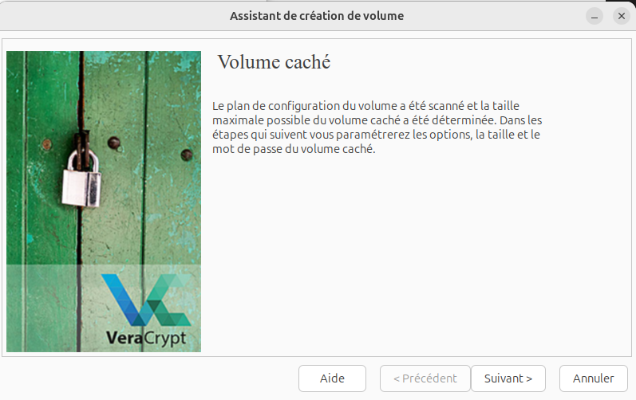
Paramétrer le volume caché comme cela a été fait pour le volume extérieur (mêmes options de protocole, algorithme, volume de fichier mais bien sûr un mot de passe différent du premier)

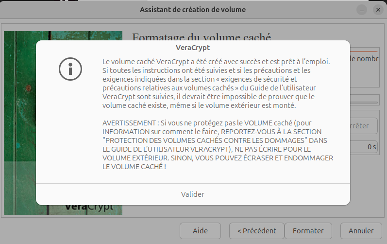
quitter l'interface de création du volume

Pour accéder au volume créé, revenir sur la fenêtre d'accueil de Veracrypt qui doit toujours être ouverte

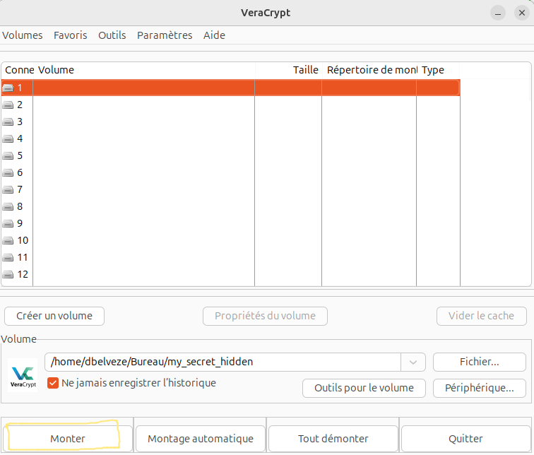
en cliquant sur le bouton "fichier", parcourez les fichiers jusqu'à celui qui contient le volume chiffré extérieur (au passage, "my_secret_hidden" n'est pas un bon nom de fichier, de préférence utiliser des noms qui n'incitent pas à la curiosité)
cliquer sur "Monter"

entrer le mot de passe du volume chiffré extérieur (non sensible) ; le volume est monté. On accède aux fichiers non sensibles. 

Pour accéder au volume caché, le principe est assez différent de celui de la valise à double fond, à savoir qu'on ne passe pas par la partition non sensible du conteneur pour aller vers la partition sensible. 
Démonter le volume
Monter de nouveau le volume, mais cette fois entrer le mot de passe relatif au volume caché : vous accédez directement au volume caché. 

Ainsi, si quelqu'un (par exemple un douanier, il est de plus en plus courant que les chercheurs et chercheuses soient obligés d'ouvrir leurs appareils aux passages de frontières) voit que vous disposez de veracrypt sur votre appareil et vous demande la localisation de votre volume chiffé ainsi que votre mot de passe. Il accèdera au données non sensibles, mais ne pourra pas affirmer qu'il existe un autre volume de données sensibles ouvrable avec un autre mot de passe. 

## Erreurs possibles : 

Après certaines installations, un message d'erreur de ce type apparaît quelque fois : 

*Mauvais descripteur de fichier - VeraCrypt::CoreService::StartElevated:567*

Pour créer un disque chiffré ou bien le monter, Veracrypt demande le mot de passe administrateur (après le mot de passe de la partition chiffrée) ; ça ne se passe pas forcément bien selon la manière dont le paramétrage d'accès aux droits d'utilisateur par un logiciel a été réalisé. 
Si on ne se sent pas capable de reparamétrer cet accès, pour éviter ces erreurs, il suffit de ne pas ouvrir Veracrypt à partir du lanceur mais à partir du terminal en mode *sudo*, ainsi on va d'abord fournir le mot de passe d'administrateur dont Veracrypt a besoin pour créer ou monter un volume puis seulement ensuite le mot de passe de ce volume, puisque la séquence inverse produit une erreur. 

Pour ouvrir Veracrypt avec les droits d'administrateur, entrer dans le terminal
```shell 
$ sudo veracrypt
```

