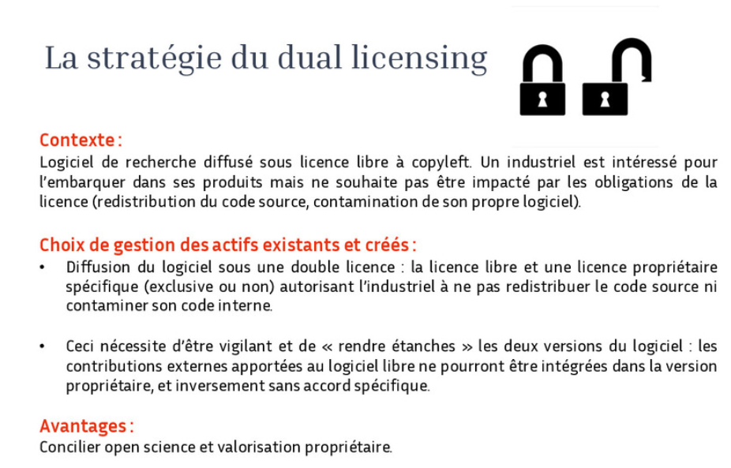

Discussion avec Philippe Effantin qui gère les problématiques relatives au code source et logiciel au sein de la SATT Ouest-Valo. 
Philippe Effantin répond à un ensemble de questions que je m'étais posées sur le rôle des SATT dans la valorisation du code de recherche et sur l'alignement (ou pas) de nos discours sur le sujet côté SATT et côté ARDoISE.

# Comment fonctionnent les SATT (jusqu'à présent du moins...)

Rappel du modèle économique des SATT :
Constat d'une difficulté à conserver ses structures viables, notamment depuis la suppression du crédit provenant de la Banque Publique d'Investissement en novembre 2024 ; l'avenir des SATT n'est plus assuré sous leur forme actuelle, risque de perte de compétences dans le passage vers les PUI (Pôles Universitaires d'Innovation)
Les SATT complètent leurs budgets en récupérant une part des profits rapportés dans le dépôt de brevet ou dans la vente de licences pour le code source. 
Désaccord avec certaines équipes de recherche sur le montant qui doit être récupéré sous cette forme. 
Concrètement, la SATT investit de l'argent et du temps en accompagnant un projet de recherche puis si le projet est rentable, récupère une partie de la manne pour se financer. 

Si la propriété intellectuelle s'applique au logiciel, il n'empêche que c'est l'employeur du chercheur ou de la chercheuse qui en est propriétaire, et que les chercheurs en théorie ne peuvent y attribuer une licence qui soit en contradiction avec ce que souhaite cet employeur. Les SATT représentent les intérêts des établissements qui sont membres de leur conseil d'administration (la SATT Ouest-Valo dessert les université Bretonnes et celles des Pays de la Loire)

Les chercheurs/ses qui viennent consulter la SATT sur du code source ne sont pas rares. 

La SATT, sollicitée par le ou la chercheuse organise dans un premier temps le dépôt du logiciel dans la base de l'Agence pour la Protection des Programmes (https://www.app.asso.fr/) afin de tracer les auteurs originels du code. 
En effet, dès que le code source est ouvert, notamment ouvert aux contributions, il devient assez vite difficile de distinguer les différents contributeurs d'un même code source entre eux : quel est le niveau de leurs contributions, qui peut prétendre faire partie de la gouvernance du logiciel, qui était à l'origine du concept, etc.
Les Communautés OpenSource autour d'un logiciel sont assez complexes à mener sur le temps long, mais on note certaines réussites retentissantes en la matière (SciKit Learn par exemple). 

# Le rôle des licences doubles (dual licences) dans la valorisation du code source

Assez régulièrement, la SATT conseille des licences duales ([[licence double|dual licence]])

Par Licence duale on mentionne notamment le fait de livrer le code source de façon différente selon le public : 

Pour le public de recherche, le code est accessible librement selon le principe de la Science Ouverte qui est la référence pour l'employeur.
Le ou la chercheuse ne peut pas monétiser pour son intérêt propre une production logicielle qu'il/elle a réalisé dans le cadre de son temps de travail, sauf à se mettre en situation d'abus de bien social. 
Philippe Effantin note que certains chercheurs ont tendance, cela dit, à se méfier des services de valorisation craignant de se voir déposséder de leurs créations. Il mentionne en particulier des chercheuses avec qui il a eu des licences et qui dans les décennies précédentes ont été victimes de l'effet Matilda au sein de leurs labos. Il note que depuis une décennie, la situation s'est grandement améliorée de ce point de vue. 

Pour les entreprises, le code est livré dans une version permissive moyennant le paiement d'une certaine somme. La licence permissive permet à l'entreprise de réutiliser le code comme une brique dans son propre code en échappant à la contamination de la licence copyleft et ainsi de ne pas avoir à rendre accessible à la communauté la part propriétaire de son code dans laquelle cette brique s'insère, ni les améliorations qu'elle a apportée à cette brique logicielle.

L'argent récupéré par la SATT permet de faire vivre le service de valorisation et pour les équipes de recherche, cet argent aide à financer de nouveaux projets de recherche. 
C'est encore plus vrai pour les projets qui impliquent l'entraînement de modèles de langage sur des infrastructures coûteuses comme le supercalculateur Jean Zay ; il est important que les entreprises qui veulent réutiliser ces modèles de langage en paient le prix pour permettre la poursuite de futurs projets de recherche de cette nature. 

Parmi les clients (clients entreprises) de la SATT, on trouve parfois des acteurs importants comme Oracle. 

Comme exemple de chercheurs ou chercheuses ayant récemment fait appel à la SATT pour leurs logiciels, Philippe Effantin cite Clarisse Bardiot pour le projet HARVEST, Cyrielle Mallard et Thomas Gaillat pour le projet A4All du Lidile, deux projets qui ont été présentés lors de la journée ARDoISE du 17 décembre. A ce sujet, Philippe Effantin se réjouit d'avoir cette discussion avec nous car il avait bien repéré ARDoISE comme un partenaire éventuel pour parler aux chercheurs et chercheuses de la valorisation de leur code de recherche. 

P. Effantin précise qu'en cas de licence duale, la licence libre de base doit être une licence contaminante ou restrictive du GPL3 ou du copyleft afin que la licence propriétaire puisse être correctement négociée avec l'entreprise (si la licence libre lui donne déjà tous les droits, comme celle du MIT, licence assez permissive facilitant la réappropriation gratuite par le privé du code source de recherche, elle ne permettra pas de négocier la licence propriétaire dans de bonnes conditions). 

# Des concepteurs essentiellement préoccupés par la pérennité de leur code source

Interrogé sur les motivations des chercheuses et chercheurs qui viennent le consulter, Philippe Effantin mentionne particulièrement la recherche de pérennité du code source. C'est ce qui préoccupait Clarisse Bardiot à la base. 
Cela n'empêche pas que du code source de recherche ait une histoire riche et longue au sein des communautés OpenSource, ni qu'on puisse vivre du libre en offrant des services sur mesure pour l'iméplementation de ce code dans des services particuliers (cf. Koha), mais les chercheurs et chercheuses ne travaillent pas dans l'optique de rendre ces services supplémentaires et n'ont pas la nécessité de vivre de leur activité de développement contrairement aux développeurs. 

Parfois le libre ne suffit pas à maintenir un logiciel dans la durée, faute de contributeurs actifs, ou bien faute d'une gouvernance structurée, le projet initial est radicalement altéré, ce qui ne plaît pas aux créateurs initiaux qui n'ont pas les moyens de s'y opposer. 
Maintenir la gouvernance d'un projet libre demande du temps. 

Les chercheurs et chercheuses sont à la recherche d'acteurs privés ou publics qui reprendront leur code source et pourront l'améliorer le développer quand eux-mêmes seront partis sur d'autres sujets de recherche et ne pourront plus s'en occuper. 
Le but de cette recherche est de trouver des acteurs qui maintiennent une liberté d'usage autour du logiciel pour des particuliers mais vendent des services supplémentaires. Philippe Effantin cite l'inventeur de Zotero qui à la base est un professeur d'Histoire américain et qui a maintenu le code source libre à travers les années mais vend de l'espace de stockage supplémentaire aux chercheurs individuels (et depuis peu aux établissements) pour rémunérer des développeurs qui feront vivre le logiciel de façon pérenne. 

# partage des connaissances sur la valorisation du code source

Philippe Effantin craint que dans le passage des SATT aux PUI, les recrutements de durée courte empêchent la constitution d'une compétence partagée et qu'un savoir-faire se perde en terme de valorisation des codes sources. Il considère qu'ARDoISE pourrait servir à diffuser une partie de ces savoirs auprès des équipes de recherche. 
Pour y parvenir, P. Effantin nous donne des pistes pour nous former. 
Il mentionne Jérémy Papalardo qui est consultant sur la valorisation du code source et logiciel et le réseau CURIE, émanation des différentes SATT dans lequel un centre de formation comme l'URFIST pourrait trouver un.e formateur ou formatrice pour intervenir sur ce sujet auprès des membres d'ARDoISE et de chercheurs/chercheuses intéressé.e.s