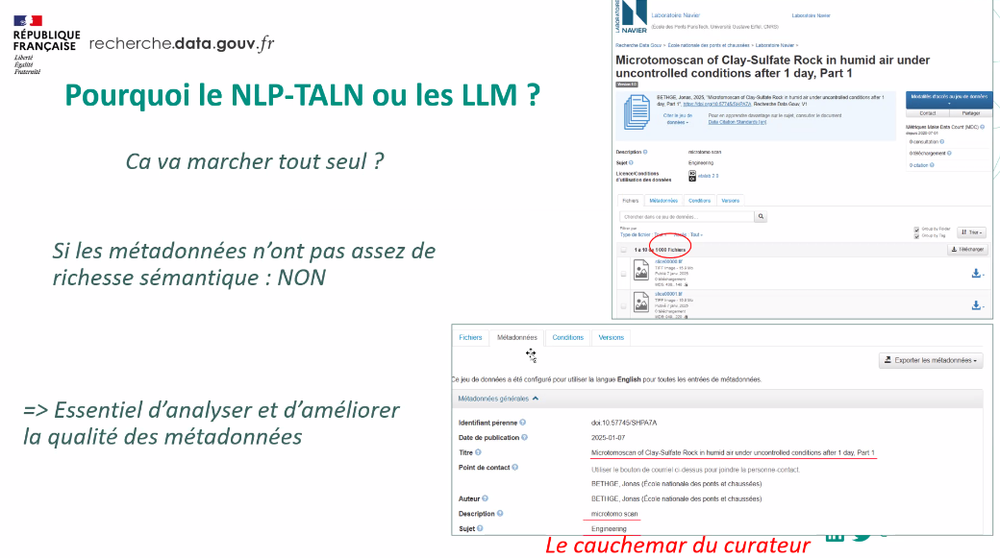

#données_recherche #veille

Dans le domaine de la [[veille informationnelle]] : sélection et éditorialisation minimale d'une information obtenue grâce à la veille sous la forme d'un produit documentaire destiné à un public particulier. 
A l'aide d'outils comme scoop.it par exemple

Dans le domaine de la gestion des données, 

Le stockage des données ne consiste qu'à conserver à l'identique les données de recherche dans un espace où on pourra les trouver en cas de besoin. 

La curation de données  est plus exigeante et en tant que telle nécessaire pour la pérennité de l'accès à ces données. Elle englobe : 

- la manière dont les données vont être converties d'un standard à l'autre pour éviter l'[[obsolescence logicielle]] et faciliter l'[[accès pérenne]] (cf. Principes [[FAIR]])
- La manière dont les données vont être décrites au fil du temps pour en faciliter la réappropriation

(Source : Marie Puren, [[Plan de gestion des données]][[@PurenCreersonplan2021]])

La curation est le processus par lequel un curateur ou une curatrice veille à la qualité des métadonnées et de la description des jeux de données qui sont déposées dans un entrepôt comme [[Recherche data gouv|Recherche Data Gouv]]

le cauchemar du curateur : un dépôt de 1000 fichiers TIF (qui crée 1000 [[DOI]]) au lieu d'une archive Tar qui les contient, sans description précise de ces jeux de données. 
Les jeux de données mal décrits, ne seront pas facilement trouvables ni à partir d'une recherche ordinaire via des mots-clé, ni à travers un assistant AI 

