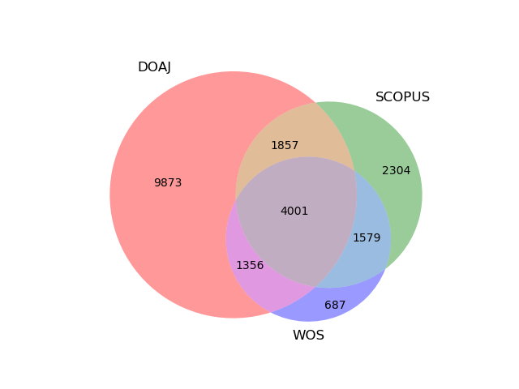

# Couverture du DOAJ

Le DOAJ permet de rendre visible des journaux de qualité qui ne sont pas indexés par le WOS ni pas SCOPUS 

source : https://blog.doaj.org/2023/07/06/doaj-is-confirmed-as-a-unique-platform-for-many-open-access-journals-and-a-key-index-for-african-journals/

<iframe src="https://masto.ai/@DOAJ/111250553052103792/embed" width="400" allowfullscreen="allowfullscreen" sandbox="allow-scripts allow-same-origin allow-popups allow-popups-to-escape-sandbox allow-forms"></iframe>

# le DOAJ comme liste blanche pour les publications

[abandon du sceau](https://fediscience.org/@petersuber/113793424862556798)

$\newline$
# bibliographie
$\newline$

