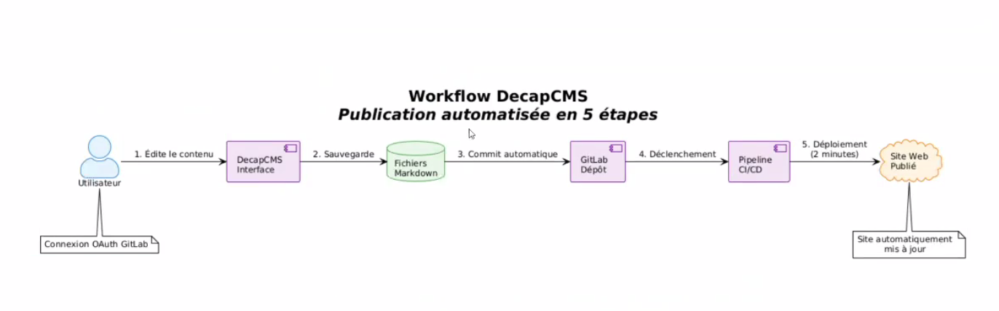
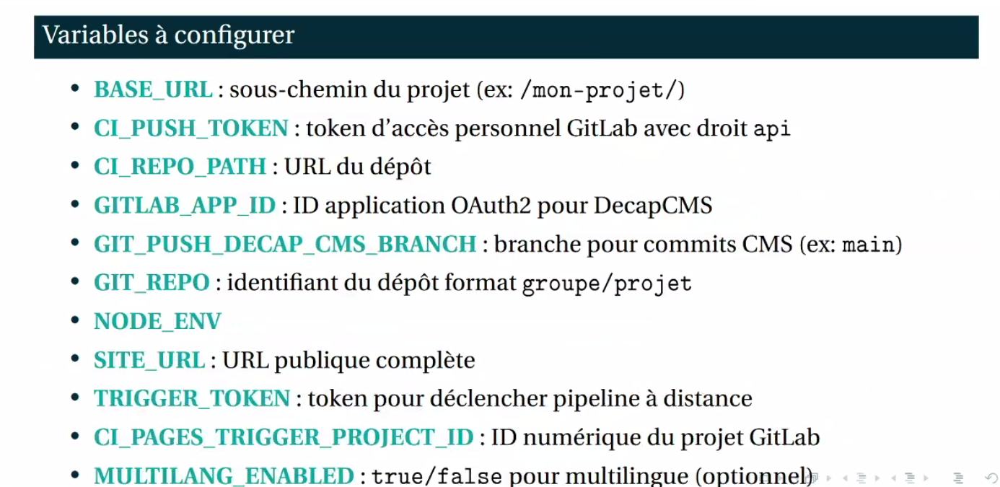
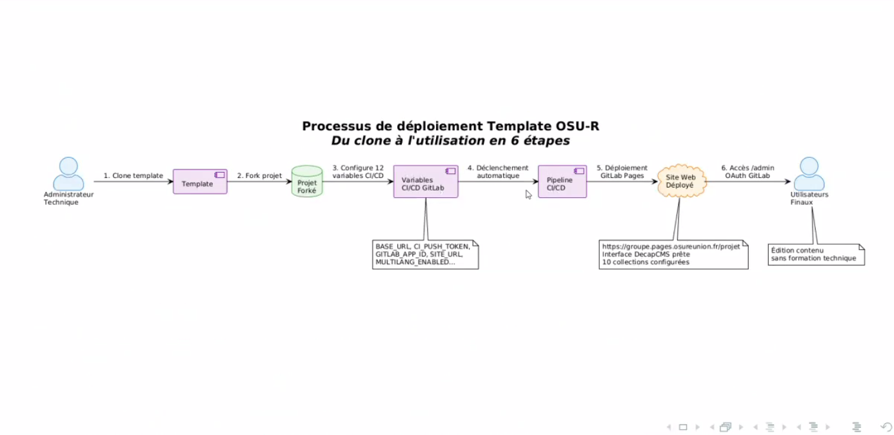

[Présentation de Julien Le Normand]([https://sist.cnrs.fr/wp-content/uploads/2025/07/presentation_cafe_sist_decap_pages_starter.pdf](https://sist.cnrs.fr/wp-content/uploads/2025/07/presentation_cafe_sist_decap_pages_starter.pdf), stagiaire de M2 encadré par Victor K'Bidi, chercheur à l'OSU Réunion, 11 juillet 2025.

Constat que le déploiement manuel de sites sous wordpress pour des projets de recherche est chronophage

- Le recours à une solution avec gitlab Pages permet de déployer des sites de manière plus rapide et de les maintenir avec moins de mises à jour à gérer.
- le recours à DecapCMS  permet d'éliminer les vulnérabilités propres à Wordpress (liées en partie aux plugins non mis à jour et soumis à des attaques)
- Le coût d'hébergement est réduit (coût du serveur de l'Université ou du labo qui héberge gitlab)
- L'utilisateur n'a pas besoin de toucher au code (présence [[interface graphique]])
 - Le déploiement se fait en moins de deux minutes et ne requiert pas vraiment de formation technique par exemple pour contrôler le pipeline d'intégration continue. 
 - grâce à [[Git]] le chercheur ou la chercheuse peut disposer d'un historique complet et revenir à des états antérieurs du site

cas concrets : gestion d'équipes de projets, partage de documentation et diffusion de résultats. 

 
interface multilingue, par défaut FR et EN, possibilité d'ajouter de nouvelles langues (détection automatique de la langue du visiteur)
DecapCMS fonctionne avec Astro et React et comporte 10 collections CMS complètes

Les sites générés avec DecapCMS disposent d'un annuaire de l'équipes, d'une FAQ, de caroussels, d'une fonction de blog ; on peut y encapsuler des visualisations de données en *iframes* provenant de plotly ou de grafana. 

La charte graphique est adaptable
Un moteur de recherche permet d'explorer l'ensemble des articles de blogs ou catégories et inclut le tri par différents critères dont la date de publication, le téléchargement de documents est également prévu. Par contre toutes les données sur le site sont visibles pour tout le monde, on ne peut pas sérier les usagers par accès en lecture. 

pipeline de déploiement se fait en 5 étapes :

préparation > gestion multilingue > génération dynamique des données > build

le build se fait en \- de 2 minutes

Comment créer un site à partir de DecapCMS ?

1. [cloner](https://gitlab.osureunion.fr/hub/decap-pages-starter) et forker le template de l'OSU Réunion
2. modification d'une douzaine de variables d'environnement
3. lancement du pipeline [[CI/CD]]
4. donner accès aux utilisateurs (authentification via Gitlab)

12 variables d'environnement à modifier :

limites : 

modifications qui ne sont pas instantanées pour l'utilisateur (ce n'est pas du [[WYSIWG]], les modifs sont prises en charge par le système d'intégration continue)
L'interface de DecapCMS est un peu lourde sur certains points. 
Un peu moins flexible que Wordpress pour la customisation

Les données chargées sur le site doivent pouvoir être rendues publiques et accessibles via Internet. 
Projet : étendre ce template à tous les projets de l'OSU. 

site démo (rempli avec du Lorem Ipsum)

https://hub.pages.osureunion.fr/decap-pages-starter

embarquement d'iframes venant de grafana ([[visualisation de données]])

bénéfices : 
- gain de productivité (modification facile du site)
- standardisation des sites
- sécurité renforcée (par rapport à Wordpress)
- simplicité (no code)
- meilleure visibilité pour certains travaux de recherche, meilleure diffusion de contenus

nom de domaine attribué au site au niveau du gitlab
