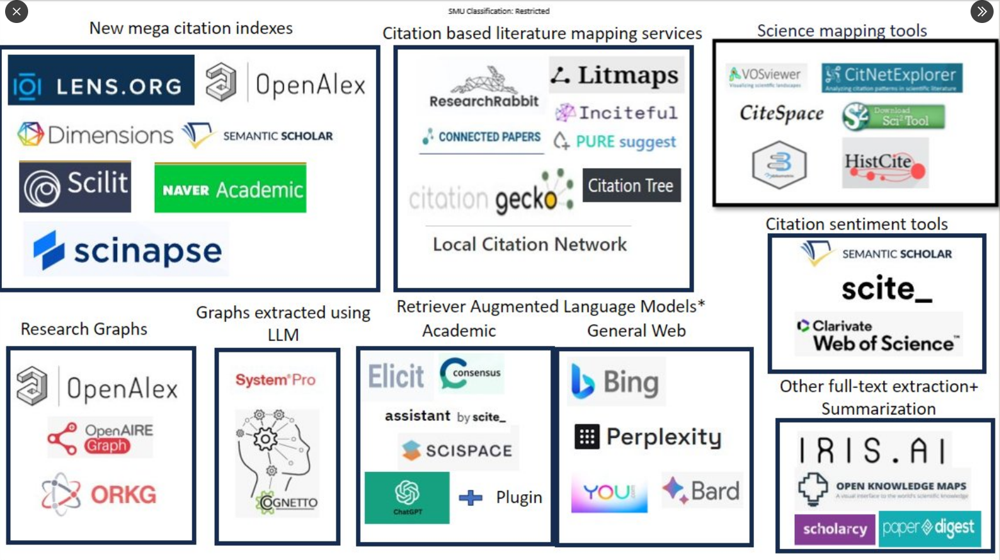

# What is AI

Source : https://raise.mit.edu/daily/whatisai.html

an [[grands modèles de langage|artificial intelligence]] makes computer more intelligent to perform tasks in order to recognize things. 

They are trained on huge datasets with a learning algorithm to make predictions. 

define a dataset and a learning algorithm

examples of AI : spam filter
dataset : past emails one has labelled as spams
texts of these emails. 

[play to quickdraw](https://quickdraw.withgoogle.com/#details)

send the list of your drawings. For one or two see how the AI managed to guess what you draw in less than 20 sc

algorithms, like recipes, are a set of instructions that modify an input to produce an output


# limitations of AI

## Carbon footprint and environmental costs

water consuming (high environmental cost), shoud be sparingly used ([[@raicuAIAlreadyHad2023]]). A community of Chile(Chili) successfuly opposed resistance against Google's project, supported by a right-wing government, to build a datacenter in a region where water may be a problem during the dry season [[@marxHowStopData2024]] 
A Google data center would have used 169 l/s in order to cool off its servers. This water would have crucialy missed to the population.

Making a prompt with ChatGPT consumes as much power as fully loading one's smartphone ([[@heikkilaAICarbonFootprint2023]])

resources consumption for **training** AI tools + **inferences** with AI during their life-cycle (training : 20% - inferences : 80% according to Amazon (AWS cloud) [[@luccioniPowerHungryProcessing2023]]) : 
- water resources (refreshing servers)
- energy consumption and greenhouse gas emited
- rare earth materials (production of servers)

Text or image [[classification]] are more energy-efficient than text and image generation (factor from one to ten)

the most energy-efficient text generative LLM consumes 16% of the full charge of a smartphone for 1000 inferences (=prompts), while the least energy-efficient image generative LLM consumes for each inference nearly the full charge of an average smartphone (0,012 Kw/h) according to [[@luccioniPowerHungryProcessing2023]]

| type of LLM | number of full load for an average smartphone |
|:---:|:---|
| text classification (1000 inferences) | 0,002 / 0,012 |
| image classification (1000 inferences)| 0,007 / 0,012|
| text generation (1000 inferences) | 0,047/0,012 |
| image captioning (1000 inferences) | 0,063/0,012 |
| image generation (1000 inferences) | 2907 / 0,012 |
(source : [[@luccioniPowerHungryProcessing2023]])

**One image generation inference is nearly as costly as a full load of a smartphone**


## lack of openness

are not open, even when designers say they are: 
sometimes the sourcecode is dowloadable, sometimes the data with which the AI was trained are accessible, sometimes the model can be modified.
The licence is generaly not an open licence, but a specific licence designed by lawyers on the account of the society who built the AI. 
In all those cases, AI is not reproducible : 

> But even the most "open" systems can't be independently replicated, due to raw computing requirements. This isn't the fault of the AI industry – the computational intensity is a fact, not a choice – but when the AI industry claims that "open" will "democratize" AI, they are hiding the ball. People who hear these "democratization" claims (especially policymakers) are thinking about entrepreneurial kids in garages, but unless these kids have access to multi-billion-dollar data centers, they can't be "disruptors" who topple tech giants with cool new ideas. At best, they can hope to pay rent to those giants for access to their compute grids, in order to create products and services at the margin that _rely_ on existing products, rather than displacing them.

([[Cory Doctorow]] [[@doctorowPluralisticOpenAI2023]])

also even if the AI tool is based on large public datasets, these datasets need to be filtered, which represents a huge amount of time and money. This task cannot be achieved by a single programmer. 
# AI-powered academic research


list of AI powered tools used by scholars to find an retrieve scientific texts: 
https://musingsaboutlibrarianship.blogspot.com/p/list-of-academic-search-engines-that.html
(list made by Aaron Tay)

What's the point of looking for previous academic works on a topic? 

- to identify gaps in scientific research (and lead new experiments)
- to start from where the scientific discussion has stalled and not reinvent the wheel

Do all the works published on a topic have the same value ? 

- they have different purposes : clinical trial, literature review, data paper, dateset
- they have not the same impact (usually is this influence measured after the number of citations). Some papers are more influencial than others. Some datasets are more re-used than others. 

When relevance is the most needed

On a new or very specific subject, when there are still not much literature published on that topic, relevance is an important criteria (as well as exhaustivity)

When influence is the most needed

Let's assume that we want to know on a specific subject what is trending and what direction research is heading to, we ought to harvest the most influential studies on a subject? 

When exhaustivity is the most needed

If there are only few papers published on a new or very specific topic, an exhaustive research will be not only possible but also recommended. 
In medical sciences, even if there is already a large literature on a subject, exhaustivity is required to draw a systematic research. Data will be involved in this search (especially data from clinical trials) ; these data may be pooled so that new evidence could be obtained, sometimes without any extra experiment.

According to our goal, our research strategies may vary a lot. 

Why reproductibility is important when we speak about research strategies ? 

when you introduce your work by saying (or letting people think) that this is the amount of all the research done on a subject, anybody would be right asking you : "how could you be so sure that you have not missed any publication"?
In the internet Era, for non scientific information, it has become impossible to prove at a given time that we have collected all the data available on a subject : 

> The history of twentieth-century conspiracy theories demonstrates that the interpretive practice does not in fact end but continues to engage in the search for more connections in the present and past ... The future, when the secret will be revealed, never arrives." In this regard, as Jodi Dean observes, the logic of conspiracy theory fits neatly with that of the online information environment in which we are overwhelmed by a flood of information which suggests that our knowledge is always incomplete, that there perpetually remains a layer behind the scenes that eludes us.

(source : [[@andrejevicInfoglutHowToo2013]])

If at a given time we want to convince our peers that all the available scientific information has been gathered by us, then we have to be transparent with the methods we used to gather these sources, letting other scientists to reuse the same methods later and identifying which new papers were published in the meantime. 

Transparency is important for reproducibility : if I want to make sure that the study was let without errors or biases, I need to assess the requests that were sent to search-engines, I need also to know a bit about how these search-engines usualy work, and if they work the same whatever be the user's history of research for instance. This is what we call reproductibility or [[reproductibilité|reproducibility]].

Later if I want to replicate the study, I also need the requests which were performed, in order to discuss them and suggest additionnal keywords or associations : this is what we call replicability



source: Aaron Tay (https://twitter.com/aarontay/status/1676274770307088384)

See [[Retrieval Augmented Generation]] tools (RAG)

what are you looking for ? 

| need | type of search | type of request (human led) | type of AI that may be associated |
|:---:|:---:|:---:|:---:|
|the most relevant paper on a subject that you are obsessed with?| looking for a single publication | thesaurus, advanced search | note: this single publication may be used as a "seed paper" in a Citation Based Mapping Service     |
|a bunch of some influential papers that deal with a specific question?|  first exploration of a subject | natural language | Consensus.ai, Elicit |
| A 360° view of the literature on a subject (but not exhaustive) | Narrative review | thesaurus, advanced search | Consensus.ai, Elicit |
| an exhaustive search of all what was published on a subject, with the subsequent data | systematic research | thesaurus, advanced search, combination of different searches | AI not recommended (not transparent, nor reproductible) | 

## The role of research graph.

What is a resarch graph?

A citation graph shows who cites whom and is cited by whom

task : 

provide the student with a list of DOI and ask him to make a prompt for ChatGPT to convert these links into bibliographic records in a bibtex file 

a bibliographic record in a bibfile looks like below:


```bibtex
@article{doi:10.1016/s0021-9258(19)52451-6,
  title={The Lowry Method for Protein Quantitation},
  author={Lowry, Oliver H. and Rosebrough, Nira J. and Farr, A. Lewis and Randall, Rose J.},
  journal={Journal of Biological Chemistry},
  volume={193},
  number={1},
  pages={265--275},
  year={1951},
  doi={10.1016/s0021-9258(19)52451-6},
  publisher={American Society for Biochemistry and Molecular Biology}
}
```
make a video showing how to use [Citation Gecko](https://www.citationgecko.com/), then ask the student to import a bib collection of references into CitationGecko and to find out which(s) paper(s) is/are cited at least by three different seed papers. 

ask them to add this paper as a seed paper and to do the research one more time.

On CitationGecko, see [[Compléter une revue de littérature]]

how to include *researchrabbit* AI powered tool in a protocol for systematic research.


## analyse the citation link through the context of the citation (=citance)

The place of the citation in the paper determines the way the cited paper is used. 

some AI tools analyse on a semantic level the paragraph in which the citation occurs, in order to qualify a bit this citation : is the paper cited as trustworthy, or on the contrary, il it mentionned as 

find which paper has results which differ from the results obtained by the authors of this one : 10.1016/j.psj.2020.09.043 . On which question do both studies have dissenting results
(solution : "while Rehman et al. concluded that supplementation of prebiotics or probiotics can improve the growth performance of broilers, Yousefi and Karkoodi, [70] and Sarangi et al. reported contradicting findings; weight gain was not affected by supplementation of probiotics in broiler diet." )

## in the reign of prompts

Prompting to an AI seems something that Librarians usually do with patrons, but it is dubious that there might be anything as a "science of prompts", since we cannot predict the results of our prompt, we cannot explain why these results were obtained and not others. 
It'all empirical and prompts efficiency vary in time according to the changing models of these IA tools. (see more about it here [[@tayPromptEngineeringSomething2023]])


