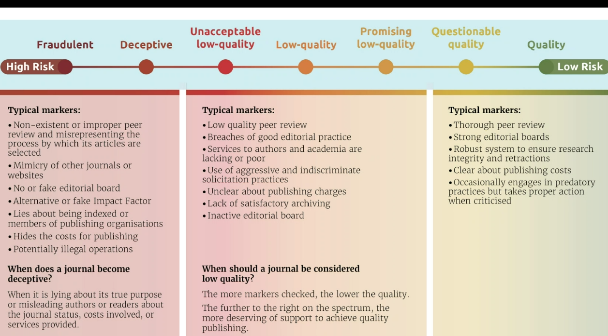
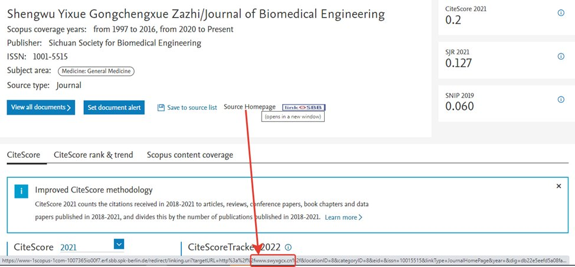
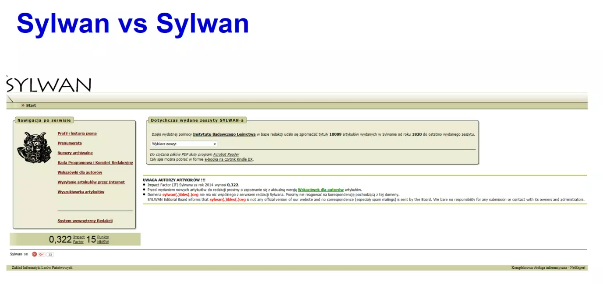
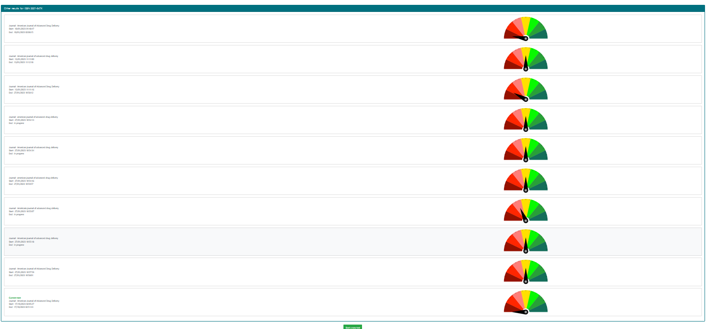
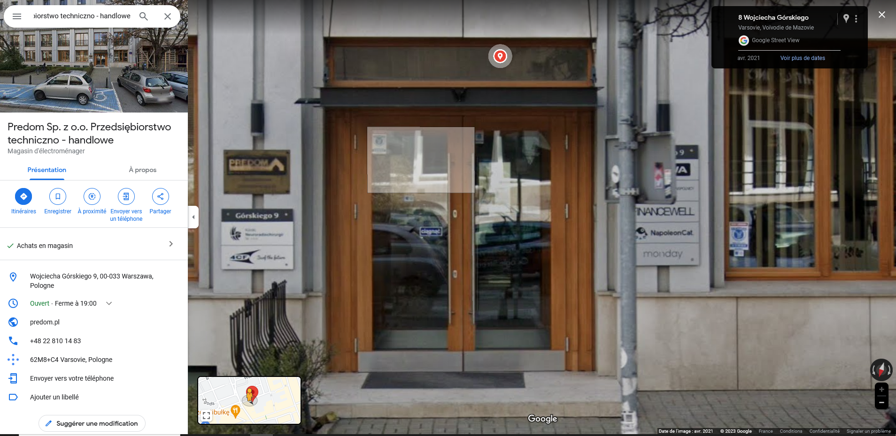

#intégrité_scientifique

voir [[open access]]
voir [[Discussion autour d'une conférence d'Alexandre Serres sur les éditeurs prédateurs]]
voir [[Publier en bonne entente et hors des revues prédatrices]]

définition provisoire de l'éditeur prédateur : les caractéristiques seront développées ultérieurement

> Predatory journals and publishers are entities that prioritize self-interest at the expense of scholarship and are characterized by false or misleading information, deviation from best editorial and publication practices, a lack of transparency, and/or the use of aggressive and indiscriminate solicitation practices [[@grudniewiczPredatoryJournalsNo2019]]

Les 4 grandes caractéristiques des revues prédatrices selon Alexandre Serres.
IAB : spectre des pratiques.

- revue en libre-accès
- évaluation par les pairs déficientes ou absentes
- mimétisme à l'égard des [[revues scientifiques]] légitimes qui peut aller jusqu'à l'usurpation d'identité : Preventive Medicine (Elsevier) // Journal of Preventive Medicine
- pratiques commerciales aggressives : spams et si on répond harcèlement (spams (over-flattering emails received by researchers, voir [lettre interactive pédagogique](https://view.genially.com/6568e905a90e77001494859c) mise au point par l'Université de Montréal pour sensibiliser les chercheurs aux mails reçus des éditeurs prédateurs))

voir aussi conférences prédatrices, réalisées par les mêmes éditeurs (imitation de vrais sites de colloques). CABELL Predatory Reports : 50 000 conférences prédatrices organisées par WASET partout dans le monde. Certains pensent qu'il y aurait plus de conférences prédatrices que de vraies conférences aujourd'hui [[@blochEnqueteConferencesPredatrices2017]]. 

Cabells Predatory Reports : 1800 revues prédatrices naissent chaque année, 

Outils pour détecter les revues prédatrices

https://kuk.muni.cz/predatori/?page=0&lang=english
list of criteria rooted in the critic of previous works such as Beall's list. 

Compass to publish

# des dérives éditoriales diverses

Même s'ils n'éditent pas les contenus que leur cèdent les [[doctorants]] en open access, certains éditeurs parasitent le marché en proposant une publication en format imprimé de très mauvaise qualité. C'est notamment le cas des Editions Universitaires Européennes, qui démarchent principalement des [[doctorants]] sur le point de soutenir leur thèse. Les doctorants n'ont pas à payer pour ces publications, en revanche, ils cèdent leurs droits ce qui peut constituer une véritable entrave pour publier ensuite chez un éditeur sérieux (source: https://twitter.com/ThomasGeha/status/1544598685102866433)
Prix de vente de l'exemplaire ci-dessous : 71 euros !

## conférences prédatrices

<!-- expansive conferences fees for conferences whose programmes are chaotic and do not make sense at all --> 

utiliser Think, Check, Submit pour vérifier si la conférence n'est pas prédatrice. 

# contexte de l'apparition des éditeurs prédateurs : le développement de l'accès ouvert payant

Raisons de l'apparition du phénomène : 
- pression à la publication ([[publish or perish]]) et modalités quantitatives d'évaluation : 

<!--Academia stuck in the transition from quantitative to qualitive evaluation methods : breeding ground for predatory open access -->
- tournant vers l'accès ouvert : apparition de pure players de l'open access 
<!--POAP parasite open access, exploit the crystal-clear philosophy of open access -->
- "perversion" de la notion de Gold OA (publication en accès ouvert) vers la publication payante pour l'auteur avec [[APC|APC]] pouvant monter à plusieurs milliers d'euros par article. Se demander dans quelle mesure les éditeurs prédateurs ne sont pas partie prenante de ce nouveau régime économique de publication plutôt qu'une conséquence encore non maîtrisée [[@Therenoblack2020]] 
<!--Predatory : non transparent or lacking information on APC -->
- focalisation sur l'indexation des revues 

<!--  false indexation  (POAP mimick the metrics, use misleading metrics -->
([[bibliométrie]])
<!-- non-transparent peer-review process -->
# controverses politiques sur la notion d'éditeur prédateur

## une définition souvent binaire et inadéquate

### les zones grises

(source : Lukas Plch)

"low quality" is not the same as "predatory". a low quality journal can improve with time.

la perspective d'une division des conférences et des journaux scientifiques entre d'un côté les bons journaux/conférences, et d'un autre côté la liste des acteurs malveillants est obsolète. On est plutôt sur un continuum qui va de l'excellent journal à la proposition intégralement malveillante mais en passant par tout un nuancier d'acteurs qui ont des process de publication et de qualité assez faibles ou pas encore au point. 

Un grand nombre de journaux dits "prédateurs" sont en général des journaux dont les auteurs ne sont pas malveillants (journaux tenus par des chercheurs par exempel) mais qui n'ont pas les reins assez solides pour garantir un travail de reviewing suffisant aux yeux des standards actuels. 
Le rapport de l'IAP insiste sur l'idée de voir la question sous l'angle d'un spectre avec à un bout le journal qui a une réputation et dispose d'un contrôle qualité suffisant et à l'autre , le journal malveillant qui n'existe que comme ressource lucrative[[@CombattingPredatoryAcademic2022]] : 

>This spectrum approach is a stimulus for starting a new, more nuanced conversation that avoids the binary classification of good and bad, safe and watch, in and out journals. It is not perfect but is fundamentally about transparency rather than making value judgements, as the value of certain traits may differ in different geographic contexts. The spectrum supplements the “international consensus” definition published in Nature (2019) as a tool for user communities to better understand and navigate their way around them

## des critères pas toujours fiables pour les détecter

- vitesse du processus de revue par les pairs

peer review speed : the most discussed criterium wihtin this field these last years.

- taux d'autocitation

## un concept destiné à renforcer les positions dominantes ?

> high fees in eminent journals may be criticised, but they would never be labelled as ‘predatory’, even if their business models may be economically exploitative. 

([[@Therenoblack2020]])

Les éditeurs prédateurs ne sont-ils pas les grands éditeurs à 40% de marge, les éditeurs dits prédateurs seraient plutôt des éditeurs imposteurs.
Le biais anti-open access (Jeffrey Beale)
Le terme est-il forgé pour disqualifier des journaux auxquels contribuent des chercheurs des pays en voie de développement (certains vont jusqu'à parler d'un [[néo-colonialisme]] en terme d'édition scientifique). Une controverse existe par exemple sur le caractère raciste ou non du classement des revues de Beale[[@TeixeiradaSilvaSignsdivisivenessdiscrimination2021]]

intérêt des gros éditeurs à élever le niveau de qualité d'un journal pour le mettre au dessus des capacités financières d'un nouvel acteur sur le marché (tous les critères de qualité ne se valent pas dans ce contrôle qualité)

## au moins, les prédateurs publient tout ce que vous leur soumettez

au moins, les prédateurs publient tout ce que vous leur soumettez, y incluant les articles comportant des résultats négatifs et des [[Negative data|données négatives]]
En revanche, les éditeurs sérieux, sont très réticents à publier des travaux qui ne confirment pas l'hypothèse testée et ce [[biais de publication]] peut aussi entraver l'avancée de la science.

> "Predatory" publishers have some problems, including intransparent and excessive fees, unclear commitments to archiving etc. But they do (probably mostly) publish the work they get sent, without demanding that authors hide inconvenient results or make things up etc.

(source[[@nilsonneGustavNilsonneTwitter]])

Si on peut toujours soumettre ces résultats négatifs sur un serveur de prépublications, il n'est pas si courant que les revues de littérature prennent en compte les prépublications.

# Comment repérer un éditeur prédateur ou de faible valeur ajoutée

## Design du site

### board et auteurs
https://twitter.com/mixlamalice/status/1617439961686605824

# Les conséquences de cette prédation

## Conséquences pour le chercheur et son équipe
Les éditeurs prédateurs font signer des clauses du type cc-by (creative commons). Le droit d'auteur français prévoit un droit de rétractation inaliénable, quelque soit le type de convention sous laquelle on publie. Le droit français en théorie s'impose mais l'éditeur est susceptible de ne pas le reconnaître et peut considérer que le droit qui prévaut est celui de son contrat (CC:by)

>Votre chercheur a accepté d'attribuer une licence "CC BY" sur sa publication qui est une licence considérée comme définitive et qui permet une exploitation commerciale de son article. Cependant, le droit français considère qu'on ne peut pas céder ses droits moraux, parmi lesquels le droit au repentir. La loi est supérieure à une licence mais le problème est que ce sera difficile à faire accepter par la revue, qui elle-même est localisée au Royaume-Uni et dépend donc d'un droit de copyright qui ne prévoit pas le repentir.

>Bref, si la revue fait preuve de mauvaise volonté, ce sera difficile de retirer l'article

[[@HannounPartageMailsediteurs2022]]

Parfois une deuxième publication dans un journal sérieux est possible, mais dans ce cas, le coût de la première publication en terme d'argent et et de temps est une perte nette pour le chercheur et son équipe. 

## Conséquences pour les journaux qui exercent un vrai travail de [[Révision par les pairs|peer reviewing]]

## Conséquences pour le public (perte de crédibilité de la science)

Les articles sont publiés comme des résultats validés alors qu'ils ne l'ont pas été et sont parfois cités comme articles validés par des journaux légitimes, cela fait baisser le niveau de la science publiée. 

# Quelles questions on peut se poser pour déterminer si un éditeur est un éditeur prédateur.

## listes blanches et noires

**blanches**

[Liste du Norwegian Directorate for Higher Education](https://kanalregister.hkdir.no/publiseringskanaler/Forside.action?request_locale=en)

Garanties de qualité des revues : COPE, DOAJ
La présence d'un titre dans le JCR n'est pas une garantie de qualité en revanche (cf. conclusion de l'Université de Masaryck sur le sujet en 2019)
A la fin de la liste de Beall, 3% des journaux présents dans cette liste étaient également indexés dans Scopus [[@plchKontrolaDodrzovaniPrincipu]]

**noires**

(biased, non transparent, incomplete) A black list will never be complete (neither a white one)
La liste mise en place par Jeffrey Beale est toujours disponible mais n'est plus [[mise à jour]] depuis 2018, Beale ayant du interrompre son activité sous la menace de poursuites de la part d'éditeurs. Liste archivée sur Github[[@StopPredatoryJournalsStopPredatoryJournals2021]]. La liste n'est donc plus à jour, certains titres incriminés en 2018 sont devenus des journaux respectables, certains choix ont été critiqués à juste titre. 

La liste Cabells (incomplete, very expansive, out of date) you need to buy [[black list]] and/or white list) est payante (12000 revues), le choix dans les universités françaises a été fait de ne pas s'y abonner, sauf exceptions. Cette liste s'avère incomplète et perpétuellement dépassée. Le prix de la souscription est considérable (bloody expansive 47 000 euros par an pour une université comme Masaryck) Des recommandations ont été faites par des chercheurs français et belges pour l'améliorer [[@ThirionHowreliableuseful2021]] 

En effet, il vaut mieux investiguer par soi-même et se poser les bonnes questions pour savoir si un éditeur peut être qualifé de prédateur ou pas. 

Ces questions sont résumées dans l'outil [Compass to publish](https://app.lib.uliege.be/compass-to-publish/) de l'université de Liège.

Interroger les doctorants au moyen d'un klaxoon board sur les caractéristiques selon eux des éditeurs prédateurs

demander aux doctorants d'analyser des journaux avec l'aide de COMPASS

critères objectifs : le journal est-il OA au sens précis du terme (avec une licence ?), le prix des APC est-il clairement indiqué (pas de prix par page)?
Mener une analyse qualitative : lire quelques articles, utiliser une liste de critères pour analyser la méthodologie, les résultats de quelques articles
trouver de l'info complémentaire : [[retraction]] watch + Scholarly Kitchen

evaluation of untrustworthy journals : transition from criteria

A Masaryck, trois bibliothécaires en mesure d'analyser des cas qu'on leur soumet (Petr, Lukas, Jiri). [Formulaire](https://kuk.muni.cz/predatori/?page=0&lang=english) en ligne pour répondre aux demandes.
Résultat de l'analyse sous 5 jours. Réponse sur l'analyse sur des critères objectifs à compléter par une analyse qualitative par le chercheur lui-même. De 2017 à 2023, 315 demandes traitées, 135 journaux sur les 292 étudiés présentaient des difficultés, ne remplissaient pas les critères d'un journal sérieux.

# de l'éditeur en mal d'organisation au pirate

## Les détournements de marque

<!-- mimicking and even cloning the real journals
scrape/harvest the content of the real journal --> 

Les journaux qui usurpent le titre et les caractéristiques d'une revue qui jouit d'une certaine notoriété ("high-jacking journals") pour attirer les soumissions sont les plus susceptibles de tromper les publiants[[@SinghWhatyouneed2021]]. 
Voir la base de données sur les ["journaux piratés"](https://docs.google.com/spreadsheets/d/1ak985WGOgGbJRJbZFanoktAN_UFeExpE/edit#gid=364865985)
et présentation sur le site Retractation Watch

https://twitter.com/AbalkinaAnna/status/1647870705977942017

legitimate : https://web.archive.org/web/20160305164252/http://sylwan.ibles.waw.pl/pls/apex/f?p=105:1:0

Fake : https://web.archive.org/web/20160305164252/http://sylwan.ibles.org/

source (via https://en.wikipedia.org/wiki/Talk:Sylwan) : https://web.archive.org/web/20160305164252/https://scholarlyoa.com/2014/05/02/red-alert-polish-scholarly-journal-is-hijacked/

(source : Lukas Plch, autre source [[@perrinBewarePredatoryPublishers2022]])

Parfois les revues changent de titre (ex: Datascience for transportation), se baser sur l'[[ISSN]] pour savoir si le journal a changé de titre, ou si c'est un journal qui souhaite se faire passer pour un autre (les chercheurs ont peu l'habitude de faire cette recherche pour vérifier qu'il s'agit du même journal)

## des cas patents de prédation

Editions universitaires européennes

La thèse et l'article ne sont pas les seules productions concernées, voir aussi la communication en congrès[[@MostafaThinkCheckAttend2019]]

OMICS[[@SilerPredatorypublisherslatest2021]]
Sur OMICS voir https://www.redactionmedicale.fr/2023/09/les-chercheurs-pieges-par-les-revues-predatrices-manquent-de-connaissance-du-systeme-de-publication-la-faute-de-luniversite

des tentatives timides d'imitation de journaux existants au piratage de la marque et à l'imposture assumée.
Différence entre [cet article](https://www.omicsonline.org/clinical-infectious-diseases-practice.php) et [celui-ci](https://academic.oup.com/cid/) , voir [Wikipedia](https://en.wikipedia.org/wiki/Clinical_Infectious_Diseases)

## Un clair-obscur  : Dans chaque institution, le statut de certaines publication est controversé

cf. [[MDPI]]

Dans le large spectre des journaux qui ne sont pas présents dans [[DOAJ]] ou indexés par [[WOS]] ou Scopus, plusieurs nuances entre le journal prédateur qui usurpe la marque d'un journal reconnu et la start-up qui n'a pas eu le temps de réunir encore un board suffisant pour faire du [[Révision par les pairs|peer reviewing]] de qualité. 

# Je me suis laissé prendre, que puis-je faire ? 

Si on a soumis et qu'on n'a encore rien payé, ne rien payer et demander la rétractation immédiate de l'article, ne rien payer si cette rétractation fait l'objet d'une demande de versement.

## conséquences négatives

## portes de sorties

note : recueillir des témoignages de doctorants

# retour sur Compass to publish

Christophe Dony et Rémy Lhoest [compass to publish](https://app.lib.uliege.be/compass-to-publish/)

les chercheurs contactent les bibliothécaires sur le sérieux des revues prédatrices. 
pratiques différentes en fonction des disciplines : envoyer son paper à l'éditeur par mail n'est pas un usage problématique en sciences humaines alors que c'est une pratique en sciences exactes qui est inhabituelle.

Le DOAJ en tant que liste positive n'est pas exhaustif : il faut que la revue ait fait la démarche d'intégrer le DOAJ. 
Le DOAJ entretient une [liste négative de revues qui prétendent faire partie du DOAJ mais en réalité n'en font pas partie](https://docs.google.com/spreadsheets/d/1Y_Sza4rPDkf-NNX9kwiErGrKeNTM75md9B63A_gVpaQ/edit#gid=0.

coût de la mauvaise publication 2,6 milliards selon le rapport IAP (2002)
predatory conferences

compass to publish : 26 critères retenus et classés en 7 catégories :

- listes de confiance
- listes de revues prédatrices
- contrefaçons
- métriques et référencement
- comité de rédaction, révision par les pairs
- présentation, design
- pratiques de communication

permet d'afficher les tests déjà conduits sur une même revue avec les diagnostics et le temps imparti pour les établir. 

exemple fourni : American Journal of Advanced Drug Delivery

intégration dans le DOAJ : + 10 points mais pas de point négatif si ce n'est pas le cas. 

![[Compass To Publish.htm]]

## exemples de tests réalisés avec Compass to Publish

#### American Journal of Advanced Drug Delivery

(Zotero : compass to publish)
#### Polish journal of science

#### Clinical infectious diseases : open access
https://www.hilarispublisher.com/clinical-infectious-diseases.html

# paper mills

[[Paper mills]] Société qui offre à des auteurs de payer pour ajouter leurs noms à des articles élaborés par des intelligences artificielles ou des petites mains. 
On achète la présence de son nom dans les auteurs d'un article qui va être publié dans un véritables journal. Menace de subversion des comités éditoriaux qui ne peuvent pas tout refuser. 

# Bibliographie

Conférence Alexandre Serres du 16 février 2023 ([voir discussion](Discussion%20autour%20d'une%20conférence%20d'Alexandre%20Serres%20sur%20les%20éditeurs%20prédateurs.md))