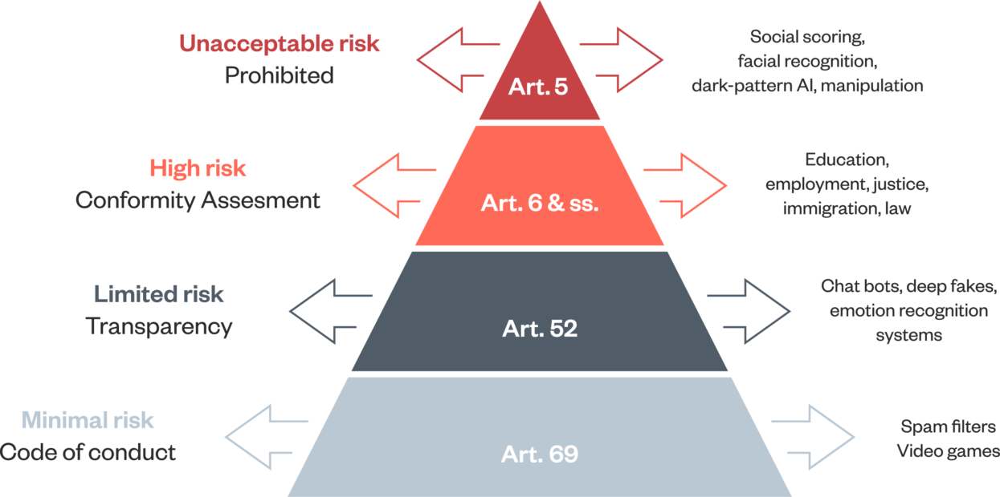
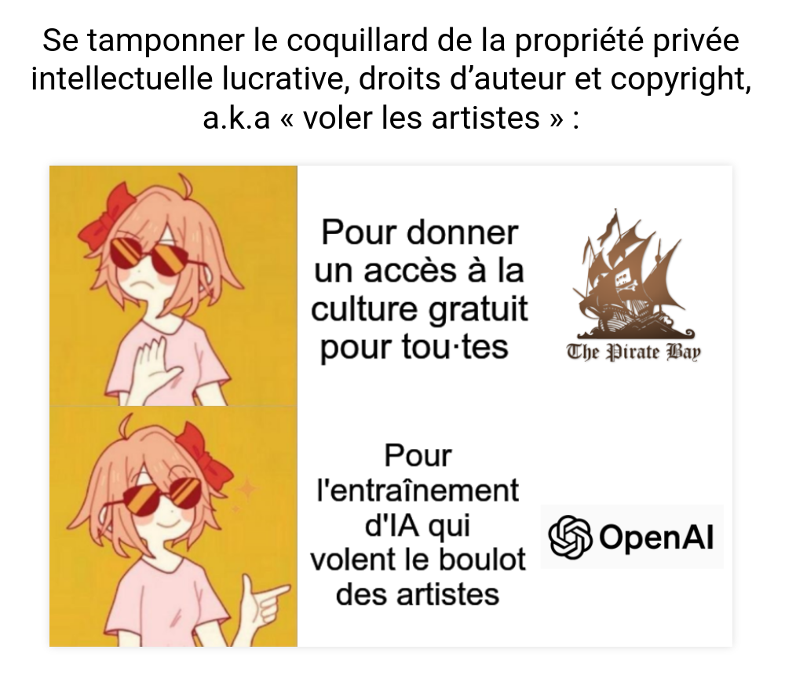

Alexandra Bensamoun (prof. droit privé)

co-autrice du rapport ministériel sur les outils d'IA remis au Président avec Yann Le Cun (Meta/Facebook) et Arthur Mensch (PGD Mistral ([[Mixtral]]))

mai 2024 : AI act (règlement européen sur les outils d'IA). Première législation mondiale sur l'intelligence artificielle qui entre en vigueur le 13 juin 2024.
Plus résolutions de l'[[ONU]], de l'UNESCO et de l'OCDE sur les outils d'IA. Un traité international a été voté au sein du Conseil de l'Europe en mai 2024 sur ces outils et leurs usages. 

sujet à dédiaboliser mais sans idéaliser (entre technophilie et technophobie)

Garder à l'esprit que c'est une formidable opportunité. 
Eviter d'opposer l'[[innovation]] et la régulation. 
L'objectif est de créer un marché unique mais la force de ce marché est d'être soutenu par l'adhésion des utilisateurs (comme dans le cas du [[RGPD]] et de l'économie des services en ligne)

Quelles valeurs portées dans l'AI Act (promulgué début juillet)

obligation de transparence : lorsqu'on utilise un chatbot, on doit être conscient que c'est un chatbot. (le test de [[Alan Turing|Turing]] est en partie dépassé)

Les images produites avec une IA doivent indiquer qu'elles ont été générées par une IA.

Systèmes d'intelligence à hauts risques : éducation, services publics, ressources humaines et emploi.

en haut de la pyramide des risques, les risques inacceptables comme le [[crédit social]] à la mode chinoise, la [[reconnaissance faciale]] (mais avec des exceptions prévues). Interdiction de l'entrée de ces outils sur le territoire européen.

encadrement normatif gradé en fonction de certains critères : 
- **Puissance** :  est-ce que ce modèle entraîne un risque systémique ou pas ? (cela dépend de la puissance de calcul, après 10 exp25 flop, cela comporte un risque)
- **Ouverture** modèle open source = obligations amoindries
- **transparence** sur les sources d'entraînement. Question de principe (démocratie), mais aussi question de préservation de la propriété intellectuelle (PI) ([[droit d'auteur]])

(source : https://mamot.fr/@p4bl0/112500625605931742)

proposition du rapport : former, informer, acculturer les élèves, les étudiants, les enseignants, et plus généralement la société civile à l'usage des outils d'IA

L'IA pourrait être à l'origine d'un agrandissement de la [[fracture numérique]], il faut s'en garder. Se garder également d'une approche [[solutionnisme technologique|techno-solutionniste]]

Question de Louis Ernenwein
a qui appartient le produit généré : à celui qui a entraîné l'IA ? à celui qui vend le produit ? a celui qui fait le prompt ?

PI s'applique sur le concept d'oeuvre, témoin de l'[[originalité]] d'un concepteur

US: refus de l'US copyright Office de mettre de la PI sur des images générées. 

Réponse : à voir au cas par cas.
On s'est beaucoup intéressé à la PI en amont (sources), on ne s'est pas encore intéressé à l'output.

Comment l'Union Européenne peut s'assurer que cette législation peut s'appliquer au niveau mondial ?

Bureau de l'intelligence artificielle interne à la DGConnect, ce bureau va être chargé de faciliter la mise en oeuvre de bcp des aspects de l'AI Act. 
L'obligation de transparence des sources d'entraînement va faire l'objet d'un template.

$\newline$
# bibliographie
$\newline$

