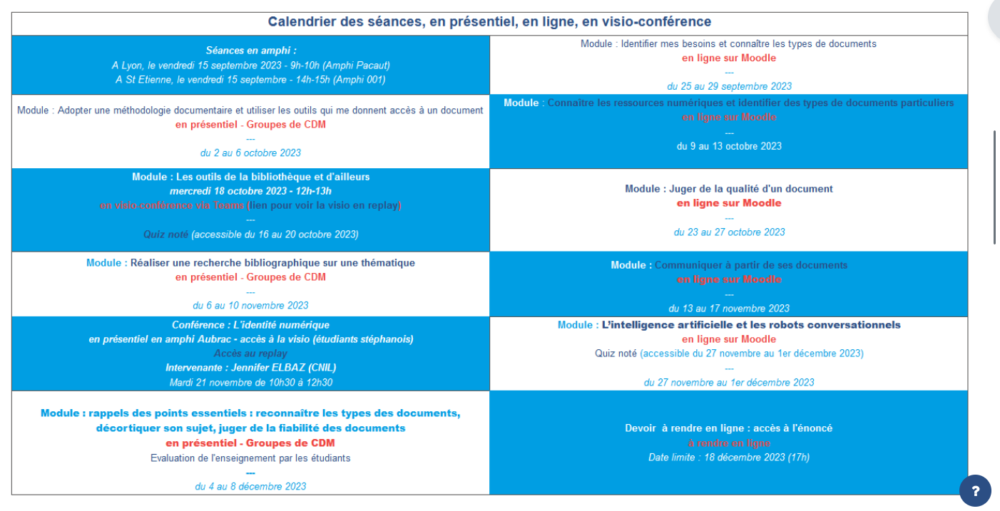
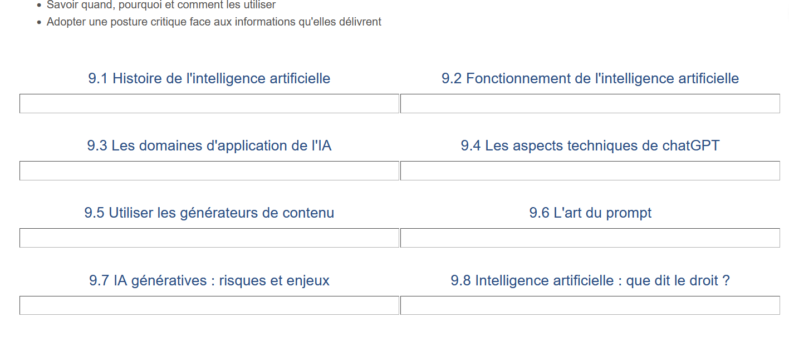

présentation de Fabienne Para (Sciences Po Lyon)

Public : tous les étudiants de 1ère année présents sur 2 campus (190 étudiants sur Lyon, 150 sur Saint-Etienne), pas possible de les réunir sur un même lieu (ce sont les formateurs qui se déplacent)
enseignement obligatoire et noté. 

Sujet : intelligence artificielle (histoire, risques, enjeux, promesses)

source : https://cours.sciencespo-lyon.fr/course/view.php?id=425#section-1
mdp : JNF2024

On sait que c'est vital de former les étudiants à ce sujet des IA pour dissiper les mythes et fantasmes sur le sujet. 

recherche bibliographique à faire pour valider le bloc.

Plan de la partie

wooclap : https://app.wooclap.com/JNFIA/questionnaires/65a8feeb57e6872d201d4e96

Accessibilité de Genialy ? (travail en cours sur Genialy et d'autres supports de Christine Calcei et Emilie Leromain, à paraître bientôt)

satisfaction sur la diversité des supports, les étudiants plébiscitent également l'alternance, mais cela demande beaucoup de mails pour rappeler aux étudiants ce qu'ils doivent faire avant une séance en présentiel. Nécessité de les materner un peu pour que le travail ([[quiz]]) soit fait. 200 étudiants sont concernés.

Le questionnaire (outil: feedback de Moodle) a été réalisé dans les 10 dernières minutes de la dernière séance. 

Mettre en place de l'hybridation est compliqué parce qu'il faut gérer avec la diversité des parcours suivis par ces étudiants pour trouver des créneaux communs pour les séances en mode synchrone.

Les étudiants se réunissent à plusieurs pour voir la séance en visio (difficile d'émarger s'ils sont plusieurs à assister derrière un ordinateur). 
Les étudiants de première année n'ont plus bcp d'intérêt dans les visios synchrones, c'est plus le cas avec les étudiants de 4ème année. 

difficulté de prévoir une note de participation
ceux qui ne se sont jamais connectés à Moodle ont eu des points en moins. Cette note est difficile à mettre mais paraît nécessaire pour favoriser l'engagement étudiant. 

Faire constituer un glossaire par les étudiants sur les concepts de l'IA : les étudiants ont tardé à envoyer leurs définitions jusqu'à la veille de l'échéance et certaines étaient un peu légères, certaines carrément erronées. 

Aborder la question de l'identité numérique 

Peut-être que dans l'hybridation, il faudrait alterner présentiel et formation en mode asynchrone et laisser tomber les visios qui ne favorisent pas l'engagement des étudiants les plus jeunes.

Emilie Leromain : résultat des focus group réalisés chaque année sur les modalités d'apprentissage à l'Université Lorraine : expression d'un ras-le-bol post-covid de la visio, mais retour progressif en grâce du distanciel synchrone depuis deux ans. 