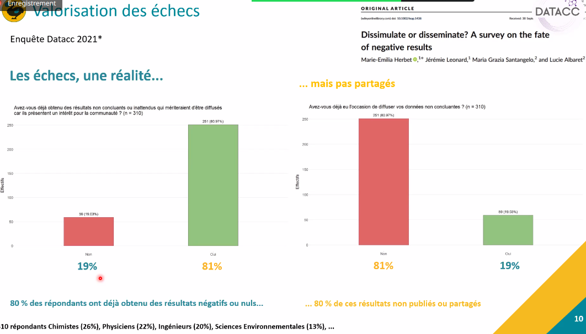

GAthering of Fundamentally Failed EXperiments
(webinaire, printemps de la donnée)

qu'est ce qu'un [[negative data|résultat négatif]]

notions différentes en fonction des disciplines

recherche biomédicale : le résultat ne permet pas de démontrer que le traitement A est supérieur à un traitement B
chimie : des réactifs ne permettent pas d'obtenir le produit désiré
SHS : une enquête de longue haleine qui ne permettent pas d'extraire des résultats significatifs à la fin de l'enquête. 

en général résultats oubliés qui restent "dans le tiroir"
synonymes : résultats nuls, non-concluants, sous-optimaux

Lorsque l'expérience ne permet pas de confirmer l'hypothèse posée initialement. 

important de publier ces résultats pour ouvrir de nouvelles voies de recherche. 

article publié 

journaux spécialisés dans la publication de résultats négatifs : 
- Missing pieces de PlosOne
- F1000 résultats nuls
- Journal of negative results
- Journal of trial and errors
- ACS Omega

- manque de temps
- manque d'information sur comment les valoriser
- manque d'incitations à le faire, notamment du point de vue de la carrière
- confidentialité (fait de révéler le sujet sur lequel on travaille)

inflation des publications : 
1 millions en 2016, 3 millions en 2021 mais réduction du nombre de publications qui publient des résultats négatifs -> [[biais de publication]]

la non publication de résultats négatifs incite à la réplication d'expériences ratées, perte de temps et d'argent

[[CoARA]] pousse dans le sens de la publication de résultats négatifs en évaluant la qualité et la diversité des canaux de diffusion des travaux de recherche plutôt que sur la quantité. 
les bailleurs de fond incitent aussi à publier les résultats négatifs. 

La plateforme vise à réhabiliter les impasses scientifiques en essayant de répondre aux principaux freins observés. 

- publication sans [[APC]]
- possibilité de ne publier que des expériences sans révéler les objectifs finaux de l'expérience.
- système de référencement avec un [[DOI]]
- modération et révision par les pairs ouverte et transparente qui permet de clarifier les échecs ; en faire un outil qui favorise les échanges entre chercheurs sur ces échecs. 
- édition automatisée de l'article à partir d'un formulaire
- [[Open Peer Review|révision par les pairs ouverte]] et transparente (système de revue spécifique impliquant une mise en réseau des chercheurs)

projet de connecter [[ElabFTW]] avec [[Gaffex]] pour une publication plus rapide des [[negative data]] à partir des [[cahiers numériques|cahiers de laboratoire]]
(projet qui sera proposé au FNSO par Gaffex)

Publions moins, publions mieux

plateforme [Gaffex](https://gaffex.org/) 
Actuellement la publication est accompagnée (dans la version beta)
ce travail repose uniquement sur des bénévoles, soutien de la Fondation de France et DATACC + direction de la documentation de l'Université de Bordeaux. 

développement fait de A à Z. 

$\newline$
# bibliographie
$\newline$

