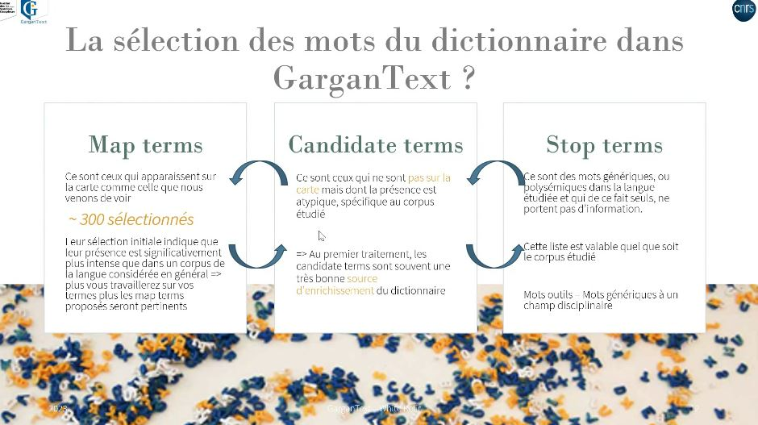
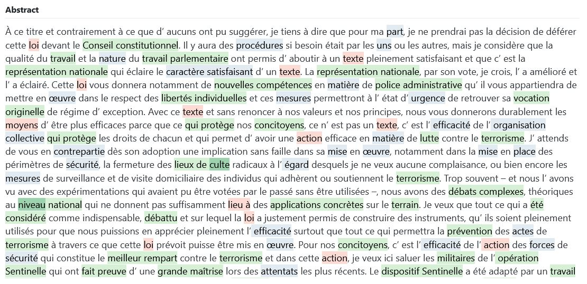
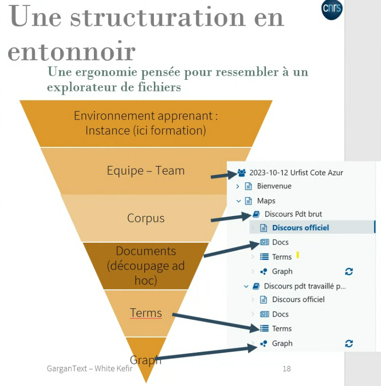

# Introduction à Gargantext

Idée initiale de [[David Chavalarias]]
transformer du texte de manière compréhensible de manière transparente et itérative 

itérative : possibilité d'activer ou désactiver le mot-clé
transparente : possibilité de retrouver toutes les contextes de citation des mots-clé

modèles de langue = supprimer les mots vides dans la langue (le, la, des, etc.) = [[machine learning]]

Gargantext calcule les [[ngrams]] jusqu'aux tétragrammes et construit un énorme dictionnaire d'ngrams. La création du corpus peut prendre plus ou moins une dizaine de minutes. La mise à jour est ensuite bcp plus rapide.

Gargantext dispose d'un corpus de base d'occurrences moyennes des termes dans la langue française et distingue dans les *map terms* les 300 termes qui reviennent le plus souvent parmi ceux qui reviennent plus souvent que dans la moyenne. 
Les termes candidats sont les termes qui reviennent plus souvent que la moyenne et les stop terms sont des termes polysémiques

map term / candidate term / stop term

Dans les mapterms on a des monogrammes ou des polygrammes. Certains sont toujours encore trop génériques : nettoyer cette liste et mettre certains termes en candidates et en map terms. (par exemple le terme *study* est souvent peu pertinent même s'il revient bcp)
De l'autre côté traiter les candidates terms pour voir lesquels intégrer aux map terms. 

Gargantext a une mémoire des map terms, candidates et stop terms et de nos choix antérieurs sur d'autres sujets. Il devient de plus en plus pertinents dans sa délimitation des map terms et des candidates.

dans les textes du corpus : en vert les map terms, en bleu les candidates et en rouge les stop terms.

Cela rend aussi le travail plus intéressant pour le collectif de chercheurs.
Quand on demande un accès à Gargantext, on demande à quelle thématique votre activité est rattachée pour que l'environnement convienne à la recherche.

possible de neutraliser cet effet (si on change souvent de sujets de recherche)
instance Academia pour toutes les personnes qui travaillent sur des thématiques différentes

structure d'une instance : 

la spacialisation d'un graphe prend 10 secondes, elle sera achevée si la [[CPU]] est performante, sinon il faudra la relancer pour l'achever (elle est déjà prête côté serveur)

quand on sélectionne un cluster non pertinent on peut faire du noeud principal de ce cluster un stop term pour se débarrasser du cluster.

# import de fichiers CSV ou TSV

https://gargtools.iscpif.fr/HAL%20To%20GarganText

$\newline$
# bibliographie
$\newline$

