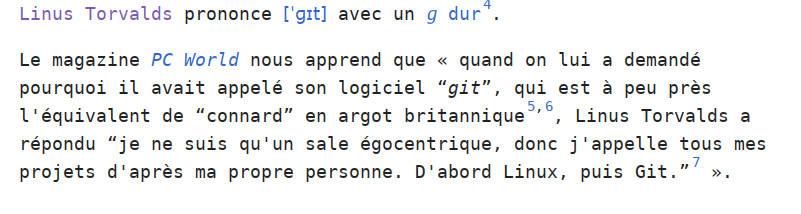
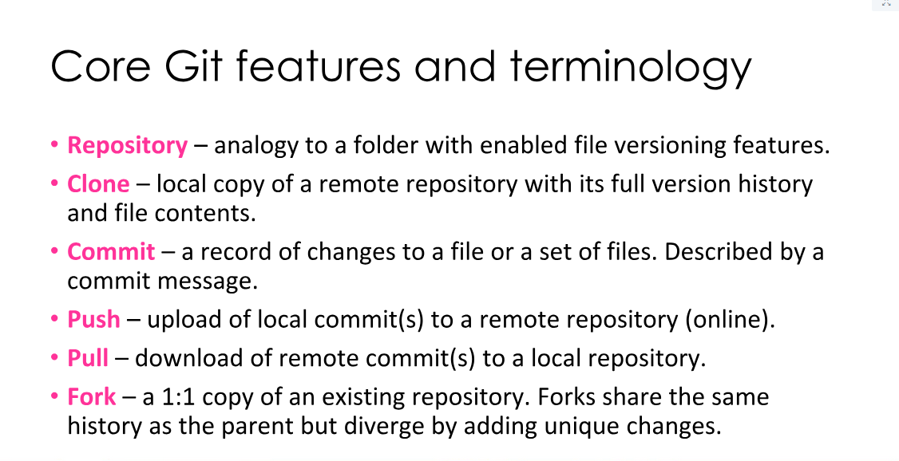
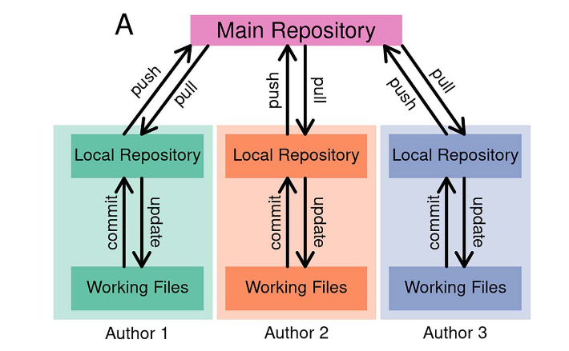
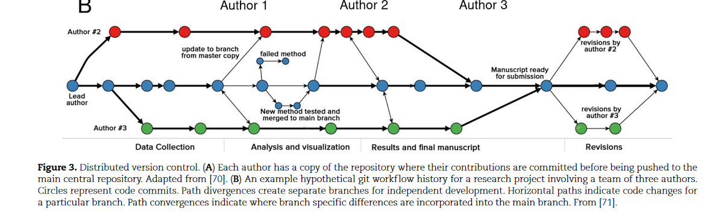
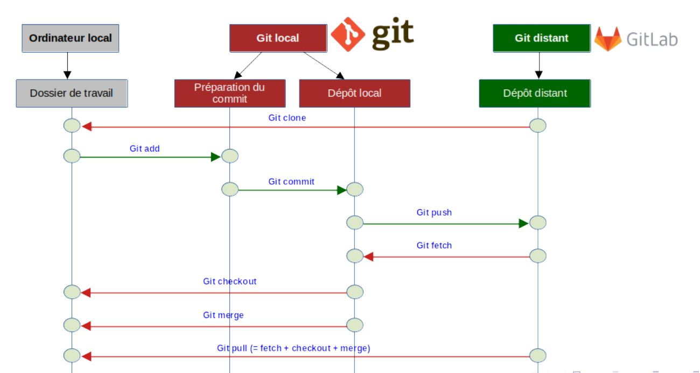

voir [prise en main de Git](https://librecours.net/modules/git/git00/solweb/co/git00.html) tutoriel présent sur Librecours.net

Git est un outil de développement incorporant un contrôle des versions (Distributed Version Control System). Le développeur possède en local une copie du code qui est accessible depuis un serveur central (un hub comme github, propriété de Microsoft, ou Gitlab). Le projet Git a été initié par Linus Torvald (également concepteur du noyau Linux) pour remplacer Beetkeeper qui était un outil de contrôle de version propriétaire. En 2005, les développeurs de Linux se mettent à utiliser Git de préférence à d'autres outils similaires. [[@cassouGitCommentCa2025]]

Git se présente généralement sans [[interface graphique]], en [[lignes de commandes|ligne de commande]] ou bien peut être actionné à travers divers logiciels comme [[Rstudio]] ([[R (logiciel)|R]]), Jupyter ([[cahiers numériques|carnets de note numériques]]) ou l'éditeur [[VS Code]]

Chaque utilisateur récupère le code partagé, le modifie et le renvoie au moyen de commandes simples (pull, push). 


clone : opération locale depuis le serveur
fork : opération à distance (plateforme vers plateforme)

git merge : fusionner deux branches
git blame : chercher à savoir par qui une modification a été faite et pour quoi (voir [exercice](https://learning.skills4eosc.eu/mod/quiz/view.php?id=897))



Différents embranchements du code peuvent être prévus dans le processus. A la fin, on ne fait qu'un seul code de ces différents embranchements (merge)


Git peut également être utilisé pour mener et écrire des études [[reproductibles]]

revenir à une version ancienne n'annule pas les modifications subséquentes

If you revert a commit and go back to a previous version, what happens to commits made after the one, you reverted? Will they also be reverted, or can you "remove" only the changes made in this one commit, but keep changes introduced by others after that?


Un DVCS identifie chaque version d'un code et chaque changement apporté à ce code (commit)

Chaque commit comporte la motivation du changement dans le code, donc on peut mieux en comprendre le sens

Les plateformes Git permettent de rendre le code visible, de le partager mais aussi de le discuter avec d'autres et d'obtenir de l'aide pour résoudre les [[bug|bugs]]


télécharger Git
Créer un répertoire (repo(sitory)) sous github ou gitlab (on fera ici référence à Github)
aller à l'endroit où l'on veut télécharger le répertoire, MAJ+clic droit > ouvrir git bash here


dans ce terminal, pour coller des expressions, utiliser la touche inser

# gérer les fichiers d'un repo
## cloner un repo

Le Ctrl+V ne fonctionne pas dans Git bash, on utilise Shift+Inser.  Les nouveaux ordis portables ont deux touches inser, la bonne est le 0 du clavier numérique (quand celui-ci est désactivé)

télécharger le répertoire vide créé

``````git
git clone repertoire.git
``````

## initialiser le repo et ajouter des fichiers au track

pour initialiser ce répertoire comme étant un répertoire git (va ajouter un fichier caché .git) : 
``````
git init
``````

créer, modifier les fichiers. 
Pour visualiser les fichiers qui ont été créés/modifiés et ne sont pas encore dans le track de git : 
``````
git status
``````
ces fichiers à ajouter apparaissent en rouge

pour ajouter un fichier

``````
git add nomdufichier
``````
pour ajouter tous les fichiers créés ou toutes les modifications de fichiers
``````
git add -A 
``````

## commettre et pousser (commit & pull)

Pour préparer les fichier à l'envoi dans le répertoire distant (commettre)
``````
git commit -m "message indiquant la création ou la modification réalisée"
``````
Il est nécessaire de commettre avant d'envoyer des fichiers / modifications vers le répertoire

pour envoyer les modifs vers le répertoire
``````
git push -u origin
``````
pour lier un répertoire git à un répertoire
``````
git remote add origin liendurepository.git
``````
pour supprimer un fichier du track
``````
git rm fichier
``````

## gestion des branches

pour créer une branche à partir d'une branche existante : 
``````
git branch nomdelabrancheàcréer nomdelabrancheexistante
``````
une fois cette branche créée, l'envoyer sur le répertoire
``````
git push -u origin branchecréée
``````

## gestion des accès

Depuis 2021, l'accès en mot de passe seul depuis un repo en local n'est plus disponible pour des raisons de sécurité. 
Les deux modes d'accès possibles sont les suivants : 

### ssh

en [[SSH]] (se créer une paire de clés ssh et envoyer la clé publique sur le repo)

### avec un jeton personnel

voir documentation [ici](https://docs.github.com/en/get-started/getting-started-with-git/managing-remote-repositories#switching-remote-urls-from-ssh-to-https)

### changer de mode

``````
git remote -v
``````
affiche le mode d'accès (ssh ou https (jeton personnel))

Pour passer en ssh : 

``````
git remote set-url origin git@github.com:USERNAME/REPOSITORY.git
``````

# fusionner deux branches


Mode d'emploi sur ces fonctionnalités de base sur Github : https://docs.github.com/fr/get-started/quickstart/hello-world


Gestion des fichiers lourds (par exemple [[données de la recherche|données de recherche]]) avec [[git-annex]]

# Les commandes qu'on utilise toujours sur Git quand on travaille avec un le repo de quelqu'un :

Dans son dossier sur son poste de travail, passer en revue ce qu'on a modifié : 

```bash
git status
```

Ajouter les modifications dans le fichier git du répertoire (= ici ajouter tous les fichiers)

```bash
git add **
```

Committer 

```bash
git commit -m "mettre dans le message quelques mots-clé sur ce qui a été modifié"
```

Envoyer vers github

```bash
git push -u origin nomdelabranche
```

# Pour résumer

Quelles commandes utiliser pour passer du répertoire local au répertoire git et du répertoire git au dépôt Gitlab ou Github distant (et réciproquement)


(source: [[@louvetLogicielsCodesSources2023]])

# problèmes rencontrés et solutions trouvées

## "Argument list too long"

survient sur des actions impliquant un grand nombre de références (git rm, cp, mv ou add)
```bash
bash: /mingw64/bin/git: Argument list too long
```
Utiliser le chaînage d'actions en lien avec la commande xarg : 

```bash
git status | grep added | xargs git add .
```
pour supprimer du file tree les fichiers marqués comme deleted : 
```bash
git status | grep deleted | xargs git rm .
```
(source : https://stackoverflow.com/questions/17290587/remove-deleted-files-from-git-argument-list-too-long)
# bibliographie

