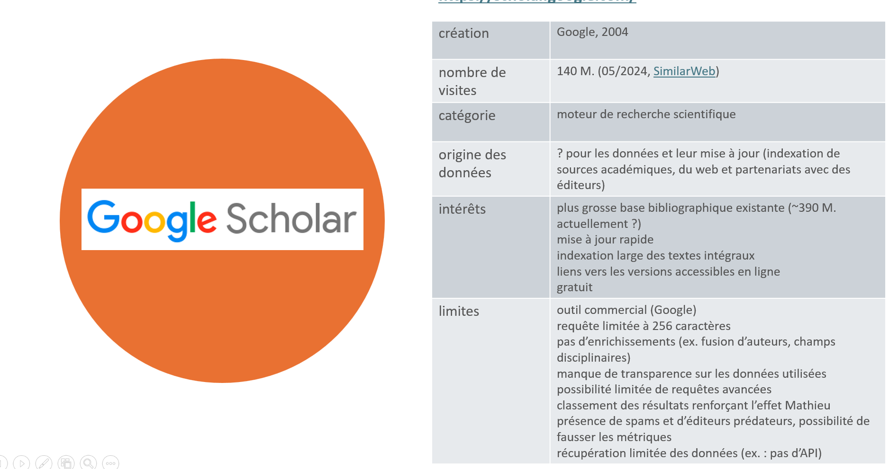

moteur de recherche scientifique de [[Google]] créé en 2004

(source: [[@bouchardSortirGoogleScholar2024a]])
- plus grand index connu
- couverture très importante mais peu critique (cf. [[Matilda]])
- pas d'enrichissements (pas de fusion des différentes formes d'auteur)
- classement renforçant l'[[effet Matthieu|effet mathieu]]
- requête limitée à 256 caractères
- pas de [[Veille Informationnelle|Veille]] possible par flux RSS
- pas d'export en [[API]] des résultats possible, exports limités à des paquets de 1000 avec l'Outil Publish or Perish

# bibliographie

