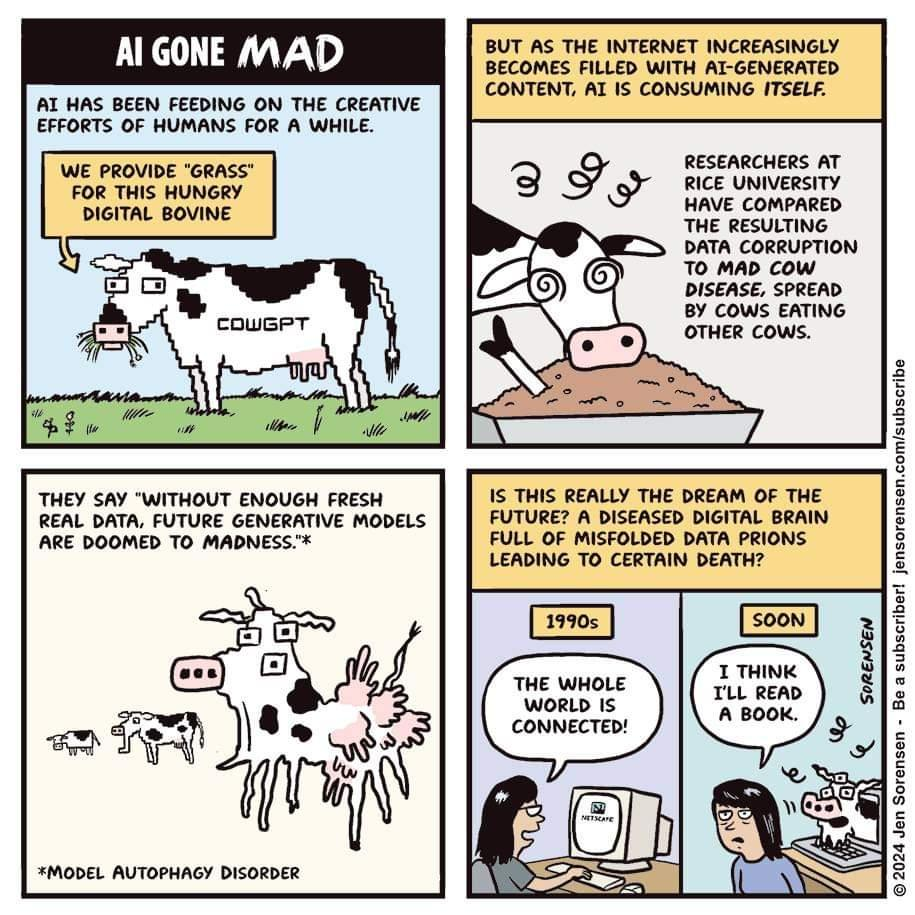

En référence avec la famille des Habsbourgs et de ses mariages consanguins. 
Baisse graduelle de la qualité des LLM quand ils sont entraînés par des jeux de données où se mélangent des données provenant d'humains et d'autres générés par d'autres LLM. 
Avec l'augmentation continue de textes et images générés par des IA et faute d'une curation des données d'entraînement qui permettrait de vérifier que ces données sont toutes d'origine humaine, les modèles de langages sont condamnés à apporter des résultats de moins en moins pertinents. 
Le phénomène a été étudié et nommé (model collapse) en juillet 2024 par Shumailov ([[@shumailovAIModelsCollapse2024]])

>I coined a term on @machinekillspod that I feel like needs its own essay: Habsburg AI – a system that is so heavily trained on the outputs of other generative AI's that it becomes an inbred mutant, likely with exaggerated, grotesque features. It joins the lineage of Potemkin AI.

(Jathan Sadowski)

même concept sous une autre appellation : Sina Alemohammad "Model Autophagy Disorder".

Potemkine AI -> [[digital labor]]

$\newline$
# bibliographie
$\newline$

