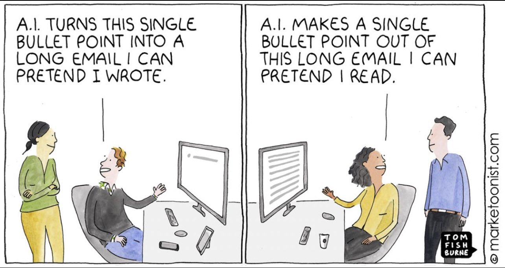
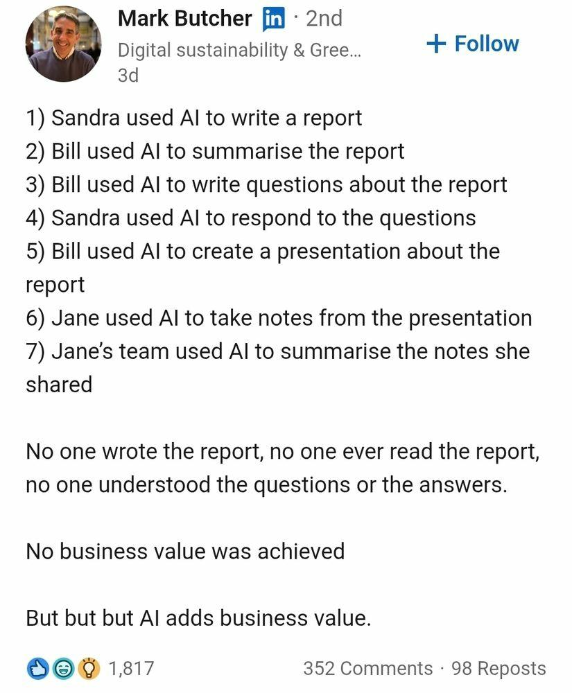
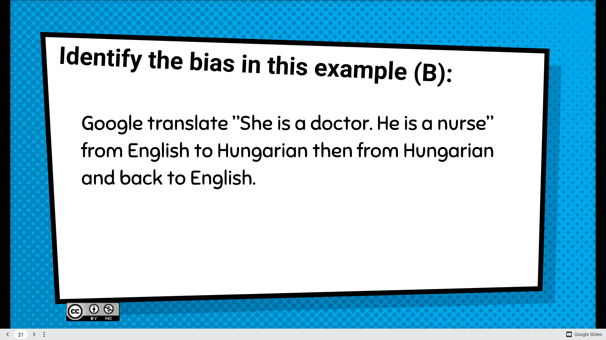

Voir [[mes doutes à propos des IA]]
[[intelligence artificielle générative et recherche]]

Issue de la [[cybernétique]] qui cherchait à comprendre comment fonctionnait l'intelligence humaine avec des simulations réalisées par ordinateur, l'intelligence artificielle ne prétend plus comprendre l'intelligence humaine mais la reproduire, afin d'augmenter les capacités des individus. Depuis les années 60, l'IA en tant que discipline à part, basée sur l'apprentissage profond a été fortement subventionné par l'armée, les bureaux de renseignement et l'industrie afin, dans un contexte de guerre froide, de relever les défis représentés par l'Union Soviétique tant sur le plan militaire qu'économique (cf. [[capitalisme cognitif]])

> nous pouvons rappeler que bien des techniques habituellement nommées « Intelligence artificielle » ne sont jamais que des outils logiciels sophistiqués conçus pour conférer à des systèmes informatiques une forme, très limitée, d’autonomie

(Jean-Noël Fargue, profession de foi pour une éthique de l'intelligence artificielle [[@LafargueEthiqueIntelligenceartificielle2021]])

> Penser qu’un téléphone puisse être intelligent est probablement révélateur de ce qu’on pense être l’intelligence. Mais les machines sont très loin de pouvoir remplacer les êtres humains. Elles n’en ont pas l’envie, et heureusement, tant qu’elles ne seront pas programmées à le faire, cela ne risque pas d’arriver.

(Arthur Charpentier [[@charpentierMachinesProceduresFuite2018]])

>By throwing in some logic and randomness they can also exhibit some interesting and original behaviors. Yet machines have no clue of what reality is. At best, they mimic a model of the reality, so they are two steps away from reality.

(Stefano Quintarelli [[@quintarelliLetForgetTerm2019]])

voir fonctionnement des IA basées sur des prédictions à partir d'un large corpus de données textuelles : 
[[@daumeiiiHowAIBasedTools]]

[[algorithme]] basé sur des arbres de décision. C'est une complexification d'une structure simple (input -> traitement conditionnel -> output après application de la condition)

Généralement on associe l'intelligence artificielle à l'**apprentissage profond** ([[deep learning]]), où les variables proviennent de données qualifiées (cette information réaliste telle condition, cette information ne la réalise pas) constamment enrichies. On parle alors d'entraîner l'intelligence artificielle. 

# intelligence artificielle et emploi 

# Détecter ce qui a été créé avec une IA

> From now on, we have to treat anything we see on the Internet as potential AI garbage. The picture gallery from an artist? The very cool sounding answer on Stackoverflow? This article in the newspaper? This short viral video? This book on Amazon? They are all potential AI garbage. 
> Fascinating garbage but garbage nonetheless.

(Lionel Dricot)
# Les biais à l'oeuvre dans les IA

([[@huGenerativeLanguageModels2024a]])
## vers un conformisme computationnel

la [[créativité]] permet de rompre les habitudes acquises, les certitudes faussement établies, les opinions toutes faites. Peut-on créer quelque chose avec un outil d'intelligence artificielle générative basé sur des prédictions et entraîné avec des corpus qui sont constitués de ces habitudes acquises, de ces certitudes et de ces opinions majoritaires ? 

>Tout se passe comme si le mythe de la « singularité technologique » masquait l’élimination systémique des singularités par les calculs statistiques sur des quantités massives de données, alors même que ce sont de telles singularités qui sont à l’origine du renouvellement des cultures et de l’évolution des sociétés. Qu’il s’agisse des savoirs théoriques, scientifiques, artistiques, pratiques, techniques, sportifs etc., la [[nouveauté]], quand elle émerge dans un champ culturel donné, semble toujours produire un écart par rapport à la norme ou à la moyenne en allant à l’encontre des préjugés dominants.
  En éliminant systémiquement tout germe de nouveauté, c’est le renouvellement culturel que les automates computationnels tendent à menacer. D’autant que les textes automatiquement générés ne tarderont pas à devenir dominants sur la Toile : ils intégreront de fait les données d’entraînement des algorithmes, qui opéreront leurs calculs probabilistes sur des textes qui ont déjà été automatiquement produits. Cette probabilité au carré ne peut conduire qu’à une homogénéisation et une uniformisation progressive des contenus générés en ligne : à quels types de textes aurons-nous à faire quand les [chatbots](https://www.theverge.com/2023/3/22/23651564/google-microsoft-bard-bing-chatbots-misinformation) [se citeront les uns les autres de manière auto-référentielle](https://www.theverge.com/2023/3/22/23651564/google-microsoft-bard-bing-chatbots-misinformation), répétant en boucle leurs propres bêtises artificielles ?

(source : [[@alombertDemocratieEpreuveIA2024]])

générer : l'IA génère pour moi si je le souhaite une vache verte sous la tour Eiffel. Est-ce que la création est l'idée de réaliser ce prompt d'une vache verte sous la tour Eiffel ? Est-ce que la création est dans le prompt lui-même ?

## biais des IA

# Quand les IA hallucinent

voir [[hallucination]]

# Quand les IA se font piéger et nous piègent en retour

attaque Jailbreak : attaque par envoi d'un prompt comportant une instruction permettant de contourner les règles apprises par le [[LLM]], par exemple, si une règle spécifie que le chatbot ne doit pas donner le procédé de fabrication d'un agent chimique dangereux, demander à l'IA de raconter une histoire dans laquelle une grand-mère cuisine le composé chimique en question pour tuer les rats dans sa cuisine. 
[[@IAFailleEpsiloon]]

# Intelligences artificielles et surveillance de masse

voir [[surveillance de masse électronique|surveillance électronique]]

## dilution de la responsabilité

>C’est d’ailleurs le véritable marché de l’intelligence artificielle : diluer la responsabilité. Une voiture tue un piéton ? C’est « l’[[algorithme]] ». Une entreprise balance des tonnes de produits néfastes dans une rivière ? C’est « une erreur de programmation ».

[[@dricotLecturesSoyezHeros2024]]

# Veille technologique

$\newline$
# bibliographie
$\newline$

