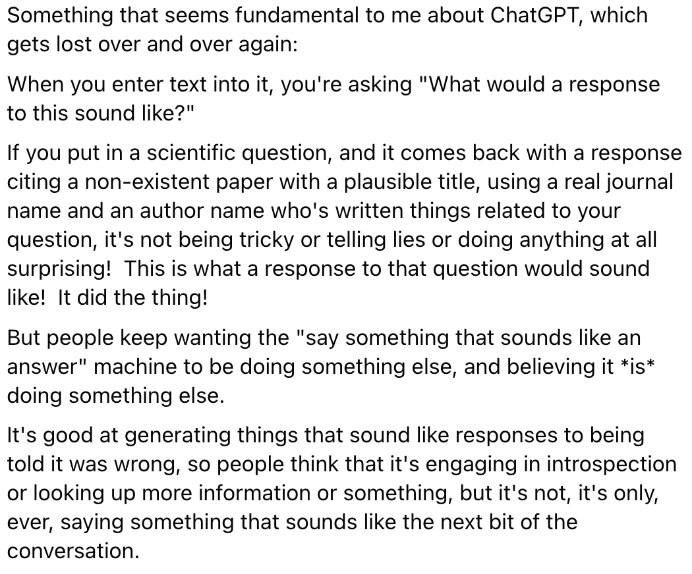
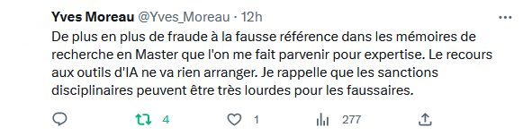

voir [[EDUC2 intelligence artificielle]]

Est-ce qu'un test auquel pourrait répondre une intelligence artificielle de façon adéquate permet vraiment de mesurer un apprentissage réalisé ? [[@ceresChatGPTComingClassrooms]]

pour une appropriation critique de l'outil dans l'enseignement.

# historique de l'IA dans l'enseignement

## Un sujet pas si nouveau

L'IA dans l'éducation n'est pas une nouveauté

L'éducation nationale utilise des logiciels autour du cycle 2 sur la lecture et les [[mathématiques]] LALILO (soutenus par le ministère de l'éducation nationale et de la jeunesse, programme P2IA). Les enseignants n'étaient pas avec les élèves et ces IA ont pu rendre possible la fourniture de devoir spécialisés en fonction du niveau de l'élève.

## une volonté de ne pas se laisser disrupter

Lors de la mise sur le marché de ChatGPT, Science Po Paris a été le premier établissement de l'ESR a bannir son usage sauf dans certains cours où il est encadré par les enseignants et/ou à la condition que l'étudiant n'indique de façon transparente comment il/elle a utilisé l'outil. 

Cette prise de position a été argumentée à plusieurs reprises par [[Dominique Boullier]], qui considère que ces outils n'auraient pas du être mis sur le marché sans une réflexion préalable sur leur impact sur nos vies et sur l'Education en particulier. 
D. Boullier voit dans cette précipitation l'oeuvre de la [[classe vectorialiste|classe vectoriale]] qui veut dicter son rythme à la marche du monde pour faire des profits de plus en plus rapide, même si cela passe par la [[disruption]] de nos modes d'enseignement. 
D. Boullier considère que si grâce à leurs utilisateurs les IA génératives comme ChatGPT "apprennent", ce n'est pas le cas des étudiants qui désapprennent par exemple le fait de faire un résumé et y voit une [[prolétarisation]] des apprenants, qui bientôt ne sauront plus faire un résumé (=tirer les idées principales d'un texte) sans le secours d'une IA. Par ailleurs, ChatGPT priverait les utilisateurs de leur faculté d'analyser et de critiquer les résultats, et les éloignerait de la vérification (données et sources) que ChatGPT ne cite jamais ou bien s'il est forcé de le faire invente parfois ([[hallucination]])
Voir sur cette position [[@boullierSciencesPoEu2023]] et [[@fayeAvecChatGPTEnseignants2023]]

# sensibilisation aux coûts énergétiques, environnementaux, cognitifs et sociaux

cartographie des acteurs de la production et de l'entraînement des IAG par [[Louis Derrac]] 
https://cartography-of-generative-ai.net/genai_cartography.pdf

## Des changements en profondeur pourtant causés par l'irruption des intelligences génératives

suppression des mémoires dans certaines universités [[@IntelligenceArtificiellePremiere2023]]
# Obtenir des points de vue

ChatGPT envoie des réponses qui semblent être celles que l'on attend (mais qui ne sont pas forcément vraies). Selon [[Cory Doctorow]], les [[grands modèles de langage|LLM]] sont surtout des *plausible sentence generators*, des générateurs de phrases plausibles (mais pas forcément vraies)[[@doctorowPlausibleSentenceGenerators]]

source : https://twitter.com/FrKadel/status/1644096510357913600

Pour Jean-Marc Jancovici, les IAbots sont surtout des outils "normands", dans la mesure où à une question, ils attribuent des réponses de Normand (Ptêt bien qu'oui, Ptêt bien qu'non)
c'est à dire, font part des différents points de vue (synthèse des différentes expressions de ces points de vue qui existent en ligne) sans prendre parti ou hiérarchiser ces points de vue, ce qui en fait des outils assez fades. 
# attribuer, citer

## absence d'attributions ou mauvaises attributions de ChatGPT

> When students asked it to back up an argument with citations from scholarly texts, it misattributed work to the wrong authors

exemple pour les [[revue de littérature#mener une revue de littérature en utilisant des outils d'apprentissage profond]]

lien : https://twitter.com/Yves_Moreau/status/1676311660829503505

# Faire appel à l'expérience des étudiants

> Kudina thinks ChatGPT might also spur educators to get more creative with assignments, for example by designing them to draw from students’ personal experiences, information that ChatGPT couldn’t have picked up from its training data[[@ceresChatGPTComingClassrooms]]

Comment enseigner avec ChatGPT [[@peronChatGPTEnseignerAvec]]

une [synthèse réalisée par Frédéric Junier](https://frederic-junier.org/chatGPT/#1) sur les usages éducatifs de ChatGPT et des LLM (agents conversationnels entraînés sur de vastes corpus de données textuelles) en général fait part de la manière dont certains spécialistes des sciences de l'éducation ou institutions reçoivent les usages de ces robots par les étudiants. 

Elle revient sur des concepts clé des IA en général : entraînement, modèle, renforcement, traitement automatique de la langue  

La présentation fait la part belle à la problématique des modèles et corpus de textes qui assez souvent (notamment pour [[ChatGPT]]) ne sont pas ouverts et peuvent présenter des biais.  

Frédéric Junier revient sur la nécessaire [[distinction]] à opérer entre vérité et vraisemblance (ou plausibilité ou satisfaction de l'humain qui pose la question). L'écart entre les deux peut être béant.  

Un exemple marquant (résumé d'un roman du XIXème siècle) montre à la fois le problème de reproductibilité et d'exactitude de cet outil. Ce que ChatGPT connaît du monde, c'est seulement les informations comprises dans les corpus qui ont servi à l'entrainer et les discussions avec les utilisateurs qui l'ont renforcé. Sur la manière dont les usagers peuvent déformer une IA en la "renforçant", voir aussi [le texte de Pacôme Thiellement "les agents conversationnels sont des cons"](https://www.blast-info.fr/articles/2022/infernet-tay-les-agents-conversationnels-sont-des-cons-VfabKlwDThWcH-rSdDkq7w)  (publié dans [[@thiellementInfernetSuiviInternet2023]])

Dans les limites de chatGPT figure l'absence de citations (ou la création trompeuse de citations qui n'existent pas).

Cette perspective sur les forces et les limites des robots conversationnels nous induiraient à les faire tester par des étudiants dans la perspective d'un recul critique, d'une vérification et d'une amélioration du contenu généré. Toutefois cette méthode comporte deux obstacles déontologiques :  

- cela consiste à demander aux étudiants de laisser une adresse mail à ces robots (on ne le fait pas pour Google par exemple)  

- cela consiste à entraîner des IA opérées par des sociétés à but lucratif.  

L'obstacle technique est moins pregnant qu'il y a quelques mois : ChatGPT est plus léger en terme de paramètres (donc moins exact aussi) mais du coup devient plus facile à utiliser (moins de blocage à l'entrée).  

Une solution transitoire consiste à réaliser soi-même les [[prompts]] et faire travailler les étudiants sur les textes conservés.

