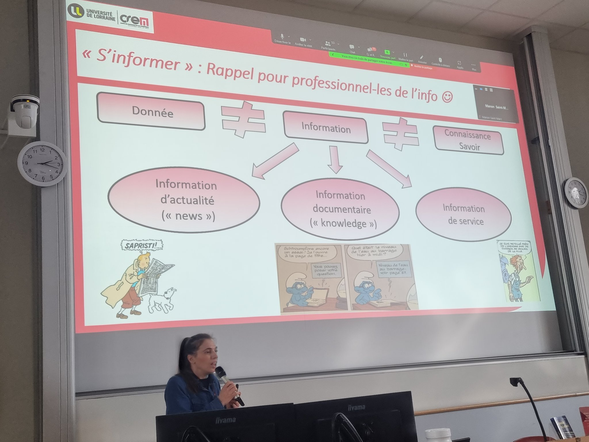

problématique = voir en quoi consisterait une acculturation informationnelle la plus juste et la plus [[Emancipation sociale|émancipatrice]] possible pour les étudiants

La bibliothèque apparaît comme décor d'un récit stéréotypé sur l'autonomie de l'étudiant (cf. vidéo de l'ONISEP 2023)
Qu'est-ce qu'on fait exactement pour acculturer l'étudiant.e et pour le rendre autonome, à part lui "donner accès des ressources" ? 

## L'étudiant.e est aussi un acteur/actrice informationnelle

[[EMI|Culture de l'information]] 

culture étudiante de l'information : être étudiant dans un DUT, ce n'es pas la même chose à Science Po, à l'IRTS ou en Licence 1 de Droit. 

Affiliation à une discipline (cf. L'acquisition du [[métier d'étudiant]] d'Alain Coulon (1999))

## S'informer : un impératif universitaire aux règles implicites

Etudiants qui ont des "itinéraires à choix multiples" (Annoot, 2012) pour un métier étudiant 

On dit aux étudiants d'être curieux de s'informer mais on ne leur dit pas comment. La curiosité est présentée comme une [[compétence]] ce qui pose question

Pour les professionnels de l'info, qu'est-ce que cela représente 

les étudiants accèdent à des données, mais il faut que ces données prennent sens (information) et que ces informations s'arriment à notre schéma cognitif ([[Savoirs|savoirs]])
Le paradigme de l'information pour le corps enseignant c'est : 
- les news (ce qui est nouveau)
- l'information documentaire (la connaissance, accumulation des savoirs)
- information de service : pour chercher des bourses, pour utiliser les services de l'université, pour faire du prêt entre bibliothèques, etc.

Grande solitude des étudiants, leur sentiment d'être aux prises avec un apprentissage qui est complètement implicite. 
3 éléments ne leur sont jamais expliqués, exception faite des enseignants en IUT et des enseignants à Science Po : 
- la bibliographie : faut-il en faire une, comment on en fait une, qu'est-ce qu'on met dedans
- Restitution de la recherche : copier/coller, plagiat "pourquoi je redirais mal quelque chose que quelqu'un a vraiment très bien dit". Les étudiants ignorent le cadre de communication attendu. Ils ne savent pas quelle forme ça doit prendre. 
- quelles sources sont attendues ? quelles sources j'ai le droit ou j'ai intérêt à mentionner. 
S'informer oui, mais quand est-ce qu'on parle du produit de cette information en cours ? Le cours se déroule avec ou sans cette curiosité des étudiants. 

## S'affilier à un nouveau monde informationnel

Ils cherchent à identifier des ressources de distinction, c'est d'autant plus vrai pour les étudiants d'origine modeste. Idéalisation des références : "il faut lire Le Monde", "Courrier International" arrive souvent en seconde place.
L'Universalis est souvent citée. "Si dans la biblio, on marque Universalis, ça passe toujours mieux que Wikipédia". L'affiliation consiste à savoir comment trouver le chemin vers l'Universalis dans l'ENT
cela dit en passant, il invisibilise Wikipédia, il invisibilise le croisement des sources. 

Exploiter les ressources académiques et fréquenter la BU, ça ne suffit pas. On est face à des étudiants qui exploitent des ressources : "aller voir LE Cairn", disent-ils (ou disent parfois leurs enseignants), et pourtant ça ne suffit pas. 
**Ceux qui passent les niveaux et réussissent, sont ceux qui vont faire preuve d'une même exigence informationnelle dans et hors le monde académique.**
Ce sont ceux qui vont avoir la même démarche informationnelle dans et hors l'université qui vont réussir leurs études. 
Une étudiante à qui on a demandé d'apporter à l'entretien un objet emblématique de son rapport à l'information amène un billet de train (trajet domicile  / université) : symbole entre le passage du monde familial et le monde universitaire. Amélie est tout le temps en train d'osciller entre un monde de références (TF1, youtubeuses qui intéressent sa soeur) et un autre(références académiques). 
Il faut favoriser cette affiliation. 
Problème autour de la culture des sources. Elle a été capable de cartographier l'environnement informationnel et les ressources mobilisables dans son parcours. 

Quand on part vers les plus jeunes. Les enfants et les ados qui viennent des milieux favorisés sont toujours capables de citer des ressources précises (Lumni, Libé Junior, etc. ). Les enfants des milieux populaires eux mentionnent "le journal", "la télévision", l'internet", les "réseaux sociaux" : ils mentionnent des canaux, pas des sources.
Les réseaux sociaux ne sont pas une source mais un canal par lequel transitent des sources.

Derrière les vélléités de légiférer sur la fermeture ponctuelle des réseaux sociaux ou sur la durée d'"exposition aux zécrans", on peut voir aussi une tentative de priver la jeunesse populaire de ses canaux d'information, ce qui pose un problème politique ([[censure]])
On confond des outils marques et des objets informationnels. 
http://secouchermoinsbete.fr/
"ça a l'air plus vrai que Wikipédia". 
La ressource à éviter dans ces récits, c'est Wikipédia (un wiki), c'est TikTok (un réseau social)

Dispositifs techniques et médiateurs : des leviers pour la socialisation informationnelle étudiante. 

le canal le plus fréquenté, c'est Youtube. Ils se constituent une "bibliothèque Youtube" (pour la moitié des étudiants)
recours à des Youtubeurs qui donnent des preuves à l'appui de leurs propos. 
Snapchat Discover : accès à une presse diversifiée à travers une application de Snapchat. On doit être capable de conscientiser que c'est une pratique de lecture de presse comme une autre.

# conclusion 

pratiques informationnelles des étudiantes = pratiques sociales de 2023

pour une approche culturelle de l'information en formation

Développer une culture des sources pour enrichir le répertoire de pratiques

Favoriser l'ancrage des formations dans des situations sociales et académiques

terme de "pédagogie universitaire"
Faire des grilles d'évaluation n'est pas une évidence. 

Les étudiants ont souvent le sentiment que le bibliothécaire vend son produit documentaire

ce qui compte, c'est le transfert des compétences du monde académique vers la vie de tous les jours. 

favorable à un vrai continuum depuis la maternelle à la fin de la licence sur la culture informationnelle.