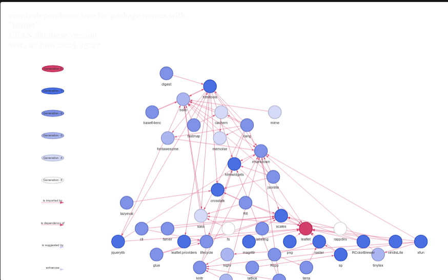

affichage sur un fonds de carte de tous les cimetières de guerre gérés par la commission des cimetières de guerre Allemands et répertoriés dans [[Wikidata]] (alternative R à [[Umap]])

`````r
---
title: "Cimetières de guerre allemands"
author: "Damien Belvèze"
date: "2024-10-03"
output: html_document
---


# collecter des données depuis Wikidata

collecte de cimetières militaires gérés par la Commission des Cimetières de Guerre Allemands (Volksbund Deutsche Kriegsgräberfürsorge)


```{r echo=TRUE, include=TRUE}

#http://www.r-bloggers.com/sparql-with-r-in-less-than-5-minutes/

library(WikidataR) # SPARQL querying package
library(ggplot2)

df <- query_wikidata('SELECT DISTINCT ?item ?itemLabel ?coords ?lat ?long
WHERE {
  ?item p:P31/ps:P31/wdt:279* wd:Q1241568 .
  ?item wdt:P137 wd:Q708567 .
  ?item p:P625 ?coords_sample . 
  {
    SELECT (SAMPLE(?coords_stmt) AS ?coords_sample) {
      ?place p:P31/ps:P31/wdt:279* wd:Q1241568 ;
             p:P625 ?coords_stmt .
    } GROUP BY ?place
  }
  ?coords_sample ps:P625 ?coords;
                 psv:P625 [
                   wikibase:geoLatitude ?lat;
                   wikibase:geoLongitude ?long
                 ] .
  SERVICE wikibase:label { bd:serviceParam wikibase:language "en". }
}
ORDER BY ?placeLabel')

# afficher les éléments obtenus

affichage des éléments issus de Wikidata

```{r}
print(df)
```

# Production de la carte

Par défaut, le fonds de carte correspond à celui d'[OpenStreetMap](https://www.openstreetmap.org)

```{r}
library(leaflet)
df$long <- as.numeric(df$long)
df$lat <- as.numeric(df$lat)
# Create the map
leaflet(df) %>% 
  # Add tiles for the base map (OpenStreetMap used here)
  addTiles() %>% 
  # Add markers with pop-up labels showing the name of each location
  addMarkers(lng = ~long, lat = ~lat, popup = ~itemLabel)

`````
problèmes d'installation : 
charger leaflet nécessite de charger [[terra]] et charger terra nécessite d'installer un paquet deb provenant de CRAN : r-cran-sf_1.0-12-1.ca2204.1_amd64.deb
(source : https://stackoverflow.com/questions/75943925/how-to-fix-problem-with-installation-of-packages-raster-terra-rgdal-ra)

pour installer les packages voulus : 

```shell
add-apt-repository ppa:ubuntugis/ubuntugis-unstable
sudo apt-get update
sudo apt-get install libudunits2-dev libgdal-dev libgeos-dev libproj-dev libsqlite3-dev
```

dépendances de Leaflet : 



produit avec Cranly (voir [[dépendances#Cranly]])

Leaflet est une librairie inclue dans le paquet tmap qui permet de faire des cartes statiques ou interactives. Leaflet pour R est téléchargé et installé depuis le CRAN en même temps que tmap
(voir [[Cartographie thématique avec R]])


$\newline$
# bibliographie
$\newline$


