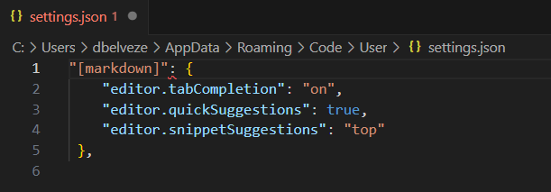

Présentation du projet par André Dietrich [[@dietrichLIASCRIPTDOMAINSPECIFICLANGUAGEINTERACTIVE2019]]

Atom, [[VS Code|VScode]] (Atom n'est plus mis à jour, on va faire la démo pour Visual Studio Code)

Charger les extensions suivantes dans VS Code : 
- Liascript preview
- Liascript Snippets

Palette : Ctrl+shift+P
entrer "settings"
sélectionner Preferences Open Settings JSON

Dans Liascript snippet, copier le snippet suivant : 

````json
"[markdown]": {  
"editor.tabCompletion": "on",  
"editor.quickSuggestions": true,  
"editor.snippetSuggestions": "top"  
},
`````

coller ce snippet après 
````json
{

    "workbench.colorTheme": "Default Dark+",
`````

<iframe width="560" height="315" src="https://www.youtube.com/embed/8vFYMo5xqyY?start=242" title="YouTube video player" frameborder="0" allow="accelerometer; autoplay; clipboard-write; encrypted-media; gyroscope; picture-in-picture; web-share" allowfullscreen></iframe>


C'est bien le fichier "user settings JSON" qui est à modifier (l'autre n'est pas modifiable)
Pas de problème avec les deux points soulignés. 
Fermer VScode et l'ouvrir **en allant dans le menu démarrer** (pas en ouvrant le dernier fichier édité)

Créer un dossier 
dans ce dossier, créer un document en [[markdown]]
Sur ce document éditer un premier [[quiz]]


(taper L I A Q, cela fait apparaître les différents quiz disponibles)

Pour ouvrir la prévisualisation, dans le menu "file" sélectionner son dossier de travail en cliquant sur "add folder from workspace"
si VScode n'identifie pas de workspace, le serveur ne démarrera pas.

Attention, également début 2024 VScode met à disposition deux extensions équivalentes Liascript-preview. Les deux ne fonctionnant pas ensemble, prendre celle qui est la plus téléchargée (raccourci clavier ALT+L) ne pas installer l'autre dont le raccourci clavier est F1.

# mise en page

## gestion des citations dans Liascript

voir cette réponse d'André Dietrich au problème du formatage des citations, reçue le 25 novembre 2024 : 

>Directly integrating citations into LiaScript will be hard, but Sebastian once made an extension for this. I hope this fits your needs, it was only a fast trial, thus we could extend this according to your needs and suggestions.  

[https://github.com/LiaTemplates/citations](https://github.com/LiaTemplates/citations)  

> Here is a little example on how you might use it ...

[exemple de code fourni par Dietrich](https://liascript.github.io/LiveEditor/?/show/code/H4sIAAAAAAAAA61STYvbMBC961dMt5cEEtlJT126i5dtKJRtKUsupRQiW5NYjSwZaUw2LPnvHclJCb22RgdrPt7Me3of3sznwnS9D3QLLVEfb4siqIPcGWqHeogYGu8IHcnGd8WTUWvseqsIY9EYUmS8i0WnjCueVw8fv6xkp4WovLNeaVEUQK2JEFtlLaQQKAcMZgLC1lgERRBJBSLTIdfyteGKGiHgFgO6BrWISGtO+4Emkync3cMrHIzT/iBrU1vjd0H17fGJ0Sc3/0aB8QhfEuzN9DSDRVlORYVOi/n8Xoi38HguF2KdaPFRcIEQm81m7IeKYyiq2vv96y/fuujdsly8T/eZACBDzDx9d/C6bhEePe+DhPBpMJpl8LB6USkUT6leDdT6cK7/POLNYNUZe8z5I6qczfk0KEf7gbWJLYYUfWiUxs408C1gPKNqnf7Hrq94gO8+7HNmCBb+4F0E1d5IH3bFopQsS1mwpFu5LJcLuVi+O4E4Jf5CSnmtTX7EJjMi5rmzvmYjHLMTUMMol6i4bPKXTlPGmbM1xUVyYDIEjA9b1iK7yhAc/GB1souy0UPvY2RH5HlMjxcYJwK/e6ecnkE07KjUmNazAZU+XjmNbcXADkb3QiZT/bg2mbTG7X9O/pfLpr8Byn2KLX8DAAA=](https://liascript.github.io/LiveEditor/?/show/code/H4sIAAAAAAAAA61STYvbMBC961dMt5cEEtlJT126i5dtKJRtKUsupRQiW5NYjSwZaUw2LPnvHclJCb22RgdrPt7Me3of3sznwnS9D3QLLVEfb4siqIPcGWqHeogYGu8IHcnGd8WTUWvseqsIY9EYUmS8i0WnjCueVw8fv6xkp4WovLNeaVEUQK2JEFtlLaQQKAcMZgLC1lgERRBJBSLTIdfyteGKGiHgFgO6BrWISGtO+4Emkync3cMrHIzT/iBrU1vjd0H17fGJ0Sc3/0aB8QhfEuzN9DSDRVlORYVOi/n8Xoi38HguF2KdaPFRcIEQm81m7IeKYyiq2vv96y/fuujdsly8T/eZACBDzDx9d/C6bhEePe+DhPBpMJpl8LB6USkUT6leDdT6cK7/POLNYNUZe8z5I6qczfk0KEf7gbWJLYYUfWiUxs408C1gPKNqnf7Hrq94gO8+7HNmCBb+4F0E1d5IH3bFopQsS1mwpFu5LJcLuVi+O4E4Jf5CSnmtTX7EJjMi5rmzvmYjHLMTUMMol6i4bPKXTlPGmbM1xUVyYDIEjA9b1iK7yhAc/GB1souy0UPvY2RH5HlMjxcYJwK/e6ecnkE07KjUmNazAZU+XjmNbcXADkb3QiZT/bg2mbTG7X9O/pfLpr8Byn2KLX8DAAA=)

>It will surely require some optimization ;-) so any comments and suggestions are welcome ...


# lettre à André Dietrich

As a librarian who trains graduate, undergraduate, and Ph.D. students in searching, evaluating, and retrieving information, I am concerned about the reuse of my course materials. My goal is to share this material as widely as possible, not only with my colleagues at the same university but also with colleagues from other universities within the same alliance and beyond, making it useful to anyone who may benefit from it.

In an effort to align my course materials with the FAIR standards used in the Open Educational framework, I have spent the past year exploring various methods for presenting content in markdown format, utilizing self-hosted repositories, and utilizing tools for interactivity and version control. Among the options I have explored, I have found Liascript to be the most advanced solution. Liascript can be used as a plugin with several text editors, including VS Code, which I use daily.

In my opinion, Liascript already meets the key requirements typically associated with free and open educational software:

- Liascript allows for editing documentation in markdown syntax, enabling courses to be easily interoperable and reusable.
- No tool is necessary to read the contents except a browser
- A Liascript course can be accessed through a specific URL, although it does not currently support a DOI like interactive resources shared with Datacite.
- Liascript offers the capability to integrate quizzes and interactive modules in a user-friendly format that can be understood by non-technical users.
- With the assistance of a separately developed script, Liascript can be integrated with the e-learning platform Moodle, which is used by 95% of French universities.

Based on my observation, Liascript is likely to become a widely used standard to design [[ressources éducatives libres|OER]], along with some other standards like H5P. Thus, I decided to introduce this solution to French from other French Universities and took the opportunity of our annual "digital stretching seminar" in March 2023 for that purpose. On this occasion, I got some encouraging feedback. Some of the attended expressed the need for more tools and documentation to make it easier for beginners to get started. 
The combination of text written for Liascript and the online interpreter (https://liascript.github.io/) has room for improvement.

Therefore I hope that Liascript designers will keep on developing this promising tool and will find a community of beta-testers to help them taking this software to the next level. 
This letter aims at helping Liascript developers to raise interest and resources for that purpose. I would personally be interested in promoting Liascript to French trainers on a wider scale. 

Yours sincerely, 

Damien Belvèze
Librarian at the University of Rennes (Brittany, France)


