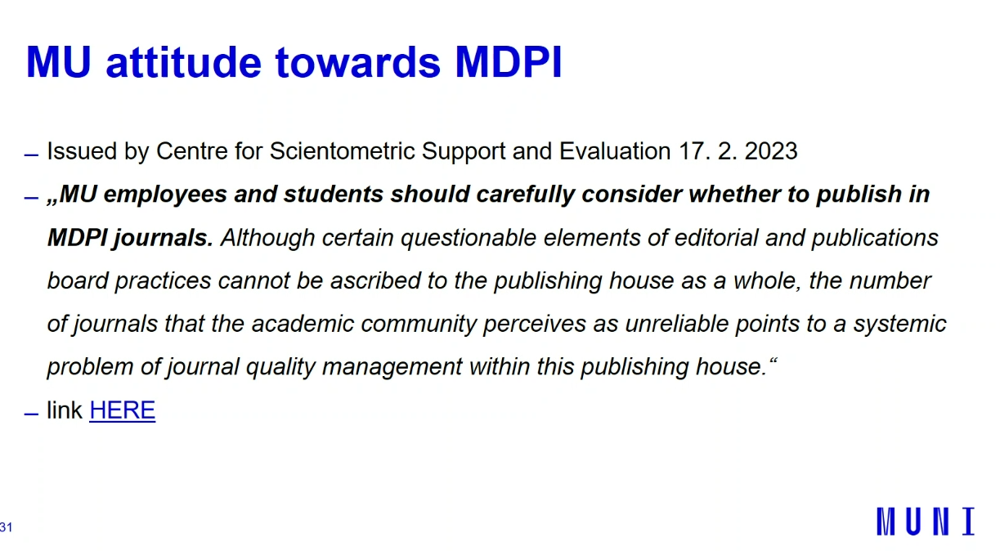
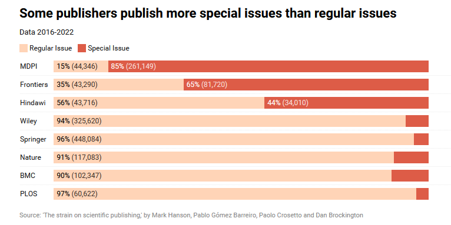

analyse de MDPI par Jiri Kratochvil et Lucas Plch (University of Masaryck)
MDPI est-il un [[Editeurs prédateurs en open access| éditeur prédateur]] ?

MDPI est dans la zone grise, la décision de ne pas laisser les chercheurs y publier est d'ordre politique. 

> it's better to educate Academia where to publish rather than where to not publish

(Lukas Plch)

1,8 millions d'articles publiés entre 2017-2022 ont été analysés dans une étude à paraître (au 6 septembre 2023)
Moyenne du temps de l'[[Révision par les pairs|évaluation par les pairs]]: 35 jours (78-122 jours) chez Frontiers, Springer, Taylor France. Est-ce que la vitesse de relecture est vraiment un mauvais point, le procédé n'est-il pas trop lent chez certains éditeurs mieux considérés ? 
41 à 50% d'acceptation de l'article, ailleurs 15 à 20%
augmentation d'articles 50% par an (4% ailleurs)
[[Retraction Watch]] database : 213 articles rétractés proviennent de MDPI mais c'est le cas aussi pour des revues mieux considérées. 

Self-citations : augmentation chez MDPI nombre décroissant d'autocitations chez Elsevier, Springer, T&F et Wiley

MDPI is not predatory it belongs to so-called greyzone
neet to find out more about editorial processes

Présentation de Sarka Erben Johansson (University of Malmö [^1]) sur l'analyse de l'éditeur MDPI

Augmentation endémique de "numéros spéciaux dans MDPI" = alerte principale. Baisse de l'exigence en matière de validité scientifique dans ces numéros spéciaux. Ces publications font gagner toujours plus d'argent à l'éditeur et ses actionnaires ([[APC]]) ([[@ansedePublicFundsBeing2023]]).

$\newline$
# bibliographie
$\newline$

[^1]:, bibliothèque : 3 bibliothèques, 50 personnels, 24000 étudiants