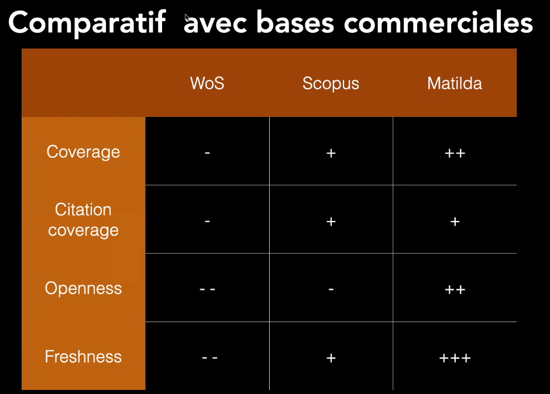
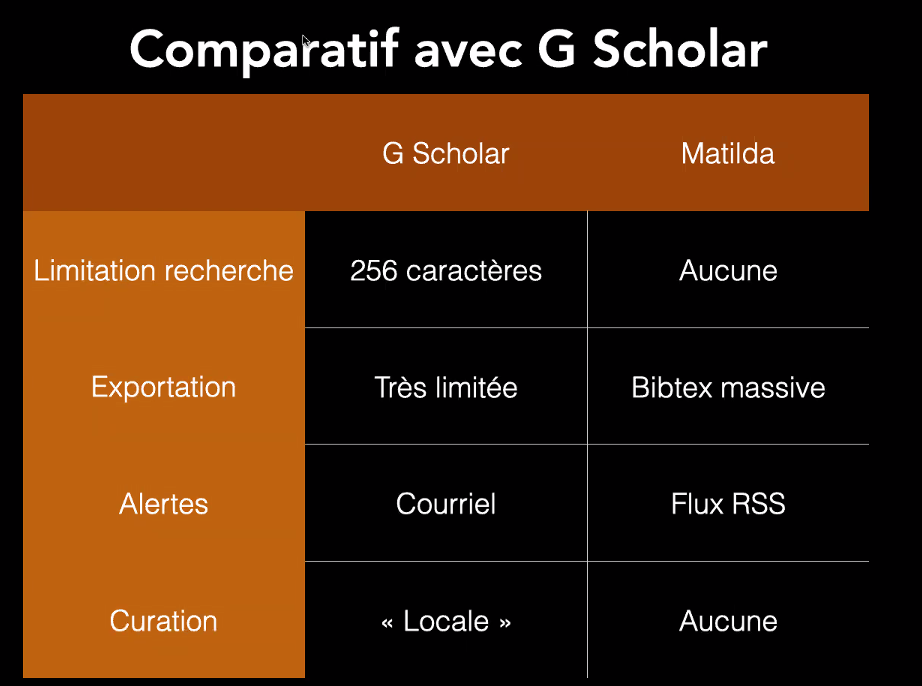

https://matilda.science/?l=fr
[[moteur de recherche]] développé pour être une alternative à Google Scholar

Didier Torny, UMR e-Cube (Mines PSL)

Constat de l'existence d'un parent pauvre de la [[Science Ouverte]], les données bibliographiques. N'existaient avant Matilda que Scholar et WOS fermés tous les deux. 

Entretemps, venue de nouveaux acteurs : OpenCitation, Isidore, OpenAlex. 

Du point de vue de Didier Torny, il n'y a pas d'outil simple pour toutes et tous. 

Septembre 2023 : Matilda rendu public. Les sources sont ouvertes. Enrichissement par [[open data|données ouvertes]], citation tracking, liens texte, alertes par [[Automatisation de la veille|flux RSS]], zotero compatible. 
Possibilité de créer des flux RSS sur une requête, un auteur, une oeuvre (afin d'avoir la liste de celles qui la citent et d'être prévenu d'une nouvelle citation)

Le moteur simple est devenu un moteur booléen. 
Graph = Neo4J ; le dédoublonnage est réalisé au moment de l'indexation de nouveaux textes

gestion de PDF légalement accessibles au moyen de GROBID ; ces PDF sont indexés dans Matilda ce qui les rend cherchables. 

Tous les textes sont considérés comme égaux. 
Matilda nommée en lien avec l'[[effet Matilda]] une déclinaison particulière au niveau du genre de l'[[effet Matthieu]]. Faire en sorte que les articles déjà considérés comme prééminents ne le deviennent toujours plus au détriment des autres.

Le vrai concurrent, c'est [[Google Scholar]]. 
La couverture de Google Scholar est bcp plus élevée mais l'outil est critiqué aussi pour avoir une couverture trop extensive, pas assez critique à l'égard de ce qui est couvert (produits par des [[Paper mills]])

Matilda : hébergement assuré par Huma-Num, développement contraint par les serveurs de ce prestataire.

Sponsoring Matilda - 
90 000 euros dépensés pour arriver jusqu'à la V2
140 000 euros dépensés pour arriver à la V3
V4 : entre 100 000 et 200 000 euros ; multiplier les financeurs. demande de soutien à SKOS
infrastructures payées à coups de projet ; [[maintenance]] + hébergement + développement entre 100 000 et 200 000 euros par an. 

Matilda est conçu comme un outil de découverte, [[OpenAlex]] prévoit lui de remplacer les usages bibliométriques du WOS ou de Scopus. Selon Didier Torny, les deux outils n'ont pas les mêmes objectifs.

OpenAlex est une entreprise non for profit qui vend des services, Matilda ne vendra jamais de services. 
D'un point de vue recherche, on ne connaît personne qui se focalise sur la production d'un labo ou d'une université, donc Matilda ne normalise pas les affiliations. Rien n'empêche que les données issues d'OpenAlex ne soient intégrées un jour comme enrichissement à Matilda.

Par rapport à Isidore, la différence c'est que Matilda est international et pluridisciplinaire - touche bientôt une taille critique qui ne pourra plus convenir aux capacités d'Huma-Num. Matilda à la fois gros et petit (gros : changement de logiciel de graphe a pris 30 jours)
Le ROR n'est pas présent dans les sources. 
Isidore a un compte utilisateur, mais pas encore Matilda.

L'idée est plutôt de ne pas prendre dans l'index des [[données de la recherche|données de recherche]] mais de n'indexer que des oeuvres.

usage catalogue : on entre un titre
usage sur les mots clé : on entre des mots-clé

tous les textes sont égaux mais les textes dont le développement est ouvert sont favorisés par le moteur de recherche de manière naturelle (un "full text" est toujours favorisé par un moteur de recherche)

$\newline$
# bibliographie
$\newline$

