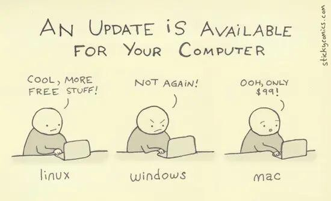

[[mise à jour des pilotes]]

# importance de la mise à jour en termes de sécurité. 

Avant toute installation d'un logiciel anti-tracking, la première chose à faire est de mettre à jour son système d'exploitation et les principaux logiciels qu'on utilise. En effet, les virus vont attaquer de préférence les systèmes qui ne sont pas mis à jour, pour lesquels les derniers patchs de sécurité n'ont pas été téléchargés. 

>If you are talking to someone who is not currently using:
>* A password manager  
>* MFA on most or all accounts that allow it  
>* **An up to date operating system on all of their devices**
  Please stop yourself from recommending:
>* A VPN  
>* [[Navigateur Tor]]  
>* [[Tails]] (or any variations/equivalents)
>Just… rewind a bit and help with the first items first.

(source : https://hachyderm.io/@hrefna/110748534412545817)
https://mastodon.social/@nixCraft/113661543963921340
# mise à jour sur [[MacOs]]

https://www.cyberciti.biz/faq/how-to-install-homebrew-on-macos-package-manager/

# mise à jour sur Linux

## Ubuntu

Avant de changer de version, faire le ménage sur Ubuntu (se débarrasser des anciennes versions de logiciels que snap a conservées bien qu'on ne les utilise plus : https://www.frayssinet.org/2020/07/15/faire-le-menage-sur-ubuntu/)

1. Mettre à jour l'ensemble des paquets
2. Mettre à jour la liste des paquets
3. Installer la version supérieure

``
sudo apt update
sudo apt upgrade
sudo apt dist-upgrade

``

vérifier que le fichier /et/update-manager/release-updrades se termine prompt=normal

``
cat  /et/update-manager/release-updrades

``

Installer la version supérieure :

``sudo do-release-upgrade``

Si ça ne fonctionne pas, c'est que certains paquets n'ont pas été mis à jour. Revenir en arrière (sudo apt dist-upgrade) et vérifier que la mise à jour n'a pas laissé des paquets non mis à jour. Si c'est le cas, mettre à jour chaque paquet individuellement

``sudo apt upgrade [nom du paquet]``

Le processus peut durer plusieurs heures

# Bibliographie
