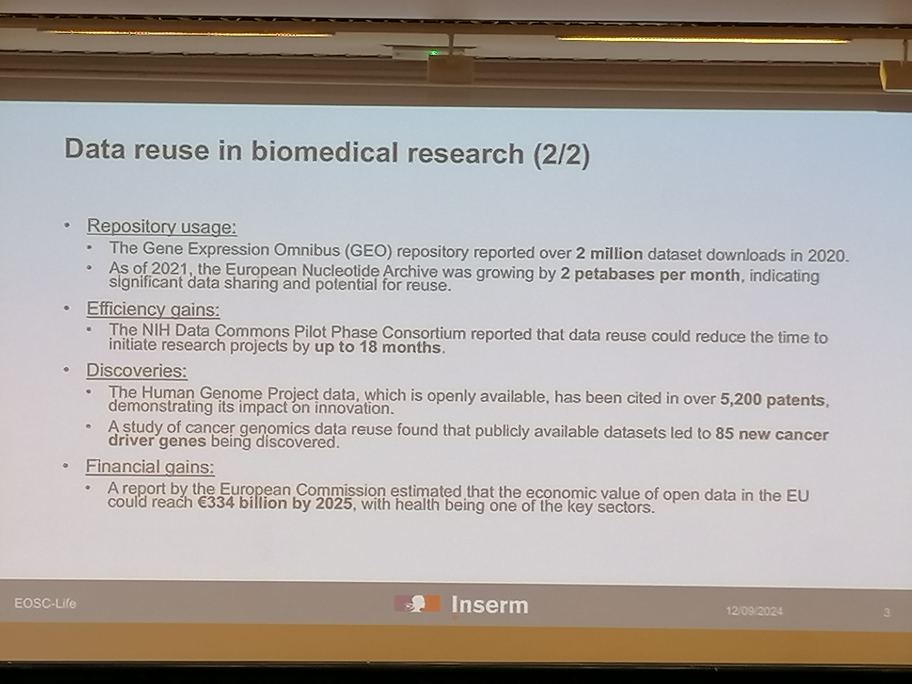

[Programme sur SciencesConf](https://eoscfrance2024.sciencesconf.org/program?lang=en)

# MESR, European Commission, steering board

(Volker Beckmann)

list of services > French distributed cloud for research data storage and analysis

tangible [[EOSC]] en France : network + computing facilities + datacenters + data repositories + data services

EOSC need human resources to complete with the budget given buy the Ministry. 

# Role of the community in the EOSC federation and the future EOSC governance

(Ute Gusenheimer)

Qui travaille pour EOSC (catégories d'acteurs + sponsors, parties prenantes, observateurs)

synchroniser l'information des communités nationales vis à vis du comité de pilotage européen. 

Budget from the UE commission : 1,36 billion euros from 2022 to 2025

Jiri Marek (Masaryk University) member of the EOSC technical and semantic interoperability. 

6 experts groups : Group 1 = persistent identifiers

timeline des actions engagées du printemps 2023 à l'été 2024

questionnaire : 121 réponses venant de diverses institutions. L'Italie a apporté le plus de réponses devant la France.

témoignage de Cécile Zwiateck, SCD Paris-Nanterre membre d'EOSC (10 000 euros per year)
difference of vision between European Union  and EOSC association. 

# empowering the EOSC Federation

(Yannis Rodopoulos)

EOSC goal deploy: Fair Data and data sharing, Open Science, reproducibility

retour sur l'histoire d'EOSC : 2017 première déclaration d'EOSC

tripartite governance : 

1. European commission
2. EOSC association, representing universities and researchers 
3. Member states & associated countries

question of the type of contract between EOSC and industrials. 

# table ronde avec Laurent Crouzet (MESR)

https://eoscfrance2024.sciencesconf.org/576053

Vers qui les chercheurs en Santé doivent se tourner : vers le [[SNDS]] ou vers [[EOSC]]
Still an open question.
Volker Beckmann suggère que la commission qui opère le SNDS n'a peut-être pas vu le lien avec le SNDS qui doit ouvrir dans quelques mois.
EOSC : "a system of systems" (Yannis Rodopoulos)
l'idée est de lier ces différents espaces de dépôt de données de recherche. 

un noeud (node) par pays ou plusieurs noeuds reconnus par EOSC dans un même pays ? Problème de définition. L'important c'est que ces noeuds communiquent entre eux. Notamment comment faire dialoguer les noeuds existants avec les infrastructures existantes. 
Crouzet : c'est encore une question trop précoce pour être en mesure d'y répondre. ça pourrait être un noeud national, ou bien il pourrait y avoir plusieurs noeuds (CNRS, INRAE, etc.), le Ministère gèrera la structuration voulue par EOSC, quelqu'elle soit, sur le territoire français.

# Software Heritage

([[Roberto di Cosmo]])

"Software is not data, it is executable knowledge"

reflecion on old [[source code]]
appollo 11 code source | quake III source code

"Source code provides a view into the mind of the designer"

Software may be a tool, an outcome and a research object
Open source is necessary to keep
Software needs infrastructure in order to: 
- monitor software develpement tool and use
- guarantee software availability
- ensure integrity and persistent identification
- enable curation, reuse and citation
- support compliance with best practices and forthcoming legal bolications (CRA)
- ease developemnt and reuse (eg. [[LLM]]s)

Software is international

# French Open Science Monitor

alias BSO ou Baromètre de la Science Ouverte
(Eric Jeangirard, MESR)

How much open science is in France ?
retour des travaux du moniteur depuis 2018 (premier plan national pour la Science Ouverte). Le MESR s'est doté d'un outil pour mesurer les progrès de la [[Science Ouverte]] en France, année après année. 

2023 : livraison des premiers indicateurs pour mesurer les progrès en Science Ouverte des institutions de recherche. 

consortium MSER, Université de Lorraine et INRIA
progrès importants de la science ouverte dans les organismes de recherche en France. Plus difficile pour les Sciences Humaines de suivre le mouvement. 

du développement de l'open access au développement de l'open source. 

*difficultés pour passer des publis au code source et aux données*

Pas de base de données globale pour les data et le logiciel
peu de métadonnées ajoutées par les auteurs
grande variété d'identifiants permanents
peu d'intérêt des chercheurs pour la valorisation de ces résultats. 

deux entrées pour compiler les chiffres d'usage : 
utiliser les publications
utiliser les répertoires de données

Plus de la moitié des articles publiés en France déclarent le logiciel utilisé. 

**prochains défis :** 
- initiative internationale pour mesurer les progrès de la Science Ouverte
- infrastructure dédiée pour analyser l'usage des logiciels à travers les publications

# Forges logicielles

outil pour le développement collaboratif de logiciel, conçu pour des logiciels mais peut être utilisé pour des publications

installation facile sur un serveur
prédominance de Github
risque d'être dépendant de cet acteur privé américain qu'est Microsoft propriétaire de Github depuis 2018

Collège COSO :   Collège logiciels et code source

Forges institutionnelles en France
73 forges identifiées dans différentes institutions de recherche

Contact national pour les forges de l'ESR : contact national
contact-national-forgs@groupes.renater.fr

Commercials : [[Github]], gitlab.com, bitbucket : 226 millions of repos on github en 2024
FLOSS : Apache, Eclipse, FSF, OW2
national : SourceSup (RENATER)
auto-hébergées ; 73 forges disponibles 64 de ces 73 forges sont basées sur [[Gitlab]] : **0,3 millions repos en 2024** sur des gitlabs auto-hébergés

possibilité d'installer simplement des Forges sans avoir trop de maintenance à gérer , un niveau de l'équipe, du labo ou de l'université. 

intérêt d'avoir sa propre forge : 
Possibilité d'avoir sa propre politique de communication et d'usage
Une forge ne doit pas servir à exposer du code source (science ouverte) mais aussi à recevoir des interactions / améliorations / reports de bugs de la communauté des utilisateurs et développeurs (> open source)

88% des repos de l'ESR Sur Github
Forge federation (by comparison to [[Mastodon]] et Fediverse) : possibilité de faire la même chose avec des forges de l'ESR. : implémentation d'un protocole de fédération des forges : ForgeJo. 

# Universal Source Code archive serving the scholarly ecosystem

(Morane Gruenpeter)

[[Software collapse]] 

https://xkcd.com/2347

Scholarly Infrastructures for Research Software

connecter [[Software Heritage]] à [[Zenodo]], [[OpenAire]]
FAIR-impact : maintening metadata guidelines for software

French software story : possible to deposit in HAL a software archived in SFH.

Software Heritage member of SCOSS (open infrastructures for Open Science Sutainability)

# Archiving, referencing and describing software  with HAL and Software Heritage 

(Yannick Barborini, CCSD)

presentation of the HAL infrastructure
collaboration between CCSD - INRIA and Software Heritage

discussions commencées en 2017 - automne 2018 : ouverture du nouveau service. printemps 2022 : proposer une nouvelle méthode pour archiver un logiciel à partir d'un identifiant (SWHID), à travers une [[forge logicielle]], service ouvert en 2023

nécessité d'avoir le code source + [[README|README]] + AUTHORS + Licence + [[codemeta]]

après le transfert, ajouter les publications liées
adaptation des types de documents côté HAL à ce nouveau type qu'est le code source (nouveau jeu de [[métadonnées]])

Moderation curators : bibliothécaires chargés de la modération du dépôt de code source sur HAL
- contrôle les métadonnées
- ajoute les métadonnées correctes
- dialogue avec le déposant pour améliorer le dépôt

HAL produit un lien vers le code source qui n'est pas sur HAL mais sur Software Heritage

le logiciel a désormais deux identifiants pérennes : le SWHID et le HAL-ID

Possibilité de lier un article soumis à [[Episcience]] à un logciel déposé sur Software Heritage et signalé sur HAL

liens entre données de recherche et logiciel dans le cadre du projet [[HALliance]] échange de relations entre répertoires

(voir atelier ARDoISE réalisé avec Josefina Sadowska)

Github est parfois incontournable si on développe un logiciel très utilisé, mais il faut penser qu'on ne doit pas laisser ce code à la merci d'une décision de Microsoft de le rendre invisible -> envoyer son code de façon synchronisée vers une autre forge stable et ouverte (cf. repo miroir)

si on veut lier une publication à un logiciel, on peut aussi fournir dans le codemeta dans l'attribut "reference publication" le nom de la publication, le lien apparaîtra cliquable dans Software Heritage. 

Q: compliqué de décider qu'à un moment on arrête le développement du logiciel pour le déposer sur Software Heritage. Ce n'est évidemment pas un problème avec les publications. 
Par ailleurs, les forges ne servent pas qu'à faire du logiciel mais aussi à écrire du texte, donc plutôt appeler ça des systèmes de versionnage que des forges. 

# EOSC Science Clusters - about ESCAPE and OSCARS

(Giovanni Lamanna, CNRS, Université d'Annecy)

début de la collaboration EOSC et MESR : 2019 : création de 5 clusters scientifiques
ESCAPE est l'un de ces clusters
catalogue et répertoire de ressources, observatoire virtuel pour l'astronomie, [[sciences participatives]]

partenariat avec les [[mésocentres]]

# Health Data Reuse

# Renater, la colonne vertébrale du réseau de la recherche en France

voir [[RENATER]]
"noeud de raccordement"
fournit Internet aux universités et institutions de recherche
supercalculateurs HPC, CINES, IDRIS et TGCC
institutions majeures comme la BNF et la Cité des Sciences

Internet but also research specific signal provider

contrôle les coûts de transfert du signal c'est pourquoi
Renater mutualise avec les Ministères Français le RIE réseau interministériel d'Etat. 

Renater (1993) : 34 Gb/s to (2023) 100 Gb/s
Présent en OutreMer ("Sun never sets on the Renater Empire")

Renater propose des 

CERT is part of RENATER : computing Emergency Responsive Team en lien avec l'[[ANSSI]] for example to counter-act immediate [[DDoS]] actions

Sovereign tools:
Visioconf tools, file sender tool, evento, Partage (Renater webmail : 1 million users in France) and so on

Interconnection with other worldwide research institutions such as GEANT

# MesoNET

(Arnaud Renard, URCA)

mutualise skills, machines, 
projet de 6 ans budgété à hauteur de 14 millions. 
7 permanents
110 [[GPU]], 19 000 coeurs

proche des chercheurs dans toutes les disciplines, "couteau suisse". 

# Feedback form a regional e-infrastructure

# Slices-RI

constitution d'un réseau et d'un cloud entièrement manageable, controlable et reproductible pour aider les chercheurs à expérimenter. SLICES est la première plate-forme européenne dédiée aux sciences du numérique. 
Vue unifiée aux 
interconnecté au réseau GEANT
SLICES-RI souhaite importer et exporter des metadata de et vers EOSC.
possibilité future de se connecter via une authentification EOSC

CEO Renater : the question is not how much money we need to found an EOSC node but in which words could we define together an EOSC node? 

# Participation Française au sein d'EOSC

What does it mean to be an EOSC node. 
8 répondants à l'enquête d'EOSC ont proposé de constituer un noeud EOSC

## Recherche Data Gouv in the EOSC landscape

(Gilles Mathieu, MESR)

[[Recherche data gouv|Recherche Data Gouv]] is acomplete ecosystem for sharing and opening research data

already a federation of different services (infrastructure and help)

FIDELIS project : establish network of Trustworthy Data repositories (harmonize what standards of "trustworthy" are)

internal EOSC internet group within RDG
RDG doit prendre place dans un prochain noeud EOSC.  RDG in EOSC would be like a local shop part of a network like a cheese seller who would like to sell cheese from the local farms but who could also sell cheddar of swedish cheese to customers relying on a network that can support this. 

## Data terra

## HAL

(Nathalie Fargier)

présentation des services autour de [[HAL]]
exprime la possibilité de devenir un noeud EOSC avec ses partenaires [[Nakala]] et [[Software Heritage]]
$\newline$
# bibliographie
$\newline$

