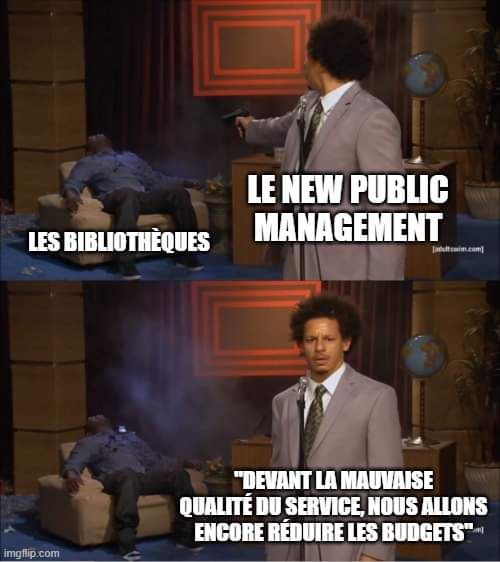

Mise en scène de l'impuissance publique, au moyen de coupures budgétaires pour remplacer un service peu coûteux mais fiable assuré par le public par un service privé, beaucoup plus coûteux, mais dont la réputation sera données comme étant beaucoup plus fiable, le tout souvent accompagné de technologies dernier cri et coûteuses financièrement et écologiquement mais qui ont une valeur purement rhétorique (IA, [[blockchain]]), voir validation des diplômes gérée par les universités : on fait intervenir un tiers de confiance privé très coûteux parce qu'on part du principe qu'on ne peut pas se reposer seulement sur une université pour garantir la validité des diplômes qu'elle décerne, exemple repris par Arnaud Levy en décembre 2024 [[@levyAlternativeLowtechAux2024]], voir [[low tech|low-tech]] et [[solutionnisme technologique|technosolutionnisme]]

# bibliographie

