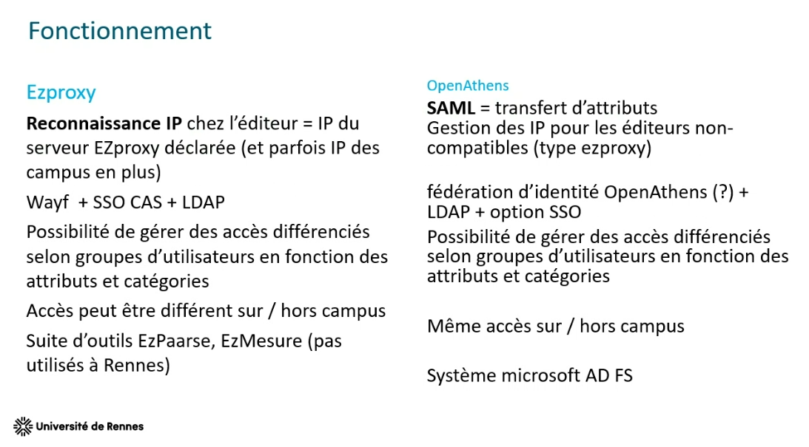

EZproxy -> OpenAthens

Fédération UK (entreprise commerciale)

mutualisation des abonnements (établissement expérimental, outil de découverte commun)
volonté des éditeurs de ne plus gérer les authentifications par IP

Transfert d'attributs
ça implique que l'éditeur ait développé cette lecture des attributs. OpenAthens propose aussi de gérer la reconnaissance par IP de tous les éditeurs qui n'auraient pas installé une reconnaissance selon leur standard.

$\newline$
# bibliographie
$\newline$

