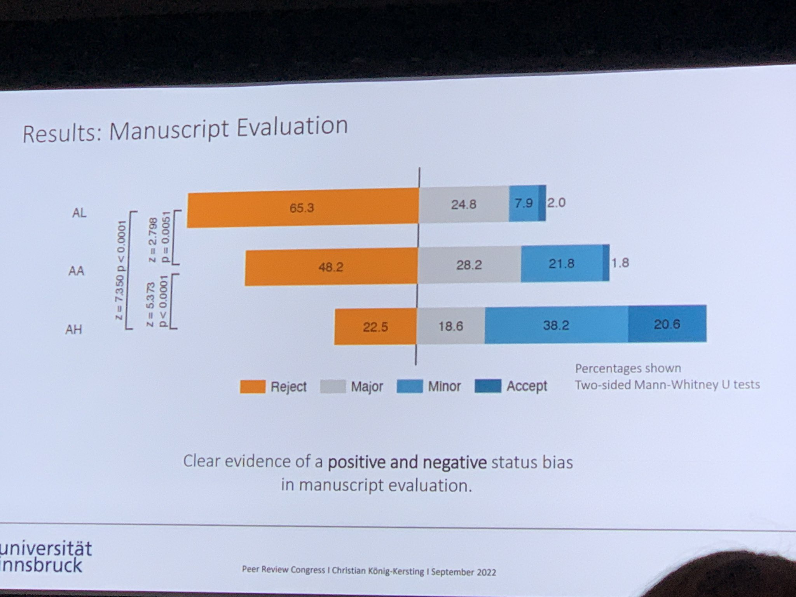

## définition

L'Open Peer Reviewing est une pratique mise en avant par les instances scientifiques qui souhaitent avancer sur le chemin de la [[Science Ouverte]]. 
Dans ce scénario, les reviewers échangent et discutent avec les auteurs en toute transparence. 

L'étude est publiée avec en supplément le contenu des remarques des reviewers. Ceux-ci sont nommés dans l'étude. Exemple : https://www.nature.com/articles/s41586-023-06220-3#peer-review

caractéristiques de l'open review : 

- **identités ouvertes** : (qui reviewe qui, qui est reviewé par qui : les uns et les autres savent le rôle qu'ils tiennent)
- **rapports ouverts** : les travaux des reviewers sont publiés en même temps que la publication. cela rend plus visible et valorise le travail bénévole de révision par les pairs qui prend tant de temps aux chercheurs. les chercheurs sont aussi encouragés à rendre un meilleur travail de révision par les pairs car ils pourront être jugés sur la qualité de cet travail (voir [Foster Open Science](https://www.fosteropenscience.eu/learning/open-peer-review/#/id/5a17e150c2af651d1e3b1bce.
- **participation ouverte**

## implémentation

La révision par les pairs est implémentée de différentes façons chez un certain nombre d'éditeurs : 

## intérêts

Les intérêts poursuivis sont les suivants : 
- **transparence**
 réduction des biais liés à des conflits d'intérêt. 
travail de reviewing accessible à tous
 
- **responsabilité des acteurs et qualité du travail**
  les travaux des reviewers sont publiés en même temps que la publication. cela rend plus visible et valorise le travail bénévole de révision par les pairs qui prend tant de temps aux chercheurs. les chercheurs sont aussi encouragés à rendre un meilleur travail de révision par les pairs car ils pourront être jugés sur la qualité de cet travail (voir [Foster Open Science](https://www.fosteropenscience.eu/learning/open-peer-review/#/id/5a17e150c2af651d1e3b1bce
- **ouverture et d'inclusivité**
participation d'un public plus vaste (voir selon quelles modalités ?)

## limites

Comme l'indique Olivier Le Deuff, un reviewer moins expérimenté que l'auteur du papier soumis peut rencontrer un problème de légitimité dans un processus ouvert. Olivier Le Deuff propose de n'ouvrir le peer-reviewing qu'après que l'article ait reçu une première validation ([source](https://twitter.com/neuromancien/status/1489510047596138496))

Propos corroboré par une étude déposée le 16 août sur le serveur de preprints SSRN
L'étude montre un fort biais de rejet ou acceptation d'un même article signé par deux chercheurs selon le nom de l'auteur de la paire qui est dévoilé : auteur très renommé : fort taux d'acceptation / auteur débutant : faible taux d'acceptation[[@huberNobelNoviceAuthor2022]]

entraînement de [[chatbots]] à partir des données de révision en mode ouvert : 

(source : https://mastodon.social/@alelazic/114406134614889609)

$\newline$
# bibliographie
$\newline$

