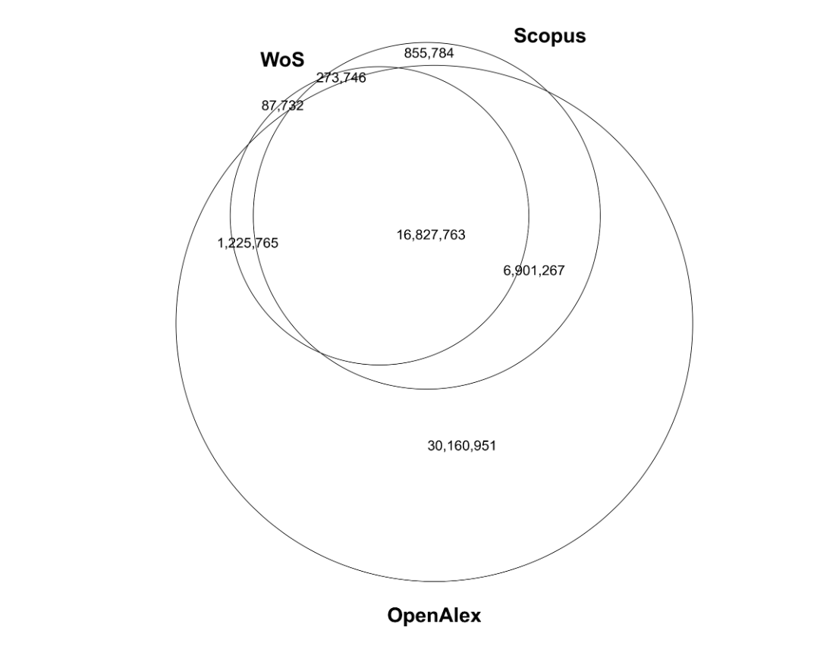

Voir [[analyse bibliométrique avec OpenAlex]]

OpenAlex, nommée ainsi en référence à la bibliothèque disparue d'Alexandrie, est une base de donnée bibliographique entièrement ouverte conçue pour remplacer la base MAG (Microsoft Academic Graph) que Microsoft a cessé de mettre à jour au 1er janvier 2022. 
En octobre 2023, OpenAlex contenait les métadonnées de 246 millions de documents (articles, ouvrages, preprints, etc) https://api.openalex.org/works, indexés selon les 65000 concepts hérités de Wikidata pour décrire le contenu de ces documents (https://api.openalex.org/concepts), et liés à 93 000 000 auteurs (après désambuiguisation, https://api.openalex.org/authors) affiliés à 107000 institutions. Ces documents sont hébergées sur 248 000 sites ( sites de revues, serveurs de preprints ou archives ouvertes https://api.openalex.org/sources)

L'accès à ces données se fait via une interface graphique en ligne (https://openalex.org/works), ou le protocole [[REST API]] (https://api.openalex.org/works). On peut aussi télécharger l'ensemble de la base hébergée sur les serveurs d'Amazon pour en verser le contenu sur un serveur propre. 

# Historique

Lorsque Microsoft a annoncé en mai 2021 que son support au MAG (Microsoft Academic Graph), une base de données citationnelles utilisée jusqu'alors librement par le monde de la recherche allait cesser, Certains spécialistes ont pointé le manque qu'allait susciter cette fin de service. L'association à but non lucratif OurResearch, avec l'ambition de proposer un catalogue entièrement ouvert du système mondial de la recherche (a fully open catalog of the global research system) a décidé de proposer à la place une base de données citationnelle entièrement en accès libre, Open Alex, qui a officiellement vu le jour le 1er janvier 2022.  

# Contenu

Le premier set de données est issu du Microsoft Academic Graph et a été progressivement enrichi par apport d'autres bases de données. 
Par exemple, les données liées aux institutions du [[ROR]] (Research Organization Registry) ont d'abord complété les données correspondantes issues de MAG avant de les remplacer en raison de leur plus grande richesse (https://ror.org/blog/2023-09-13-openalex-case-study/).
OpenAlex utilise également les données d'[[ORCID]] pour relier des oeuvres à des auteurs et Wikidata pour réaliser une indexation thématique des articles.  

travaux reliés (related works). Les travaux reliés dans les notices descriptives des travaux correspondent à des objects documentaires qui ont en commun un grand nombre de concepts ou bien étaient déjà reliés dans le graphe hérité de MAG. 

# Accès

Le contenu de la base est disponible en REST API. Il peut-être téléchargé librement et gratuitement. 
Depuis juillet 2023, la recherche booléenne est intégrée à l'API. 
Le code-source de l'application est également disponible sur GitHub (https://github.com/ourresearch/openalex-guts)
Une interface graphique pour interroger la base a vu le jour à l'été 2022 (https://openalex.org/works)

# Usages académiques

En plus de son ouverture, la transparence et la reproductibilité est la principale promesse d'une base de données citationnelles comme OpenAlex. C'est pour cela que l'Université de Leyden ( à l'origine du manifeste de Leiden sur la bibliométrie de 2015 [[bibliométrie#manifeste pour une bibliométrie plus transparente]]) a fait part de son intention d'utiliser OpenAlex et d'autres outils et méthodes libres pour établir son classement des institutions de recherche de 2024, alors que les précédentes versions du classement étaient réalisées au moyen d'outils propriétaires, comme le Web Of Science, propriété de Clarivate. 

OpenAlex est conçu comme un outil permettant à des institutions de recherche de mieux connaître leur production scientifique et parallèlement de connaître les orientations de recherche d'institutions concurrentes ou partenaires. 
OpenAlex peut être utilisé par des universités notamment pour mesurer les progrès réalisés par leurs équipes de recherche par rapport à leurs objectifs en matière d'ouverture des publications ou de développement durable. En effet, l'API d'OpenAlex utilise les données du [[DOAJ]] ainsi que d'Unpaywall pour indiquer le statut (Fermeture ou ouverture) et la voie utilisée pour la mise en open access (Gold, Green, [[Bronze Open Access|Bronze OA]], Hybride). 
L'API d'OpenAlex utilise les requêtes d'Aurora pour qualifier les oeuvres indexées en fonction des objectifs de développement durable définis par les Nations Unies. 

couverture d'OpenAlex : 

(source: [[@culbertReferenceCoverageAnalysis2024]])

# Présentation d'OpenAlex au SCD de Rennes

Voir présentation de Mélanie Friche le 19 décembre 2024 ([[@frichePresentationDOpenAlexServices2024]])

# OpenAlex et R

voir [[OpenAlex et R]]

## Notes et références

$\newline$
# bibliographie
$\newline$

