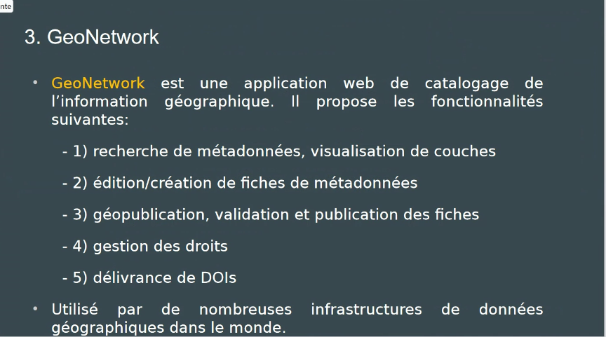

https://www.osuris.fr

OSUR : observation de l'environnement
formation à partir du master. 
plateforme suivie par deux ingénieurs géoscience. (1 ETP). [[maintenance]] technique assurée par des prestataires. 

# partager des données à l'OSUR

Cela fait une quinzaine d'années que l'OSUR développe un système de partage de données. réflexion sur l'outil et les standards. Séminaire Métadonnées dans lequel on a invité un chargé de mission écologie et développement durable. 
Inventaire des données concernées par la directive INSPIRE : ressources minérales, géologie, hydrographie : toutes ces données devaient être mises à la disposition des communautés de chercheurs. [[FAIR]] recommandé depuis 2012. 

Les chercheurs ne déposent pas directement dans OSURIS ("ça serait trop beau"). 

# outil de catalogage
normes ISO 915 : territoires

Géonetwork

# geoflow

développé par l'IRD, on utilise cet outil pour intégrer des jeux de données qui sont assez ressemblants. 2 fichiers : fichier de config + fiche de métadonnées. 

Les chercheurs fournissent leurs données à des ingénieurs qui les entrent dans Osuris. 

choix d'utiliser des [[thesaurus]] reconnus internationalement

Les réseaux des zones ateliers peuvent être moissonnés par Osuris. 

Osuris dispose d'un système de versionnement sur la fiche de [[métadonnées]] mais pas dans les données lui-même. 

# OSUR et DataTerra

Volonté des OSU de se rapprocher de DataTerra (Theïa) pour l'archivage des data

Sur OSURIS l'idée est d'obtenir une fiche par projet (l'atelier de la donnée ARDOISE devrait rappeler cela aux chercheurs), libre après aux chercheurs du projet de renvoyer vers les données hébergées ailleurs (DataTerra, [[Recherche Data Gouv]])
moissonnage d'OSURIS par Cat.Indores
OSURIS n'a pas la capacité de faire de l'hébergement des données -> renvoyer les chercheurs vers les entrepôts qui ont cette capacité. 

Faciliter la saisie des métadonnées: templates, Geoflow, Data2geo ; import et export de données depuis le dataverse avec [[R (logiciel)|R]]
