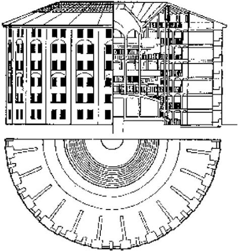

Invité par le duc Potemkine (celui des fameux Villages Potemkine) à gérer une équipe de travailleurs, Samuel Bentham, frère de [[Jérémy Bentham]], a du faire face assez vite à des troubles au sein de ses équipes de manoeuvres dus à l'alcoolisme et aux rixes. Afin de pouvoir tenir en permanence ses travailleurs sous sa surveillance, il les a réunis dans un dortoir circulaire disposant d'une cour intérieure et s'est aménagé un bureau dans la tour située au milieu de cette cour. C'est à partir de ce modèle que Jérémy Bentham a imaginé son fameux *panopticon* au départ pour concevoir un nouveau type de prison. C'est de ce *panopticon* pénitentiaire dont [[Michel Foucault]] s'est servi pour penser l'Etat de surveillance. 
Il faut noter que le panopticon n'avait pas à l'origine un contexte pénitentiaire mais provient de la nécessité de contrôler la force de travail, ce que font aujourd'hui les [[grands modèles de langage|intelligences artificielles]] comme celles d'Amazon (voir à ce sujet Kate Crawford [[@crawfordContreatlasIntelligenceArtificielle2023]])

$\newline$
# bibliographie
$\newline$

