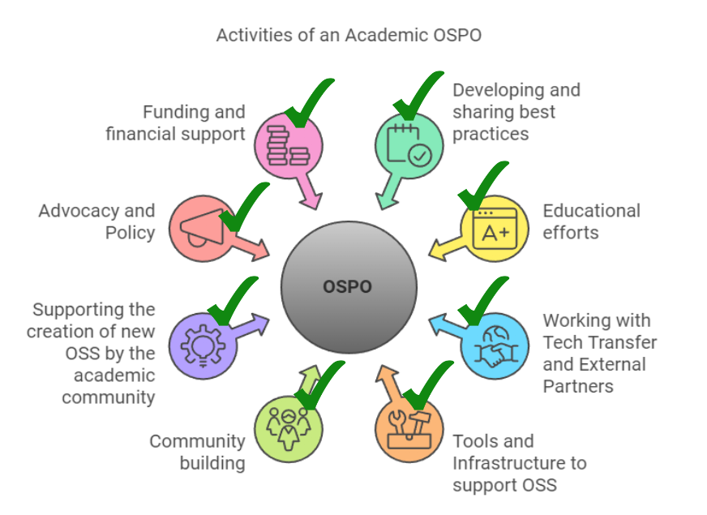

# Qu'est-ce qu'un OSPO ?

"Open Source Programme Office"

Les OSPO ont d'abord été présents dans les entreprises avant de concerner le monde académique

L'enjeu pour les entreprises étaient de faire face aux risques de réutilisation du logiciel libre : certaines licences libres sont contaminantes. Si on réutilise des briques sous ces licences, on doit ouvrir l'ensemble du logiciel à la communauté (Cas de la General Public Licence)

La Commission de l'Union Européenne a été la première instance publique à ouvrir un OSPO en Europe. 

L'Université de Grenoble Alpes a inauguré son OSPO, le 23 septembre 2025, le premier OSPO académique de France. 

Les OSPOs académiques du monde entier sont soutenus par l'alliance CURIOSS (Community for University and Research Institutions OSpoS). CURIOSS est financé par une fondation Sloan, une fondation américaine à but non lucratif qui soutient des projets dans les domaines de la science et de la technologie. 

# Qu'est-ce que l'Open Source

Le logiciel libre est une philosophie, un mouvement social. 
L'open source est un mode de développement ouvert du logiciel libre (ouvert à différents types d'utilisation et de contribution). 
Le monde industriel ne parle pas de "libre" mais plutôt d'"Open Source". Pourtant l'Open Source reste très lié aux origines des 4 libertés attribuées au logiciel libre

- Liberté 0 : pouvoir exécuter le code pour n'importe quel usage
- Liberté 1 : pouvoir d'étudier le code et le changer pour en faire ce que l'on veut
- Liberté 2 : pouvoir le partager (droit de redistribution).
- Liberté 3 : pouvoir améliorer le code

# Que fait un OSPO académique ?

Ce que fait un OSPO académique reste très lié à la question qui en fait partie ? 

Généralement on retrouve ces parties prenantes : 

| service                                                                               | rôle                                                                                                                                                                                                                                  |
| :------------------------------------------------------------------------------------ | ------------------------------------------------------------------------------------------------------------------------------------------------------------------------------------------------------------------------------------- |
| Valorisation et expert juriste en licences libres                                     | conseille les chercheurs et chercheuses sur les licences à attribuer à leur code                                                                                                                                                      |
| DSI                                                                                   | gère des infrastructures propices au développement de code source, en particulier la forge de l'établissement                                                                                                                         |
| BU                                                                                    | fait le lien entre code source et HAL (publications) ou code source et données (Atelier de la donnée) code source et archive (> lien avec Software Heritage)  de plus en plus forme les doctorant.e.s au partage du code source |
| Enseignants travaillant dans le cadre de l'OSPO                                       | forme chercheurs/ses et doctorant.e.s aux bonnes pratiques en matière de développement (poursuit l'action des BU)                                                                                                                     |
| Centre de calcul (en tant que lieu où se retrouvent des gens qui développent du code) | développent du code, créent et partagent des bonnes pratiques et méthodes de développement (frameworks)                                                                                                                               |
| Entreprises du bassin d'emplois                                                       | entreprises qui produit du code source libre                                                                                                                                                                                          |

un OSPO académique aide une institution de recherche (université, institut de recherche) à coordonner et gérer une stratégie de valorisation du logiciel libre, des politiques en matière de licence et des activités (en terme de production de logiciel libre) 

et concrètement ? 

Rôles possibles des bibliothécaires au sein de l'OSPO : 

- présentation de l'OSPO aux chercheurs et doctorants
- formation aux outils de développement (forge)
- formation aux bonnes pratiques en matière de reproductibilité
- lien du code avec l'archive ouverte

Violaine Louvet insiste sur deux points : 

Les services de valo ont un rôle éminent, mais en général ne connaissent pas bien les licences logicielles libres

Des liens sont à faire avec des acteurs non académiques, en partie pour comprendre quelles sont les nouvelles bonnes pratiques de développement ou bien avec les entreprises qui produisent du logiciel libre

-> Lien avec OSPO-FR  : OSPO des administrations françaises comme l'OSPO de la DINUM

-> Liens avec [OW2](https://www.ow2.org/) : association d'entreprises qui produisent du logiciel libre. OW2 promeut la production de code source libre de haute qualité pour les besoin des entreprises.

# Comment crée t-on un OSPO ?

Coalition de partenaires sur le campus obtenue grâce à deux années de discussions à l'Université de Grenoble. 

Bastien Guerry (DINUM) : 

> Il faut parler très fort et garder le lien avec la hiérarchie. 
> Il faut élargir la base des gens qui ont besoin de notre OSPO. 

La DINUM a écit un "codemeta des OSPO" : https://github.com/Bluehats/ospometa

Le VP Recherche de l'Université de Poitiers est intéressé par la création d'un OSPO dans son université.

CURIOSS existe pour aider à la mise en place d'un OSPO