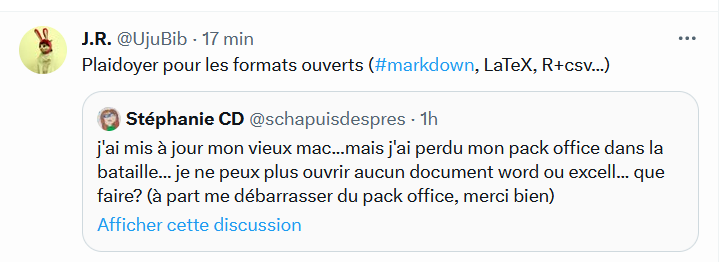
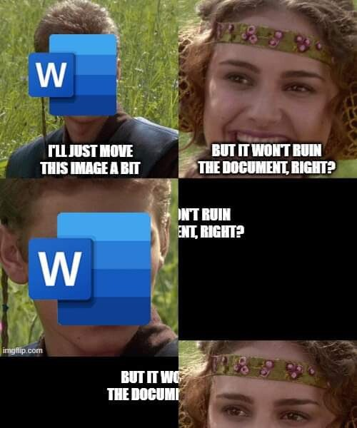

# Qu'est-ce que le markdown

Le markdown est un langage de balisage simple inventé par [[John Gruber]] avec l'aide d' [[Aaron Swartz]]. Cette syntaxe est  facilement interprétable par un humain ou une machine (à l'origine pour produire du HTML, l'édition en HTML étant ressentie comme compliquée et facilitant les erreurs). 
Le markdown est devenu la syntaxe standard dans lequel sont documentés les projets libres (en particulier les projets éducatifs libres ou ressources éducatives libres [[@dietrichLiaScriptDomainspecificlanguageInteractive2019]]

Certains considèrent que le Markdown devraient rester un langage de balisage et ne pas devenir un format de mise en page (comme le format word), mais le fait de parser à la volée le Markdown dans les applications et les éditeurs de texte (typiquement c'est le cas chez Obsidian) a tendance à rendre le markdown invisible, ce qui contredit l'esprit initial du projet, voir à ce sujet [[@anonymeMarkdownSlowFade2025]]
qui cite Gruber [[@gruberThingsSupportMarkdown]]

# Avantages du markdown

## un format alternatif à $\LaTeX$ et au traitement de texte et parfaitement interopérable

Format interopérable, réutilisable

Il s'agit d'une syntaxe très simple à apprendre et faite pour éditer des textes vers une grande variété de formats (wiki, odt, doc, pdf, html, [[LaTeX]]), c'est cette souplesse à donner à lieu à des formats différents qu'on appelle la versatilité du markdown. 

## traitements de texte vs éditeurs de textes

Depuis 1984, ceux qui écrivent de la poésie et ceux qui écrivent du code, à quelques exceptions près, n'écrivent plus sur le même support numérique. (le traitement de texte Wordstar vendu à partir de 1978 avec la microinformatique de l'époque (MSDos) permettait auparavant d'écrire des codes exécutables en même temps que des textes imprimables et formatés pour être lisibles sans changer de logiciel)

L'essor du traitement de texte -qui ne permet plus d'écrire du code- a eu pour corrollaire le développement séparé des éditeurs de texte orientés langages de programmation. ([[@DehutfiniravecWord2018]])

>Nous avons donc perdu progressivement la capacité d’écrire dans un langage interprétable par la machine

Un traitement de texte est fait pour vous faciliter certaines mises en page de façon automatique : il prend en charge (tout en les invisibilisant) des opérations sous-jacentes.  Cela vous fait gagner du temps mais jusqu'à un certain point. 

Le fait de recourir à ces traitements de texte opaques (parce que propriétaires et parce que ne permettant pas d'accéder à la liste des opérations) constitue un danger pour écrire la science (Cela comporte un risque d'erreur du au manque de transparence du logiciel). Par ailleurs, le traitement de texte développé par Microsoft est un logiciel de bureautique, idéal pour envoyer des commandes, des reçus, des notes administratives mais pas approprié aux écrits académiques sur certains points. On ne peut pas par exemple placer si on le souhaite disposer les notes de bas de page en notes de marge (style Tufte). La placement des images est toujours un défi avec Word. 

Pour ces besoins moins communs existe depuis les années 90 le langage de programmation orienté édition $\LaTeX$ qui découple le contenu du texte de sa mise en forme. Cela ouvre la voie à des fonctionnalités qui permettent une finesse d'édition plus importante que celle dont sont dotée les traitements de texte. 
Bien sûr, ce langage convient particulièrement aux chercheurs en informatique pour qui l'édition est aussi une affaire de programmation. Mais on voit de plus en plus de chercheurs et chercheuses en Sciences Humaines s'en emparer, sans parler des éditeurs chez qui ils font paraître leurs écrits qui ajoutent $\LaTeX$ à leur chaîne éditoriale. 

## Découplage structure / contenu

Ce découplage forme/fonds (qui va à l'encontre de l'impératif du [[WYSIWG]]) est un acquis important dans l'acquisition d'un [[compétence#Compétence vs capital|capital informatique]] selon Julie Denouel ([[@denouelNumeriqueEducationFormation2022]] p77)

> Certains parents montrent à leurs enfants d’autres logiciels, tableur-grapheur, des fonctionnalités de mise en forme de texte qui confrontent les enfants à l’idée d’une séparation entre la forme visible du texte et sa structure sous-jacente

En 2024, Aaron Swartz et John Gruber ont inventé le markdown plus simple à utiliser que HTML comme on l'a vu mais aussi beaucoup plus rapide à appréhender que le complexe langage $\LaTeX$ (même si ce dernier permet de faire des réglages que Markdown à lui seul ne peut pas prendre en charge, notamment en vue de la composition de PDF ;  mais il est toujours possible de réserver dans un texte en markdown des environnements en $\LaTeX$ au besoin)

>Le HTML comprend un grand nombre de balises. La mise en page du texte peut être également enrichie au moyen du CSS. La force du Markdown résulte dans l’utilisation de balises peu nombreuses, simples à mettre en place et à mémoriser. Il devient aisé de réaliser un document dont on maîtrise la mise en page sur le Web, sans pour autant devoir apprendre le HTML. Plus encore, en conjonction de Pandoc qui est un moteur de conversion, il devient possible de produire aussi bien du HTML, que des pdf, des docx, des epub, et même des présentations de type PowerPoint. On ne produit alors ses données qu’une seule fois et on les exporte mises en forme automatiquement pour plusieurs supports. 

[[@dehutFinirAvecWord2018]]

Au lieu d'apprendre à utiliser des [[interface graphique|interfaces]] qui changent régulièrement avec les changements de version et n'engendrent qu'un savoir restreint à l'éditeur de texte, apprenons plutôt le langage homme-machine pour compiler du texte avec des instructions de mise en forme. 

Marcello Vitali-Rosati voit également dans la combinaison du Markdown pour la simplicité et du $\LaTeX$ pour la finesse un moyen de dépasser sa frustration d'universitaire qui souhaite donner plus de sens à la structure d'un texte [[@vitali-rosatiChercheursSHSSaventils2018]]

# un format qui gagne du terrain

## Insertion dans les chaînes éditoriales scientifiques

Entre les paradigmes des outils TeX et celui des traitements de texte (Word, Writer de LibreOffice, Google Docs), un autre paradigme alternatif se met en place autour de markdown et de Pandoc mais qui permet à présent de s'ouvrir aux revues en ligne. Au lieu d'avoir à transformer son texte en markdown dans un template word ou LaTeX, il est désormais possible de l'envoyer via Pandoc en XML-TEI sans rien connaître à ce format, à travers Stylo un éditeur mise au point par Marcello Vitali-Rosati et qu'Humanum s'est réapproprié pour permettre aux auteurs et autrices de passer plus simplement à une écriture en Markdown. Stylo est l'éditeur de base des revues qui sont éditées avec la deuxième version de Lodel (sortie en avril 2024), c'est à dire des revues hébergées sur OpenEdition ou la plateforme Metopes [[@perretLodel2Stylo2024]]. 

## ChatGPT, Teams, messageries instantanées, finalement le markdown se retrouve partout 

Des outils très populaires qui ont intégré la possibilité d'éditer ou de générer du contenu en markdown (ou qui fonctionnent principalement avec cette syntaxe) ont donné une nouvelle popularité au markdown et accru son usage. 
Il est possible par exemple d'écrire des messages en markdown sur Slack ou sur Teams ; ChatGPT génère ses réponses en markdown, on peut le constater quand on copie-colle celles qui comportent des tableaux sur un traitement de texte. 

Tout cela laisse à penser que le texte simple accompagnée d'une syntaxe légère comme le markdown pourrait un jour s'imposer par rapport aux formats complexes issus de traitements de texte. 

> Markdown is being used more and more—without people being fully aware what it really is and what it’s called. Just like the WYSIWYG became ubiquitous without most people knowing what it’s called. We should nevertheless encourage everyone, especially children, to learn it consciously, to extend their know-how beyond headings, bold and italics. Markdown helps us focus on what we want to say instead of how it looks. It gives us more control over our writing—and over the digital tools we use

[[@anonymeMarkdownSlowFade2025]]

$\newline$
# bibliographie
$\newline$

