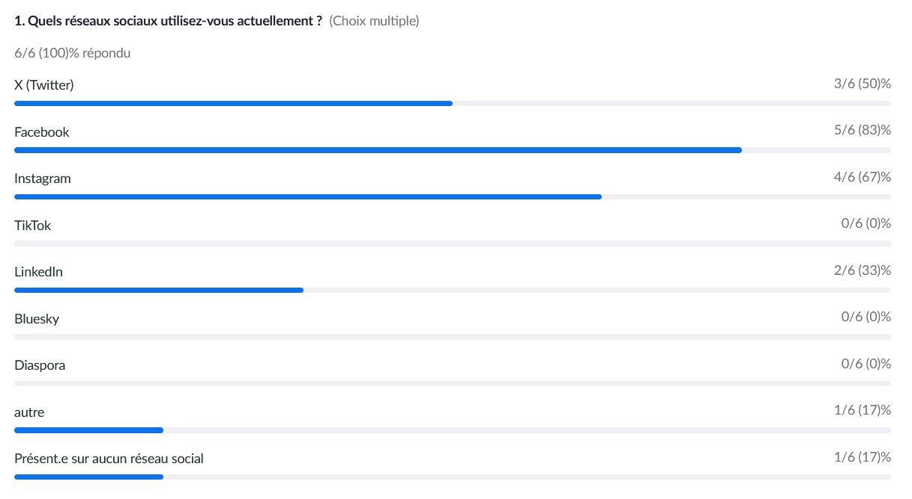
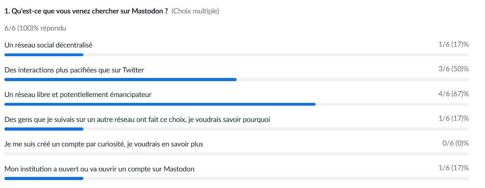
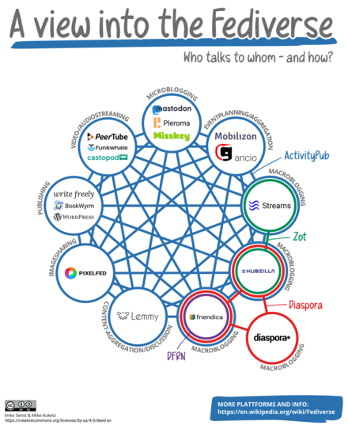
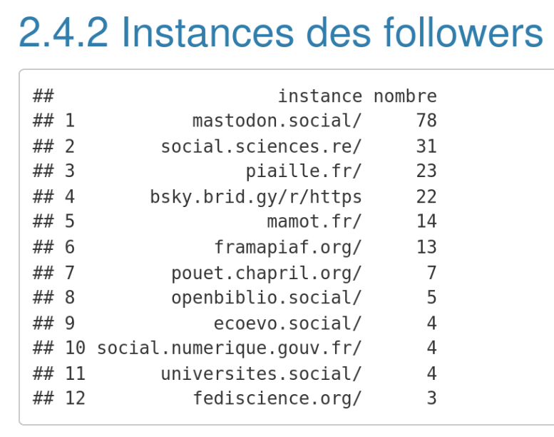
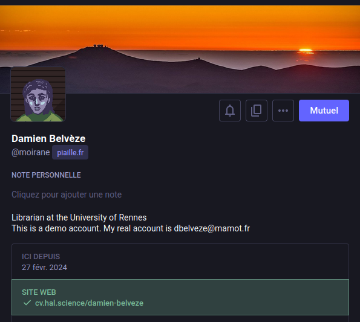
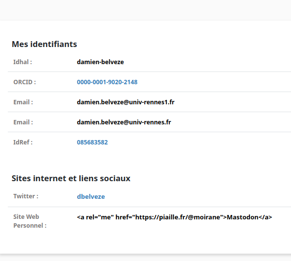

# Premiers pas avec Mastodon
### Stretching numérique 2025
##### Damien Belvèze

---
# Sondage

Merci pour vos réponses !

---
Sur quel réseau social vous trouvez-vous actuellement ?

note: 
réponses 2024

---
Qu'est-ce qui vous fait venir vers cet atelier sur Mastodon ?

 note: 
 réponses 2024
---

<grid drop="left" >

## Mastodon n'est pas un clone libre de Twitter

- Fedivers / Mastodon
- Mastodon (logiciel) = Eugen Rothko
- Fedivers (réseau et protocole)
</grid>
<grid drop="right">

</grid>

note:
(plus que Bluesky à ce jour en tout cas [[@hermannBlueskyEstilDecentralise2024]], voir aussi ce [[thread]] du [4 février 2025](bluesky_decentralized.html) )
Ce réseau, le Fédivers (Fediverse), fédère plusieurs instances tournant avec le même logiciel ([[Mastodon]], mis au point par Eugen Rochko). Le Fédivers permet de faire tourner d'autres logiciels que Mastodon (Peertube et Diaspora par exemple) selon un protocole unique, ActivityPub. Donc quand on devient utilisateur de Mastodon, on ne va pas à proprement parler "sur Mastodon", mais sur le Fédivers.
Pour en savoir plus sur ce réseau qu'est le Fédivers, nous vous recommandons de suivre le [cours ouvert consacré à ce sujet](https://librecours.net/module/lownum/fediverse/fed02c01fediverse.xhtml)

---
### Intérêts d'une architecture décentralisée 

- coûts réduits (pas besoin de monétiser)
- Ouverture à des acteurs plus variés
- règles prises de manière collaborative
- forte résistance à la censure globale (mais possibilité de censures locales)
- responsabilité individuelle encouragée (content warning)
- l'usage garde le contrôle de ses données

notes: 
- pré-requis techniques pour héberger un serveur
- temps à passer à la modération (plus les comptes hébergés sont nombreux et plus le travail de modération prend du temps)

---

nomutilisateur@nomservice

note:
Le protocole d'échange sur le Fédivers est le suivant : 

nomutilisateur@nomservice  
par exemple : dbelveze@mamot.fr  
Mamot (https://mamot.fr) est l'instance de Mastodon maintenue par la Quadrature du Net sur le Fédivers. Pour communiquer avec moi, il faut préciser mon nom d'utilisateur et le service que j'utilise (en l'occurrence une instance de Mastodon qui a pour adresse mamot.fr)
[liste de serveurs Mastodon](https://joinmastodon.org/servers)

---
### Points d'attention lors du choix du serveur (1/2)

<ul>- <b>Langue</b> : les modérateurs indiquent qu'ils ne pourront pas modérer des messages dans des langues qu'ils ne connaissent pas</ul>

<ul>- <b>Communautés</b> : certaines instances sont spécialisées autour de certaines communautés, par exemple communautés éducatives</ul>

<ul>- <b>NSFW / CW</b> : politique en matière de contenus susceptibles de choquer (= content warning)</ul>

note:

(charte orientée vers un groupe d'usages, cas de [octodon.social](https://octodon.social/about), instance maintenue par un collectif politique et qui pratique une censure en fonction de ses parti-pris politiques). La censure sur Mastodon (sous toutes ces formes, de la réduction de la portée du toot au blocage) est tolérée dans la mesure où on peut changer d'instance sans perdre son réseau ni ses messages (contrairement aux réseaux sociaux centralisés). 
Hormis ces cas un peu extrêmes, choisir une instance, ressemble un peu à choisir un hébergeur pour sa messagerie (john.doe@gmail.com ou john.doe@yahoo.fr)
Lorsque vous connaissez John Doe, mais ne savez pas chez quel hébergeur il est, vous pouvez avoir des doutes. Est-ce vraiment John Doe qui est derrière cette adresse. 

---
### Points d'attention lors du choix du serveur (2/2)

<ul>-<b>No pub</b> : prohibition de la publicité (# Bluesky)</ul>

<ul>-<b>robots</b> : indiquer qu'il s'agit d'un robot si c'est le cas.</ul> 

==Il est très facile de changer d'instance, sans rien perdre au passage !==

---
## certification
<grid drop="left">
## certification

</grid>
<grid drop="right">      

</grid>
note:

Mastodon vous offre la possibilité de "vérifier" (très différent de la certification sur Twitter puis X) votre compte en le reliant à un espace de publication que vous maîtrisez (site web ou bien CV HAL)
 (cf. [ce tuto](https://celiangodefroid.fr/blog/certifier-compte-mastodon-cv-hal))
---
## création d'un compte sur Piaille

S'inscrire sur l'instance Piaille.fr (https://piaille.fr/home)
paramétrages : 

choisir un nom de compte
une ou deux lignes de bio et des hashtags en présentation

note:
Certaines instances font le choix de ne plus accepter de nouveaux membres (Mamot de la Quadrature du Net) pour éviter la surcharge ou par volonté de laisser de la place à d'autres instances.
D'autres modèrent à l'entrée (sciences.re)
Mastodon Social est la première instance (historiquement et en nombre de comptes hébergés de Mastodon)
Piaille reste ouvert et ne modère pas à l'entrée

---
## premiers échanges

- suivre (depuis Mastodon) Strech_Num_Mastodon@piaille.fr
- suivre @Wikipédia_fr
- Envoyer un toot avec #SN_mastodon 
- Chercher tous les messages avec un hashtag #SN_mastodon et suivre leurs auteurs

---

<table style='font-family:"Courier New", Courier, monospace; font-size:60%' >
    <tr>
        <td><b>X-like</b></td>
        <td><b>Mastodon</b></td>
    </tr>
    <tr>
        <td>tweet (280)</td>
        <td>toot (500)</td>
    </tr>
    <tr>
        <td>retweet</td>
        <td>boost</td>
    </tr>
    <tr>
        <td>like</td>
        <td>favorite (pas comptabilisé)</td>
    </tr>
    <tr>
        <td>__</td>
        <td>bookmark (plus important que favorite)</td>
    </tr>
    <tr>
        <td>quote tweet</td>
        <td>___</td>
    </tr>
</table>
 

- Les images doivent avoir un *alt text* (de préférence l'écrire sans IA)
- Les images sensibles doivent être mises en cw (content warning)

note: 
Longueur du texte : dépend de l'instance, assez souvent 500 caractères ; parfois, il n'y a pas de limites.
Liens : tous les liens courts ou longs font 27 caractères, globalement, ça évite d'utiliser des [[raccourcisseurs de liens]] (fragilité des liens + captation de données personnelles par bit.ly ou Google shortener)

---
<grid drop="left">    
## interopérabilité avec BlueSky 

</grid>
7<grid drop="right">   
- [instructions](https://fed.brid.gy/docs#fediverse-get-started)
- le pont connecte dans l'autre sens
- il faut avoir déjà envoyé quelques toots pour que ça fonctionne
</grid>

---
## Listes

- créer une liste
- ajouter un profil à une liste
- importer une liste (lists.csv). Au moment de l'import, bien sélectionner le type de liste dont il s'agit : liste de comptes à suivre ? liste de comptes à bloquer ? dans tous les cas, nommer le fichier lists.csv
- Pour une liste de comptes à suivre, colonne A : nom de la liste, colonne B : comptes à suivre en relation avec cette liste.
---
## Starter packs 

trouver le *starter pack* qui vous va bien : 
https://fedidevs.com/starter-packs/
Plus tard, qui sait, vous créerez votre starter pack

---
## Pour aller plus loin

pour bien démarrer avec Mastodon, utiliser le tuto en français de [Grégory Gutierez](https://gregorygutierez.com/doku.php/linux/intro-mastodon)

Régulièrement mis à jour (mais en anglais)
- [Mastodon Help](https://mastodon.help/
- [Fedi.tips](https://fedi.tips/)

---
## Analyser les données de Mastodon

Utiliser R et le package Rtoot

[analyser les données de Mastodon](https://damienbelveze.github.io/Mastodon_SO_UnivRennes/mastodon_study.html)

[analyser les données avec Python](https://gist.github.com/rndblnch/2b496948204c5453c45a74c2518ec463) 