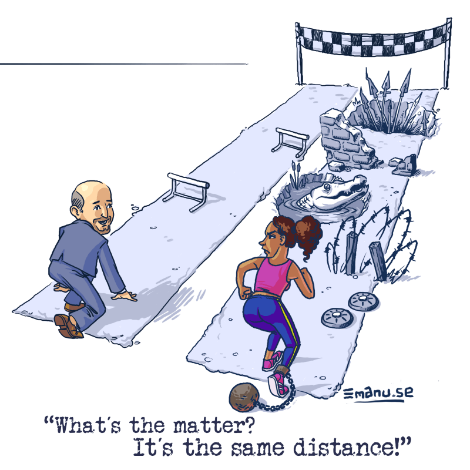

# naissance du concept

Peggy Mcintosh est une chercheuse qui a étudié dans son propre parcours et le parcours de personnes de couleur les moments où elle a été avantagée, ne serait-ce que par le fait de n'avoir par été discriminée pour sa couleur de peau. Elle a tiré de ces observations et de son expérience le concept de **privilège blanc**, tout en montrant aussi les limites de ce concept, et parmi ces limites, le fait que le privilège octroyé aux blancs du fait de leur couleur de peau n'est un privilège que tant qu'on considère qu'il s'agit d'une exception alors qu'il devrait être la norme. 

Les émeutes de 2005 suite à la mort de Zied et Bouna ont manifesté la [[racialisation]] des rapports sociaux qui était à l'oeuvre dans la société depuis l'époque coloniale. Notamment, on a montré que les personnes de couleur faisaient l'objet de contrôles policiers bien plus nombreux que les personnes blanches et que ces contrôles avaient plus de risques de mal tourner. 

En tant qu'hypothèse de recherche, le concept de privilège blanc, devrait donc permettre au moyen d'enquêtes sociologiques et de recueil d'observation sur le terrain d'identifier les moments ou les conditions où les personnes de couleur sont discriminées par rapport aux personnes blanches afin de mettre fin à ces discriminations. 

On peut observer aussi du côté des personnes blanches une incapacité à observer le [[racisme]] là où il est parce que précisément ces personnes n'en seront pas les victimes. D'où pour ces personnes la nécessité de ne pas évaluer la portée d'un fait social à leur seule expérience.

Le concept de privilège blanc n'est pas fondé sur une essence (on est blanc ou noir), mais sur une construction sociale (on apprend à se conduire en personne blanche ou personne de couleur). De même, à la base, la blanchité n'est pas un concept essentialiste mais une construction sociale qu'il s'agit de [[Déconstruction|déconstruire]] avec les outils de la méthode sociologique ou le savoir historique. Toutefois, l'emploi de ces termes dans la société des années 2020, et notamment sous la plume d'essayistes comme [[Robin di Angelo]], auteur de Fragilité Blanche, remettent en cause ce postulat déconstructioniste et attache ces termes à des essences : en tant que personne blanche, on devra se repentir toute sa vie des privilèges attachés à sa couleur de peau. Cet usage militant de la notion produit du rejet et au lieu de permettre à différentes catégories de population d'entrer en contact avec d'autres catégories en essayant de comprendre comment elles sont avantagées par rapport à ces dernières, l'essentialisation de la blanchité détourne des segments de la population (blancs, hétéros, hommes cis) des cercles militants ce qui est contre productif. 
Il faut noter que la notion de privilège comporte ce risque alors qu'on pourrait plutôt parler de désavantage pour les les populations qui sont dépourvues de privilèges : 

> L'universitaire et militante féministe Aurore Koechlin a raison de pointer le caractère peu satisfaisant de ce mot, qui implique l'idée d'un "quelque chose en trop", et non de "quelque chose que tout le monde devrait avoir". Peut-être vaudrait-il mieux en effet insister non pas sur les avantages dont jouissent les un.e.s, mais sur les "désavantages", et les "injustices" dont pâtissent les autres

([[@cholletResisterCulpabilisationQuelques2024]], p235)

Reconnaître ses privilèges, ce n'est pas marquer une forme de culpabilité. Il n'est pas nécessaire que cette reconnaissance soit suivie d'actes. 

> Vous n'avez pas forcément quelque chose à faire après avoir reconnu vos privilèges. Vous n'avez pas besoin de vous excuser. Vous avez à comprendre l'étendue et les conséquences de vos privilèges, et à rester conscient.e.s du fait que les gens différents de vous évoluent dans le monde et l'expérimentent de manières dont vous ne saurez jamais rien. 

(Roxane Gay, bad feminist, 2014, cité par [[@cholletResisterCulpabilisationQuelques2024]], p236)
Dans le cadre militant, le privilège peut être aussi mis à disposition de la cause à défendre ; par exemple la visibilité ou la force physique ou encore l'éducation et le niveau de diplôme. Il s'agit d'abord et avant tout de savoir soi-même d'où on parle et comment accueillir la parole et l'expérience de l'autre, complémentaire de la sienne. 

Détournant l'esprit de cet usage inclusif de la reconnaissance de privilèges, certains établissements de Californie (Community Colleges) reprennent littéralement les propositions de Robin Di Angelo et imposent à tous leurs enseignants de prendre conscience de leur racisme. Toute personne qui ne se dit pas raciste est dans le déni, selon les promoteurs de ce programme auquel on ne peut de désister sans nuire à son avancement et à ses perspectives de carrière [[@lesnesToutProfesseurQui2023]]. 

Selon le sociologue Ary Gordien (voir ci-dessous), l'usage actuel du concept par un grand nombre de [[militants]] [[antiracisme|antiracistes]] a le tort également de considérer que s'il y a des blancs (dominants), il y a en face des noirs (dominés). 

<iframe width="560" height="315" src="https://www.youtube.com/embed/H9iX2XCYLBI" frameborder="0" allow="accelerometer; autoplay; clipboard-write; encrypted-media; gyroscope; picture-in-picture" allowfullscreen></iframe>

Cette binarité est aveugle à la question du contexte. Par exemple, une personne maghrébine peut considérer faire partie des dominés en France mais peut aussi occuper la position de dominants au Maroc ou en Algérie où le racisme anti-noir est également très développé. De même, d'après certaines listes de privilèges, comme celle de [Buzzfeed](https://www.buzzfeed.com/regajha/how-privileged-are-you), le fait d'être un athée est un privilège dans les pays occidentaux (par rapport à celui d'être un musulman par exemple), alors qu'en Egypte des militants sont détenus en prison pour athéisme (exemple emprunté à Sophie Mazet [[@MAZETAutodefenseintellectuelle2020]].

- Tous les blancs ne sont pas privilégiés indistinctement et par rapport à eux certains personnes de couleur peuvent occuper des positions sociales enviables. La question du privilège blanc peut occulter d'autres questions sociales comme l'inégale répartition des richesses.

- De même certains privilèges pourtant documentés par la littérature sociologique ne font jamais l'objet d'attention comme celui de la beauté. Jean-François Amadieu a pourtant mis en évidence que les personnes au physique avenant avaient plus de facilité à être recrutés puis promus que les personnes au physique plus passe-partout. 

- Dans certaines situations, le privilège d'être un homme devient un désavantage quand on lui combine une propriété comme la couleur de peau. Dans les multiples contrôles au faciès des jeunes d'origine maghrébine ou africaine, le [[genre]] masculin ne constitue en aucun cas un privilège bien au contraire. Cette combinaison de variables et leur impact sur les individus sont mis en évidence par la méthode [[intersectionalité|intersectionnelle]](source : [[@Gauvrittetesbienfaites2019]], note de bas de page 239)

Enfin cette binarité a tendance à figer les acteurs dans des groupes constitués à partir de caractères visibles comme la couleur de peau et à sédimenter et pétrifier ces catégories que la notion de privilège blanc entendait au départ [[Déconstruction|déconstruire]]. 
C'est ce que les sociologues appellent le *looping effect* : en [[classification|classifiant]] les individus sur la base de leur apparence et de leur couleur de peau, on forge des personnes réduites à cette apparence et à cette couleur de peau, et on [[naturalisation|naturalise]] des comportements. ([[@crawfordContreatlasIntelligenceArtificielle2023]], p165)

cette auto-réification sur fonds de réappropriation de l'identité jugée discriminée se retrouve également dans des discours populistes d'extrême droite, comme le note [[Eva Illouz]] à propos des Séfarades ("Mizrahim") que les leaders d'extrême droite recrutent en rappelant à quel point ces derniers ont été discriminés depuis leur arrivée en Israël par les Ashkénazes : 

> La discrimination assigne l'autre à une identité figée, et la fière réappropriation de cette même identité contribue en réalité à la figer plus encore, à perpétuer de façon très ironique l'auto-réification dont les auteurs de ces discriminations furent à l'origine. 

(Source : [[@illouzEmotionsContreDemocratie2022]], p169)

Pour l'écrivain Thomas Chatwill, certaines personnes noires ont de la [[nostalgie]] pour la ségrégation parce que le fait de se définir par sa race permet de ne pas avoir à se chercher une [[identité]] plus complexe et d'autres valeurs. Cela fige la quête identitaire à des attributs simples et surtout réducteurs : 

> On ne peut pas transcender le racisme si l'on s'en tient aux anciennes catégories qui l'ont produit. 

(extrait d'une [[émission]](https://twitter.com/i/status/1364241193111060481) sur Arte 28 minutes)

Alain Deneault, en parlant de la *gauche cannibale* observe que les descendants de militants qui ont conquis des droits sociaux font passer ceux-ci pour des privilèges quand ils sont exercés par des populations réputées être oppressives (mâles blancs hétéronormés). Citant Tania de Montaigne à l'appui, il invite à ne pas considérer ces droits qui devraient être accessibles à tous comme des privilèges mais plutôt comme un 

> état de normalité, qu'on peut souhaiter tel et dont il faut se demander concommitamment pourquoi et comment des groupes sociaux entiers en sont exclus

source : [[@deneaultMoeursGaucheCannibale2022]], p35

# checker ses privilèges

Sur les réseaux sociaux et dans les groupes de discussion, il devient courant qu'on invite les personnes à checker (vérifier) leurs privilèges. 
Ceci doit permettre justement aux participants à accorder leur parole à leur situation personnelle et devrait éviter par exemple à une personne de minimiser un fait social dont elle ne pourrait pas être victime elle-même du fait de sa couleur de peau, de son sexe, de sa religion ou de son orientation sexuelle. 

Toutefois, cette pratique sociale, née sur les campus américains, est grevée par les mêmes inconvénients que ceux qui sont inhérents à un usage essentialiste de la théorie du privilège blanc plus quelques autres comme le fait par exemple pour les militants de s'en tenir aux apparences et à la bonne conscience qu'octroie un acte de contrition publique. Cette tendance est très décrite par la chercheuse Phoebe Maltz Bovy : 

> les classes supérieures ont trouvé dans cet acte de contrition la parade pour faire oublier la nécessité d'agir contre les inégalités. Il suffirait de confesser son privilège et ensuite on peut passer à autre chose.[[@BovyPerilsPrivilegeWhy2017]]

Dans son ouvrage sur les formes les plus radicales de la lutte anti-capitaliste "Saint Luigi", l'essayiste Nicolas Framont compare le fait de "checker ses privilèges" à une forme de développement personnel pour une gauche qui aurait perdu le lien avec une contestation efficace de la domination du capital : 

> la théorie des "privilèges" qu'il faut "checker" est devenue le nouveau développement personnel de la gauche. Plutôt que d'agir, je reconnais, je prends conscience de mes privilèges. A ce sport les plus diplômés sont les plus qualifiés, et excellent. En attendant, on se demande toujours bien ce que la reconnaissance orale de ses privilèges apporte à ceux qui n'en jouissent pas. Du réconfort peut-être ? En tout cas, le système de santé privé à l'américaine rend bien difficile le petit jeu du classement des plus ou moins privilégiés 

[[@framontSaintLuigiComment2025]], p109

Michaël Foessel revient également dans le deuxième chapitre de son ouvrage sur la gauche et les plaisirs. S'il reconnaît le bénéfice individuel d'une pratique qui peut permettre de prendre conscience des difficultés rencontrées par les représentants de certaines minorités, en tant que pratique sociale, Foessel considère que l'exercice n'a pas d'issue dans la mesure où il faudrait postuler un corps absolument dénué de tout avantage à partir duquel on pourrait mesurer les privilèges des uns ou des autres, ce qui est impossible à trouver[[@Quartierrougeplaisir]] : 

>Or un corps absolument dénué de privilèges n'existe que dans l'imaginaire. Qui plus est, dans un imaginaire doloriste en regard duquel, en cherchant bien, tous sont susceptibles de profiter de quelques avantages inaperçus. 

Par ailleurs, en reprenant les critiques adressées à James Baldwin par des militants noirs pour son attrait pour les hommes blancs dont il témoignait dans ses oeuvres de fiction, checker ses privilèges donne l'illusion que notre conduite ne dépend que de ces privilèges, alors qu'en réalité, elle peut dépendre d'autres caractéristiques qui ne sont pas comptabilisés (check) comme des privilèges : 
Chacun a droit à un usage pluriel de son corps et c'est ce qui a été refusé à James Baldwin : on lui reconnaît le droit de témoigner de sa condition de racisé, mais pas de prendre du plaisir avec des hommes blancs. 

# L'abandon d'une émancipation collective au profit d'une morale individuelle

Le rite social de la vérification des privilèges met l'accent sur la capacité de l'individu à se réformer lui-même, de même que le politiquement correct insiste sur le fait de châtier sa langue pour ne pas offenser autruit. Cette insistance sur le comportement individuel est indissociable d'une société dans laquelle on n'attend plus aucune perspective de libération collective, tout au plus une manière d'aménager le capitalisme pour le rendre compatible avec la survie de la planète. 
Faute de cet horizon commun, les efforts militants se portent uniquement sur les comportements individuels et confinent à une sorte de morale ascétique : si tu ne peux pas changer le monde, change-toi toi-même([[@Quartierrougeplaisir]], p81). 

> dans la mesure où la conscience des privilèges est individuelle, elle devient très facilement [[dépolitisante]]. Dire ses privilèges signifie au mieux "changer les règles du jeu, s'épuiser à vouloir jouer mieux, s'exténuer à jouer dans telle équipe, plutôt que dans telle autre". Cette réflexivité de tous les instants laisse inchangé le jeu lui-même.

# L'abandon des blancs des classes populaires à l'extrême droite

Si le privilège blanc désigne assez bien un système d'oppression qui défavorise les personnes de couleur, le terme en politique peut avoir des conséquences incontrôlées et s'avérer très contre-productif ; ainsi la gauche étatsunienne s'aliène l'électorat masculin blanc des classes populaires (en le considérant comme "privilégié") alors que cet électorat aurait du lui être acquis. Cet électorat a depuis été récupéré par les Trumpistes et l'extrême droite "anti-woke".

> Lorsque des catégories entières de population sont réduites à leur origine ethnique et à leur sexe, et par la même cataloguées comme "privilégiées", il reste peu de place pour défendre la classe ouvrière blanche de la prédation capitaliste, et c'est ainsi que les mouvements de gauche s'aliènent la possibilité de nouer des alliances qui les rendraient plus forts et plus puissants. 

(source : @kleinDoubleVoyageDans2024 )

# Enseignement et recherche : too old, too male, too pale

