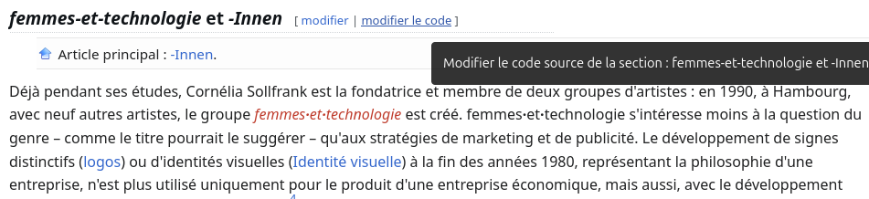
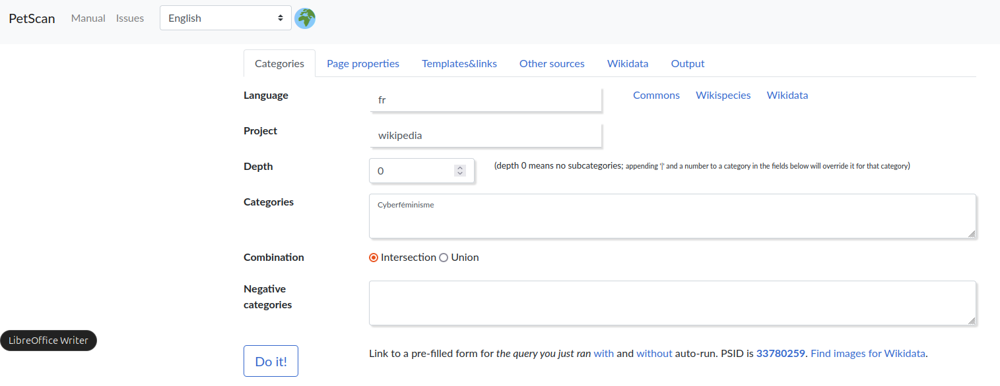
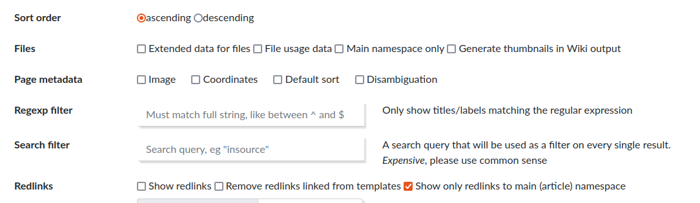
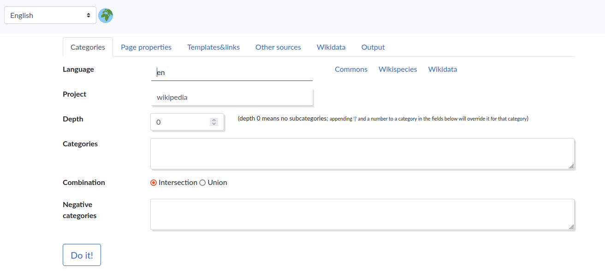
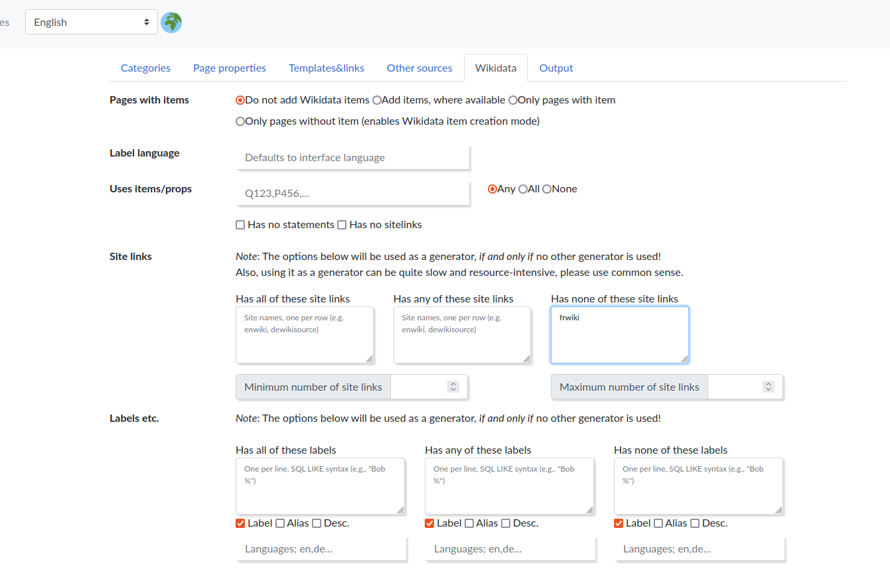
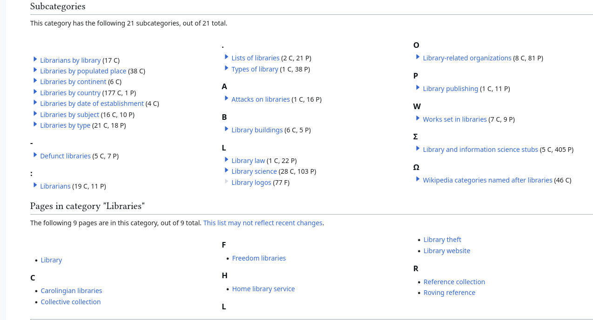
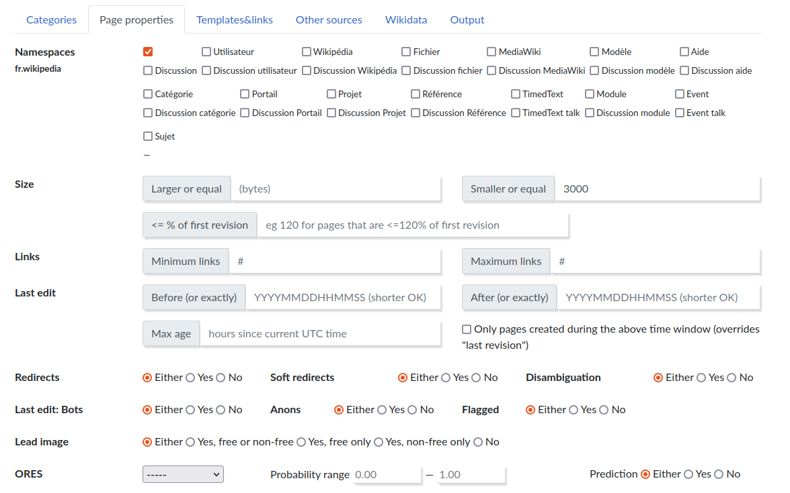
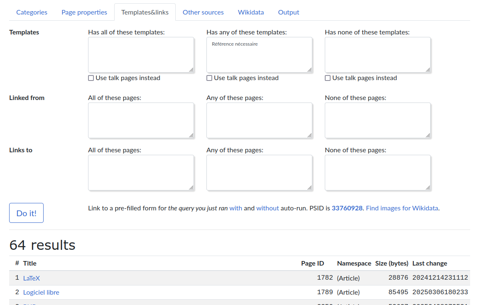

Vous vous êtes inscrit.e à un atelier 1Lib1Ref mais vous ne savez pas encore comment vous allez pouvoir contribuer à l'encyclopédie lors de cet atelier ? 

Vous pouvez attendre de recevoir les informations nécessaires sur l'édition dans Wikipédia par l'animateur ou l'animatrice de l'Encyclopédie libre qui est là pour vous expliquer comment procéder. L'atelier comporte une présentation des règles d'édition par un administrateur de Wikipédia, puis un travail en autonomie avec l'aide des Wikipédien.ne.s présents. 

Mais si vous avez déjà une connaissance des principes d'édition de Wikipédia, vous pouvez préparer en amont les sujets sur lesquels vous souhaiteriez intervenir, de sorte à gagner du temps, être plus autonome au cours de l'atelier et augmenter le volume de vos contributions pendant ce temps dédié à l'Encyclopédie Libre. 

**Ce guide vous présentes quelques outils et méthodes pour commencer.** 

1Lib1Ref en janvier, ou 1Bib1Ref en mai (il s'agit du même type d'atelier), orientent la contribution à Wikipédia vers l'ajout de sources. Cette tâche est très importante dans la mesure où les sources constituent en grande partie la force et la légitimité de ce projet encyclopédique collaboratif qu'est Wikipédia. 

Mais vous pouvez aussi, utiliser ce temps imparti à la contribution, pour mener d'autres travaux : 

- Création de pages dans Wikipédia  
- Traduction de pages d'une langue à l'autre   
- Développement de pages déjà existantes  

N'oubliez pas que quelque soit votre contribution, pendant la campagne 1Bib1Ref, elle doit être marquée par le tag \#1Lib1Ref ou \#1Bib1Ref (tag à ajouter au moment de valider votre ajout) 

Ce guide vous présente un outil qui peut vous permettre d'identifier des pages à traduire, sourcer, développer dans le périmètre de vos intérêts personnels. 

# Créer des pages

C'est l'option la plus difficile, et quelqu'un peut habitué à éditer dans Wikipédia, ferait sans doute un meilleur choix en enrichissant des pages existantes, avec du texte, des références ou des images sous licence libre ou bien en les traduisant d'une langue à une autre.

La tâche est difficile, non tant parce que l'éditeur de Wikipédia est compliqué (il existe aujourd'hui un éditeur intégré de type WYSIWG qui rend la chose assez simple), mais parce que la page créée doit être conforme aux [règles d'admissibilité de l'encyclopédie](https://fr.wikipedia.org/wiki/Wikip%C3%A9dia:Crit%C3%A8res_d%27admissibilit%C3%A9_des_articles). Ces règles sont différentes selon le sujet de la page. 
Par exemple, [voici les critères](https://fr.wikipedia.org/wiki/Wikip%C3%A9dia:Notori%C3%A9t%C3%A9_des_jeux_de_soci%C3%A9t%C3%A9) que'un jeu de société doit remplir pour faire l'objet d'une page dans Wikipédia : 


>Pour justifier d'un article sur Wikipédia, **un jeu de société commercialisé** devrait répondre **aux trois conditions suivantes à la fois** :  
>
>1. être ou avoir été disponible en magasin dans plusieurs pays, **et**  
>2. présenter des caractéristiques originales, **et**  
>3. répondre à au moins un des critères suivants :  
>
    1. avoir fait l'objet de plusieurs éditions (un jeu qui n'est pas réédité est rarement notoire et les jeux récents attendront avant de justifier un article)  
    2. avoir remporté une récompense majeure ; cependant, un prix pour un projet de jeu ne suffit pas ;  
    3. avoir été vendu à plus de 10 000 exemplaires.   


Des débats sur l'admissibilité de certaines pages sont courants sur Wikipédia alors même que la page créée nous paraît conforme à ces critères. Il faut donc être sûr de son coup au risque de voir son travail supprimé de l'encyclopédie. 

Pour avoir plus de chances de créer des pages Wikipédia qui seront admissibles, on peut se baser sur deux choses : 

- les **liens rouges** : ce sont dans les articles de Wikipédia les liens laissés par les éditeurs qui signalent ici à la communauté des sujets qui selon eux seraient admissibles et pourraient faire ultérieurement l'objet de création de pages.  

- le **fait qu'une page existe dans une autre langue de l'encyclopédie** ; par exemple, si la page a été créée dans l'encyclopédie hispanophone, mais qu'elle n'existe pas dans l'encyclopédie francophone, il semble raisonnable de penser que cette page sera considérée comme recevable par la communauté sur l'encyclopédie FR. Cela n'engage pas à faire une traduction de la page en espagnol. On peut concevoir son article tout à fait autrement,  mais la traduction reste dans ce cas,  le choix le plus simple à faire.   

Les liens rouges sont visibles dans un grand nombre de pages de l'encyclopédie, comme ici dans un article consacré à la cyberféministe [Cornelia Sollfranck](https://fr.wikipedia.org/wiki/Cornelia%5FSollfrank)

Avant de double-cliquer sur le lien pour créer cette page, vérifier qu'elle entre [dans les critères d'admissibilité relatifs aux associations](https://fr.wikipedia.org/wiki/Wikip%C3%A9dia:Notori%C3%A9t%C3%A9_des_associations). Comme indiqué plus haut, le fait qu'[une page relative à ce groupe](https://fr.wikipedia.org/wiki/Frauen%C2%B7und%C2%B7technik) existe dans la Wikipédia allemande devrait plaider en faveur de son admissibilité dans la Wikipédia française.

Pour avoir une vue dans un ensemble sémantique donné de toutes les pages qui ont des liens rouges, on peut utiliser l'outil PetScan

Pour cela, on va entrer une catégorie (au sens wikipédien du terme) dans la première page. Par exemple, si on veut faire une recherche à partir de la [catégorie Cyberféminisme](https://fr.wikipedia.org/wiki/Cat%C3%A9gorie:Cyberf%C3%A9minisme)



Et dans la page Output, on va restreindre la liste des pages à afficher à celles qui comportent un *lien rouge*
en cliquant l'option **Redlinks** > "show only redlinks to main (article) namespace" 



Les trois articles appartenant à la catégorie Cyberféminisme comportent chacun au moins un lien rouge : des pistes à suivre pour les futur.e.s contributeurs ou contributrices.

# Traduire des pages

Un grand nombre de pages sont donc accessibles dans d'autres langues que la langue française et mériteraient d'être également présentes dans la Wikipédia francophone. La réciproque est d'ailleurs vraie dans un grand nombre de cas.  

Pour repérer des pages écrites en langue étrangère dans une catégorie donnée, l'[outil PetScan](https://petscan.wmcloud.org/)va également nous être utile


Dans l'exemple ci-dessous, on va récupérer les pages créées à propos des bibliothèques (dans la catégorie "bibliothèques" de l'encyclopédie en anglais) et qui n'existent pas encore dans la Wikipédia francophone. 

- Laisser le langage en "en" (anglais)  
- Laisser wikipedia comme source.  
- Dans Catégories, aller chercher la graphie exacte de la catégorie qui vous intéresse en anglais (si elle existe). Pour les bibliothèques, ce sera la [catégorie "Libraries"](https://en.wikipedia.org/wiki/Category:Libraries)  
- Restituer le nom de la catégorie (ici "Libraries") dans le champ *categories* **en respectant la casse** (majuscules et minuscules)  
- Aller ensuite dans l'onglet *Wikidata*  


- A partir de cette page, dans le champ "Has none of these site links" écrire *frwiki*. Si vous souhaitez enrichir une autre version de Wikipédia que la francophone, par exemple la lusophone changer le fr en pt.   

On trouve actuellement dans cette catégorie 7 pages en anglais qui ne sont pas (encore) présentes en français :   

| #   | Title                                                                          | Size (bytes) | Last change |
| --- | ------------------------------------------------------------------------------ | ------------ | ----------- |
| 1   | [Reference collection](https://en.wikipedia.org/wiki/Reference%5Fcollection)   | 8438         | 20240829    |
| 2   | [Library website](https://en.wikipedia.org/wiki/Library%5Fwebsite)             | 2169         | 20241120    |
| 3   | [Library theft](https://en.wikipedia.org/wiki/Library%5Ftheft)                 | 13784        | 20250312    |
| 4   | [Collective collection](https://en.wikipedia.org/wiki/Collective%5Fcollection) | 19156        | 20240516    |
| 5   | [Freedom libraries](https://en.wikipedia.org/wiki/Freedom%5Flibraries)         | 13378        | 20250316    |
| 6   | [Home library service](https://en.wikipedia.org/wiki/Home%5Flibrary%5Fservice) | 9942         | 20250121    |
| 7   | [Carolingian libraries](https://en.wikipedia.org/wiki/Carolingian%5Flibraries) | 27590        | 20250318    |

Si on veut élargir le nombre de ces pages à traduire, on peut inclure les sous catégories propres à la catégorie qu'on a entrée : 



Par exemple, "Attacks on Libraries" et "Library publishing" sont des sous-catégories de la catégorie *Libraries*. Pour augmenter la profondeur des catégories et sous-catégories dans la page d'accueil de PetScan, faire passer le curseur *Depth/Profondeur* de 0 à 1 (ou à 2 pour prendre aussi en compte les sous-catégories des sous-catégories, etc.)

# Augmenter des pages

Si on dispose de sources et de connaissances sur un sujet, on peut souhaiter augmenter -c'est à dire développer, enrichir- des articles qu'on juge trop succincts sur un thème donné. Comment trouver ces articles ? Là encore on peut utiliser PetScan.

Par exemple, si on souhaite repérer les articles liés à une catégorie (mettons ["Logiciel Libre"](https://fr.wikipedia.org/wiki/Cat%C3%A9gorie:Logiciel_libre)) dont le nombre de bytes est inférieur à 3000 (un byte est assez souvent équivalent à un caractère), aller cette fois dans l'onglet "Page Properties" et introduire le nombre 3000 dans *Size* > *smaller or Equal* : 

On trouve 8 articles dans cette catégorie, par exemple [celui-ci](https://fr.wikipedia.org/wiki/F%2Elux)

# Ajouter des références

Venons-en à présent à l'élément central d'un atelier 1Lib1Ref : l'ajout de références. 

Lorsqu'une contributrice ou un contributeur tombe sur une assertion qui lui semble devoir être sourcée mais qu'aucune référence ne vient appuyer cette assertion, les règles de l'Encylopédie l'invitent à indiquer à la communauté qu'il manque une référence à cet endroit. Ce marquage se fait au moyen du modèle (en anglais *template*) "Référence Nécessaire" (en anglais *Citation needed").

Dans l'éditeur, cela consiste à l'endroit où il manque la référence (à la fin de la phrase, avant le point) à inclure le code suivant : 

```
{{Référence nécessaire|date=Avril 2025}}
```
Si on veut justifier la demande de référence, on procède ainsi :
```
{{Référence nécessaire|date=Avril 2025|raison=_mettre ici votre commentaire_}}
```

Comment trouver des articles qui comportent ce modèle ? 
On va cette fois utiliser la page "Templates&Links"



En augmentant la profondeur de la catégorie "Logiciel libre" de 0 à 1, on trouve 64 articles à qui il manque des références. Il y a du pain sur la planche. 

Si l'on veut quelque chose de plus simple encore, on peut utiliser l'[outil CitationHunt](https://citationhunt.toolforge.org/fr?id=bee63850) qui à partir d'un mot-clé permet d'afficher un extrait de page avec une référence à fournir. Mais cet outil ne permet pas d'avoir une vue globale de tous les articles dans une catégorie donnée qui ont besoin d'être sourcés. De ce point de vue CitationHunt est moins pratique à utiliser que PetScan. 

# Déterminer des priorités

S'il y a plusieurs pages qui mériteraient votre attention et que vous auriez plaisir à améliorer, sourcer, traduire mais que vous n'aurez pas le temps nécessaire pour vous consacrer à toutes, vous pouvez décider de les prioriser en fonction du nombre de vues qu'elles réalisent. 
C'est aisé à faire au moyen de l'outil Page Views de Wikipedia. Voici par exemple [une comparaison des vues entre 2021 et 2025 sur les pages consacrées à deux jeux vidéo](https://pageviews.wmcloud.org/?project=en.wikipedia.org&platform=all-access&agent=user&redirects=0&start=2021-01&end=2025-03&pages=Papers,_Please|This_War_of_Mine), *Papers Please* et *This War of Mine*

# Conclusion

Il existe plusieurs moyens d'identifier de manière systématique les pages qui - dans une catégorie, c'est à dire sur un sujet donné - ont besoin d'être enrichis, traduits, développés, sourcés, au cours d'un atelier contributif (1Lib1Ref) ; on peut directement repérer ces articles au moyens de requête en SPARQL avec Wikidata ; mais cela nécessite de comprendre les bases de ce langage de requête. PetScan a le mérite de permettre aux contributeurs et contributrices de mener ces recherches à partir d'une interface graphique disposant d'un grand nombre d'options. C'est donc un outil particulièrement intéressant à utiliser en amont d'un atelier 1Lib1Ref pour trouver des articles à modifier en lien avec ses intérêts. 

# Références

Cet atelier est largement une transcription de la [présentation](https://www.youtube.com/watch?v=i7BR4ZcnzHg) que Mohammed Hijjawi a donnée au forum EduWiki en juin 2023

il est aussi inspiré d'un extrait du [cours de Pierre-Yves Baudouin](https://callisto-formation.fr/course/view.php?id=362#section-3) consacré à l'extraction de données issues des Wikipédia et Wikidata, cours accessible sur Callisto.  