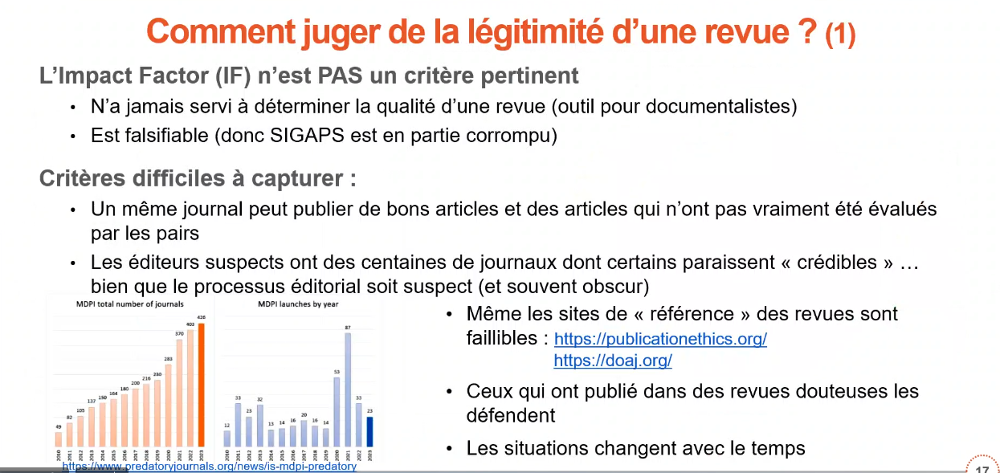
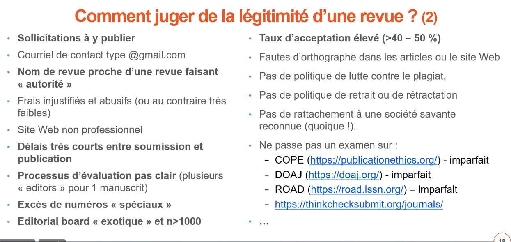

[Lien vers l'enregistrement](https://pod.inserm.fr/lorier/rendez-vous-lorier/video/2285-rdv-lorier-publier-en-bonne-entente-et-hors-des-revues-predatrices-par-christian-funck-brentano/)

Christian Funck-Brentano, RIS de l'Université de Lille et membre de l'Editorial Board d'une revue en cardio d'OUP (Oxford University Press)

considérations sur la définition de l'[[autorat]]

L'immense majorité des revues prédatrices sont complaisantes (percevoir le plus possible des [[APC]])
Ces revues peuvent être indexées dans les grandes bases et avoir des bons facteurs d'impact. 
cela prend en défaut l'évaluation [[SIGAPS]] des revues cotées selon sigaps peuvent être douteuses. 

au delà des revues de qualité il y a des revues frauduleuses mais aussi des revues en zone grise. 
bons articles publiés dans des revues douteuses. 
[[Paper mills]] (cf. étude publiée dans Nature : la médecine et la biologie sont les plus touchées (jusqu'à 3% des études publiées))

tracking de chaînes de texte (signatures, smoking gun de ChatGPT). 
 
Le [[facteur d'impact]] n'est pas un critère pertinent pour déterminer si une revue n'est définitivement pas une revue prédatrice (du coup SIGAPS partiellement corrompu)

pas de liste blanche, noire ça change tout le temps

il faut être capable de repérer soi-même des critères : 

sociétés savantes bidon
listes noires : https://www.predatoryjournals.org/ , https://jfp.csc.fi/jufoportal

promotion du modèle de [[Peer Community In|PCI]]

Lien de la présentation : 

**Voici les liens de la présentation d’aujourd’hui :**

#2 [https://sante.sorbonne-universite.fr/faculte-de-medecine/integrite-scientifique](https://sante.sorbonne-universite.fr/faculte-de-medecine/integrite-scientifique "https://sante.sorbonne-universite.fr/faculte-de-medecine/integrite-scientifique")

#3 [https://recherche-innovation.aphp.fr/les-recommandations-de-lois-de-lap-hp-en-matiere-dautorat/](https://recherche-innovation.aphp.fr/les-recommandations-de-lois-de-lap-hp-en-matiere-dautorat/ "https://recherche-innovation.aphp.fr/les-recommandations-de-lois-de-lap-hp-en-matiere-dautorat/")

[https://pro.inserm.fr/rubriques/en-labo/recherche-responsable/integrite-scientifique/signature-des](https://pro.inserm.fr/rubriques/en-labo/recherche-responsable/integrite-scientifique/signature-des "https://pro.inserm.fr/rubriques/en-labo/recherche-responsable/integrite-scientifique/signature-des")[1]publications-scientifiques

#4 [https://www.redactionmedicale.fr/2024/06/12317703](https://www.redactionmedicale.fr/2024/06/12317703 "https://www.redactionmedicale.fr/2024/06/12317703")

[https://www.icmje.org/recommendations/browse/roles-and-responsibilities/defining-the-role-of](https://www.icmje.org/recommendations/browse/roles-and-responsibilities/defining-the-role-of "https://www.icmje.org/recommendations/browse/roles-and-responsibilities/defining-the-role-of")[1]authors-and-contributors.html

[https://www.icmje.org/recommendations/translations/french2025.pdf](https://www.icmje.org/recommendations/translations/french2025.pdf "https://www.icmje.org/recommendations/translations/french2025.pdf")

#5 [https://credit.niso.org/](https://credit.niso.org/ "https://credit.niso.org/")

#6 [https://www.dovepress.com/articles.php?article_id=68852](https://www.dovepress.com/articles.php?article_id=68852 "https://www.dovepress.com/articles.php?article_id=68852")

#7John Oliver : [https://www.youtube.com/watch?v=0Rnq1NpHdmw](https://www.youtube.com/watch?v=0Rnq1NpHdmw "https://www.youtube.com/watch?v=0rnq1nphdmw") [https://www.redactionmedicale.fr/](https://www.redactionmedicale.fr/ "https://www.redactionmedicale.fr/")

#8 [https://www.cartoonstock.com/directory/s/scientific_journal.asp](https://www.cartoonstock.com/directory/s/scientific_journal.asp "https://www.cartoonstock.com/directory/s/scientific_journal.asp")

#9 [https://www.nejm.org/doi/full/10.1056/NEJMe2415937](https://www.nejm.org/doi/full/10.1056/NEJMe2415937 "https://www.nejm.org/doi/full/10.1056/nejme2415937") [https://latunisiemedicale.com/index.php/tunismed/article/view/5666/3512](https://latunisiemedicale.com/index.php/tunismed/article/view/5666/3512 "https://latunisiemedicale.com/index.php/tunismed/article/view/5666/3512")

#15 [https://www.medrxiv.org/content/10.1101/2023.05.06.23289563v2](https://www.medrxiv.org/content/10.1101/2023.05.06.23289563v2 "https://www.medrxiv.org/content/10.1101/2023.05.06.23289563v2")

#17 [https://publicationethics.org/](https://publicationethics.org/ "https://publicationethics.org/")

[https://doaj.org/](https://doaj.org/ "https://doaj.org/")

#18 [https://publicationethics.org/](https://publicationethics.org/ "https://publicationethics.org/")

[https://doaj.org/](https://doaj.org/ "https://doaj.org/") [https://road.issn.org/](https://road.issn.org/ "https://road.issn.org/")

[https://thinkchecksubmit.org/journals/](https://thinkchecksubmit.org/journals/ "https://thinkchecksubmit.org/journals/")

#19 [https://predatoryjournals.org/](https://predatoryjournals.org/ "https://predatoryjournals.org/")

#20 [https://jfp.csc.fi/jufoportal](https://jfp.csc.fi/jufoportal "https://jfp.csc.fi/jufoportal")

#21 [https://conferencedesdoyensdemedecine.org/la-conference-des-doyens-de-medecine-et-du-cnu](https://conferencedesdoyensdemedecine.org/la-conference-des-doyens-de-medecine-et-du-cnu "https://conferencedesdoyensdemedecine.org/la-conference-des-doyens-de-medecine-et-du-cnu")[1]sante-luttent-contre-les-revues-predatrices/

#22 [https://github.com/pmartinolli/TM-bullshitometer](https://github.com/pmartinolli/TM-bullshitometer "https://github.com/pmartinolli/tm-bullshitometer")

#23 [https://www.scienceeurope.org/news/rra-agreement-final/](https://www.scienceeurope.org/news/rra-agreement-final/ "https://www.scienceeurope.org/news/rra-agreement-final/")

[https://coara.eu/agreement/the-agreement-full-text/](https://coara.eu/agreement/the-agreement-full-text/ "https://coara.eu/agreement/the-agreement-full-text/")

[https://sfdora.org/read/read-the-declaration-french/](https://sfdora.org/read/read-the-declaration-french/ "https://sfdora.org/read/read-the-declaration-french/") [https://coara.eu/agreement/signatories/?category%5B0%5D=france#signatories](https://coara.eu/agreement/signatories/?category%5B0%5D=france#signatories "https://coara.eu/agreement/signatories/?category%5b0%5d=france#signatories")

#24 [https://peercommunityin.org/](https://peercommunityin.org/ "https://peercommunityin.org/")

#25 [https://peercommunityin.org](https://peercommunityin.org "https://peercommunityin.org/")

Intégrité Scientifique
$\newline$
# bibliographie
$\newline$

