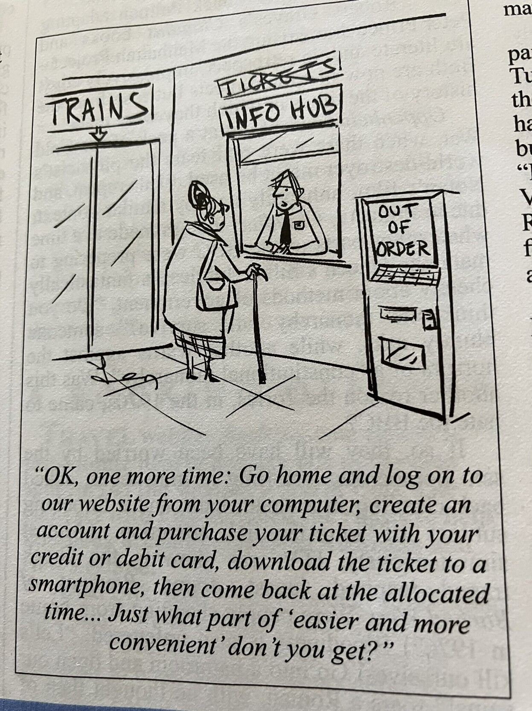

voir [[licences libres]]
Libertés à la base des licences [[GPU]] (conçues par Richard M. Stallman)

- Liberté 0 : pouvoir exécuter le code pour n'importe quel usage
- Liberté 1 : pouvoir d'étudier le code et le changer pour en faire ce que l'on veut
- Liberté 2 : pouvoir le partager (droit de redistribution).
- Liberté 3 : pouvoir améliorer le code

# Liberté -1 : droit de ne pas recourir à une plateforme numérique pour un service public

voir [[fracture numérique]]

Certains collectifs proposent une liberté -1 : pouvoir utiliser un service analogique à la place d'un service numérique (libre ou propriétaire) quand le recours au numérique peut représenter un danger pour la [[Vie privée|vie privée]]. Cette liberté -1 est donc juste une référence aux 4 libertés sans être particulièrement liée au logiciel libre. 

# Liberté vs Droit : faire prévaloir le droit de tous, sur le droit des individus

voir [[droits et libertés]]

Une critique des quatre libertés de Stallman repose sur le fait que ces libertés sont édictées au niveau de l'individu (même si la communauté est mentionnée dans la quatrième liberté). C'est l'individu qui a le droit d'exécuter le code comme il l'entend, ou d'en faire des copies. 

En faisant un parallèle entre les 4 libertés et des 3 lois d'utilisation des robots, telles que définies par Isaac Asimov dans son oeuvre de science-fiction, Jens Finkhaeuser, remarque qu'Asimov dans un deuxième temps a modifié l'une de ses lois (un robot ne doit pas porter tort à une personne humaine) pour y faire entrer la communauté (un robot ne doit pas porter tort à l'humanité), en considérant que si un robot éludait l'ordre d'assassiner Hitler, par là-même, il contribuerait au malheur de l'humanité. 
Pour Finkhaeuser, les quatre libertés promues par Stallman et l'usage qui en a été fait pour mettre au point dans un deuxième temps des licences très permissives afin de permettre à l'industrie de s'emparer du logiciel libre, valides en leur temps (1. première époque : lutte contre les enclosures, 2. Deuxième époque : lutte pour l'adoption du logiciel libre par l'industrie), ces libertés, donc ne sont plus suffisantes pour faire face aux enjeux contemporains ; comme en témoigne l'augmentation des [[backdoors]] repérées dans du logiciel libre très usité (cf. XZUtils en mars 2024). Il faut un cadre qui permette à ces libertés de s'exprimer (une liberté est bornée par une autre) et qui surtout garantissent la viabilité de l'écosystème du libre avec une participation obligatoire plus importante de ceux qui peuvent y contribuer financièrement (aide financière aux développeurs, mise à disposition d'infrastructures)[[@finkhaeuserSearchFoundationalFLOSS2024]]

