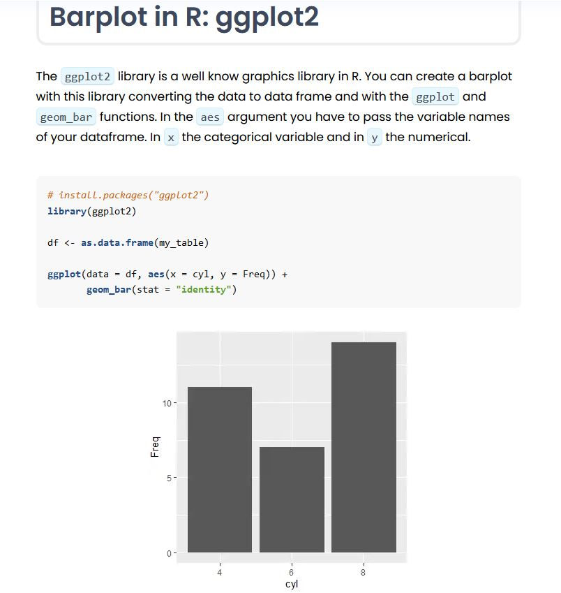
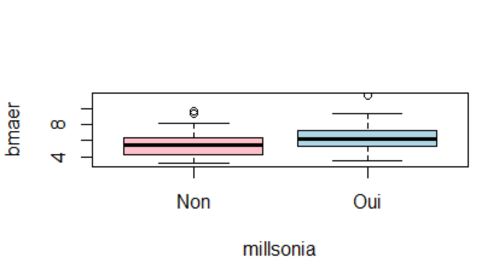
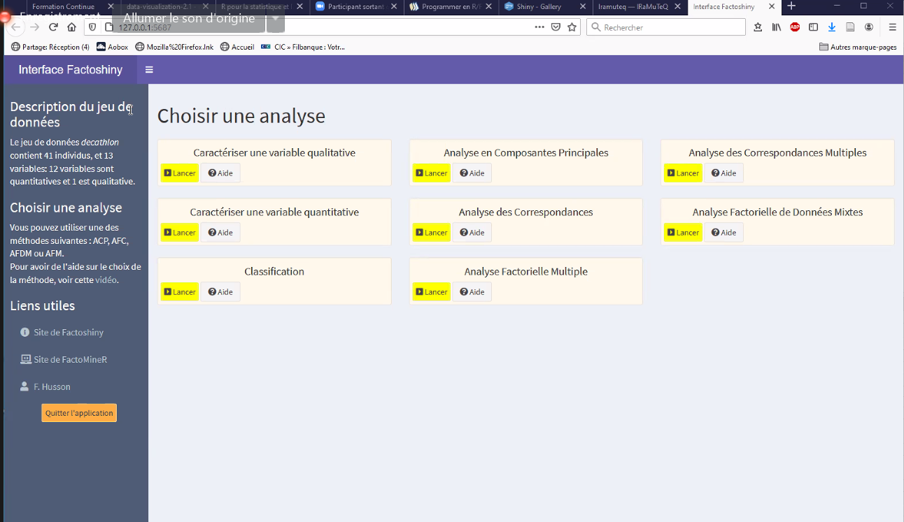

# Philosophie du logiciel R


ouvert, reproductible, conforme à la Science Ouverte
évite les [[ruptures logicielles]] : tout depuis la collecte des données jusqu'à leur visualisation peut être faite à l'intérieur de R

## interface et environnement de travail

R dispose d'une interface graphique rudimentaire qui s'ouvre en ligne de commande : 

Windows : 
``R``
Linux : 
``R -g Tk &``
D'autres interfaces graphiques existent : Rcmdr et Rkward par exemple

[[Rstudio]] [[IDE]] de [[R (logiciel)]]

[support du cours](http://emily.perso.math.cnrs.fr/FormationContinue/FormationContinue/Formation_Continue.html)

R et Rstudio

télécharger sur Ubuntu https://linuxize.com/post/how-to-install-r-on-ubuntu-20-04/

Désinstaller d'Ubuntu : https://webhostinggeeks.com/howto/how-to-uninstall-r-and-rstudio-on-ubuntu/

utilisation de la console comme calculatrice

variable = objet dans R

création d'une variable c : 

c <-154

<- est l'opérateur d'affectation de R : la ligne ci-dessus se dit "la variable c reçoit la valeur de 154"
<- est l'équivalent de = qui peut d'ailleurs être utilisé alternativement, mais = de fait en tant qu'opérateur d'affectation est différent de == qui signifie "égalité" entre ce qui est à gauche et ce qui est à droite ([[@adlerLessentiel2011]])

modification de la valeur d'une variable

```R
x <-1
y <-2
z <-c(x,y)
# la valeur de z quand on fait >z est 12
y<- 3
# y a changé mais la valeur de z est toujours 12 quand on fait >z pour mettre à jour la valeur de z avec la nouvelle valeur d'y il faut retaper : 
z <-c(x,y)
```


enregistrer un fichier de script (avec extension )
possibilité de sauvegarder l'environnement complet de travail (script + console + variables) : enregistrer avec une extension Rdata

Projet dans Rstudio : réunir tous les fichiers (données, scripts relatifs à un même projet)

file>project
possibilité de faire un lien avec un répertoire [[Github]]
Rccp : permet de faire du C++ dans R

Possibilité d'envoyer le projet au collaborateur avec ou sans les données pour qu'il puisse y travailler. 

## usage de R à travers d'autres éditeurs que Rstudio

Pour installer Rstudio après avoir installé R, voir [[Rstudio]]
usage à travers [[VScode]]

Nécessité d'avoir installé au préalable R et VS Code sur sa machine

1. Installer dans R le package language server : 

``install.packages("languageserver")``

2. installer dans [[VS Code|VScode]] l'extension pour R


## Packages

### télécharger des packages

#### depuis le CRAN

taper dans la console : 
``install.packages("nomdupackage")``

#### depuis github

nécessite le téléchargement préalable du package devtools.
télécharger un package depuis [[Github]]: 
installer le package devtools
``install.packages("devtools")``
utiliser ensuite devtools de la manière suivante : 

``library(devtools)``
``install_github("nom_du_propriétaire/nomdurepo")``

Possibilité également d'installer à partir de remotes des packages présents dans Github :

```r
install.packages("remotes") #if remotes is not already installed
remotes::install_github("lvaudor/glitter")
# exemple avec le package glitter
```


faire attention à l'arborescence des fichiers dans le projet. Prévoir un dossier pour les principaux scripts est recommandé.

#### Depuis une archive

Si le package se présente comme une archive (.zip ou .tar) il est possible de télécharger l'archive, de la décompresser ( ``tar -xvf nomdelarchive.gz.tar``), puis d'installer depuis le shell le package avec la commande suivante : 
``R CMD INSTALL nomdupackage``
au besoin s'aider du gestionnaire pacman cf. mode d'emploi de Rnltk (package de [[NLP]]) https://www.rdocumentation.org/packages/rnltk/versions/0.0.1 )

## Les objets

R est un logiciel orienté objet, il faut savoir à tout moment quel est le type d'objet (la classe) à quoi on a affaire derrière une variable. 

```R
#exécuter ce chunck dans Obsidian avec le plugin pour Obsidian execute code
ventes <- c("pommes","poires","bananes")
achetes <- c(67,45,90)
vendus <- c(56,45,89)
commerce <- data.frame(ventes,achetes,vendus)
a <-paste0("ventes : ",class(ventes))
print(a)
b <- paste0("achetes : ",class(achetes))
print(b)
c <- paste0("commerce : ",class(commerce))
print(c)
d <- paste0("class : ", class(class))
print(d)
```


## Les fonctions d'un package

Un package ou r-base vient avec des fonctions. 
Pour savoir à quel package est rattachée une fonction dans la console taper ? suivi du nom de la fonction. Par exemple :

?pdf

donne : pdf{grDevices}
Graphic Devices est une fonction comprise dans r-base (R fournie par défaut)

`data <- data.frame(x1=rnorm(100), x2=rnorm(100), x3=rnorm(100))`

fonction data : génère un tableau avec trois colonnes 

`PCA(data)`

pour préciser que la fonction fait référence à un package donné : 

`FactominR::PCA(data)`

nécessité le package FactoMineR
Installer le package depuis le site du CRAN
installer > charger le package (en cochant dans la liste des packages le package nouvellement installé)

pour faire du code [[reproductibilité|reproductible]] dans R entrer la commande library : 

`library(FactoMiner)`

principal défaut de R : les mises à jour sont très régulières et du coup la mise à jour des packages ne suit pas forcément puisque les packages sont créés en général par des chercheurs. Cette instabilité est la principale limite de R. Actuellement on est à une version 4 de R. Les packages de la version 3 sont assez souvent obsolètes.

## supprimer des packages

afficher les packages déjà installés : 

```r
installed.packages()
```

```r
remove.packages('nom_du_package')
```

Supprimer tous les packages installés par l'utilisateur tout en conservant les packages recommandés pour faire fonctionner R

```r
# Get names of all installed packages
all_pkgs <- rownames(installed.packages())

# List of base/recommended packages to keep
keep_these <- c("base", "compiler", "datasets", "grDevices", "graphics", 
                "grid", "methods", "parallel", "splines", "stats", 
                "tcltk", "tools", "utils")

# Remove all packages except for base/recommended ones
to_remove <- setdiff(all_pkgs, keep_these)
if (length(to_remove) > 0) {
  invisible(lapply(to_remove, function(pkg){
    cat("Removing", pkg, "\n")
    remove.packages(pkg)
  }))
} else {
  cat("No packages to remove.\n")
}
```
copier le code ci-dessus dans un script R, mettre le script en surbrillance et l'exécuter. 

## question de reproductibilité

cette instabilité pose un réel problème en matière de [[reproductibilité]] des expériences. Car si l'on refait les calculs 10 ans plus tard, la version utilisée à date est devenue très différente de celle avec laquelle a été conçue l'étude, des packages sont devenus obsolètes. Il faudrait refaire une partie du code en appelant des fonctions ou des packages qui n'existaient pas alors. Cela demande d'installer une version obsolète de R, voir de changer le [[système d'exploitation]] de son ordinateur.

A un moment T, en revanche, R dispose d'un moyen efficace pour gérer les [[dépendances]] et rendre du code exécutable d'un environnement à l'autre ce qui facilite l'échange de scripts entre collègues. C'est l'intérêt du [package renv](https://rstudio.github.io/renv/index.html)

Pour faire face à cet enjeu de reproductibilité ; quelques bonnes pratiques sont à observer. 
- Utiliser le package *sessioninfo()* pour indiquer avec quelle version de R on travaille. 
- Utiliser un [[conteneur logiciel]]


le bouton update permet de mettre à jour un package

les packages sont disponibles sur https://cran.r-project.org
cliquer sur Packages (actuellement 17000 packages)

Pour assurer la reproductibilité sur le long terme, on peut aussi faire en sorte que les [[package|packages]] utilisés sur une étude restent accessibles dans leur stade de développement au moment de la publication de l'étude sous la forme de code sauvegardé dans [[Software Heritage]]. Cf conférence de Florent Chuffart (IAB, Inserm)

> R est à la fois un langage de programmation statistique et une implémentation logicielle du langage. Outre sa grande communauté, le succès du logiciel et l’essor du langage reposent sur son mécanisme d’extension appelé *package*. Les packages R contiennent du code, des données et de la documentation dans un format standardisé. Ils peuvent être installés par les utilisateurs à partir de référentiels centralisés tels que CRAN et Bioconductor, ou décentralisés via les nombreux référentiels git disponibles sur le Web.  
  Après une présentation générale de R, nous verrons comment les piliers de la science ouverte _[Software Heritage](https://www.softwareheritage.org/?lang=fr)_/[HAL](https://hal.science/) (voir [[HAL]]) permettent de figer l’état d’un package sur le très long terme afin de publier des résultats scientifiques.

## Rmarkdown

permet d'embarquer du langage R dans le langage [[markdown]]. 
pour générer le fichier de sortie : knit

le chunk encapsule du code R

supprimer le code de la publication finale : 

`echo=FALSE` (dans la déclaration de chunck)

```{r,echo=FALSE}
print("bonjour")
```


simulation d'un jeu de données

```{r, echo=FALSE}

data<-data.frame(x1=rnorm(100), x2=rnorm(100), x3=rnorm(100))

```

### Les citations dans un document Rmarkdown

voir [[Zotero#Utiliser Zotero avec Rstudio]]

## Faire une présentation avec Rmarkdown

avec le template (package) [Xaringan](https://bookdown.org/yihui/rmarkdown/xaringan-format.html#slides-and-properties)
Installer le package depuis le site du CRAN

### entête YAML : 

````yaml
title: "gérer, diffuser et partager ses données de recherche"
subtitle: 
author: "Damien Belvèze"
date: "13/04/2022"
output: 
  xaringan::moon_reader:
    lib_dir: libs
    nature:
      ratio : "16:9"
      highlightStyle: github
      highlightLines: true
      countIncrementalSlides: false
	  
````

### diapositives

les diapositives se succèdent avec un titre de niveau 2 (h2) ou \#\# et séparées par des \-\-\-

sauf la diapositive de titre (titre 1)


avant le titre de la diapositive, possibilité de changer la couleur de fond ou la classe

````
background-color: #bebebe
class: middle
````

par exemple pour les diapos de titres ou titres intermédiaires : 

````
class: center, inverse, middle
````

Notes de la diapo, 

elles peuvent être placées sous ??? et apparaître dans la présentation en tapant sur la touche p

### ajout d'un iframe

Si l'on colle uniquement l'[[iframe]], lorsqu'on va *knitter*, [[Pandoc]] va convertir l'iframe et celle-ci ne s'affichera pas dans le document final. Nécessité de rajouter *data-external="1"* à la fin de l'iframe

```html
<iframe width="800" height="842" src="https://damienbelveze.github.io/desinfo_dcb33/dyor.html" frameBorder="0" scrolling="no" styles="width:100%"  data-external="1"></iframe>
```
([source](https://github.com/rstudio/rmarkdown/issues/2027))
#### ajout d'une image

##### taille de l'image

`````r 
.center[
```{r echo=FALSE, out.height=300, out.width=600}
knitr::include_graphics("img/types-donnees.png")
```
]
``````

si pas nécessaire de retailler les images, pas besoin de mentionner les images dans un chunk : 

````r
.center[]
````

##### emplacement des images

image à gauche, légende à droite

````r
.pull-left[
```{r echo=FALSE, out.height=400, out.width=300}
knitr::include_graphics("img/ocde.png")
```
]

.pull-right[
2007 : Parution du rapport de l’OCDE, « Principes et lignes directrices de l’OCDE pour l’accès aux données de la recherche financée sur fonds publics ». http://www.oecd.org/fr/science/inno/38500823.pdf 
]
````


#### polices

petits caractères entre balises \<small>\</small>

## Créer un template

Plutôt que d'avoir à tout le temps à préciser dans les fichiers créés les paramétrages habituellement utilisés et d'appeler les packages souhaités, on peut créer un template qui contiendra de base ces informations. 

Créer un template avec R revient à créer un package, mais un package qui a une architecture particulière :

nomdupackage __ DESCRIPTION 
            |__ inst
                 |__ rmarkdown
                     |__ templates
                          |__nomdupackage
                             |__skeleton
                                 |__skeleton.Rmd
                             |__template.yaml

Le fichier DESCRIPTION omis dans la méthodologie expliquée ici[[@saysHowCreateCustom2021]] est pourtant nécessaire pour que la commande ```devtools::install(nomdupackage)``` fonctionne

Ce fichier texte sans extension a la forme suivante : 

```
Package: unirennes
Type: Package
Title: template for UniRennes word documents
Version: 0.4.21
Date: 2024-01-07
Authors@R: person("Belvèze", "Damien", email = "belvezedamien@gmail.com", role = c("cre","aut"))
Description: template to write Rmarkdown documents in order to convert them in UniRennes word documents
Depends: R (>= 4.0.0)
License: GPL-3
Encoding: UTF-8
VignetteBuilder: knitr
Language: en-US

```
Il est très important de faire un saut de ligne à la fin de la dernière ligne pour ne pas avoir un message d'erreur. 

charger ensuite le package ``library(nomdupackage)``
Le template va apparaître dans la galerie de templates et il sera désormais possible de l'utiliser lors de la création d'un nouveau document. 


## produire un document Word

Knitter à partir d'un modèle de document word

Utiliser un template word (par exemple https://docs.dbelveze.fr/s/SfarcgTyrDkeQnS) (le fichier s'intitule unirennes.docx)
```yaml
title: "rencontre avec Mathieu Pourrieux"
date: 21/12/2023
author: "Damien Belvèze"
output: 
  word_document: 
    reference_docx: unirennes.docx
    keep_md: yes
```

les [[listes à puces]] fonctionnent (contrairement avec ce qui se passe dans une conversion directe avec [[Pandoc]])

#### bibliographie

insérer un appel au package knitrcitations. Si knitr ne donne pas le résultat escompté, cela permettra à l'utilisateur de le charger en tapant dans la console : 
install.packages(knitrcitations)

A l'endroit où on mobilise les packages nécessaires, appeler knitrcitations

```{r, echo = FALSE}
library(knitcitations)
```

A l'endroit où on insère l'appel de citation :

`r citep("https://www.oecd.org/fr/science/inno/38500823.pdf")`


## Base de programmation en R/Rstudio

Tous les objets de r sont des vecteurs (valeurs qui ont un identifiant)

numeric = vecteur quantitatif (par exemple la taille de plusieurs individus)

Comment créer un vecteur ? 
- import d'un jeu de données
- création d'un vecteur dans r

` x <- c(1,2,3,4)`

`x[2]` extrait la valeur qui est en position 2 (contrairement à [[Python]] la première valeur n'est pas 0 mais 1)

`x[1:3]` génère les trois premières valeurs de x

Une valeur seule est un vecteur de taille 1, un réel est un vecteur qui a une seule chaîne de caractères.

Les nombres entre crochets en début de ligne donnent le numéro de l'indice de la valeur dans la suite. 


vecteurs rfactor = variable qualitatives

vecteur character # vecteur factor

matrix : faire un tableau à deux dimensions

`M <- matrix(1:6), ncol=2)`

summarise : résume un jeu de données

`summarise(jeu de données)`

Faire la moyenne d'une variable quantitative en supprimant les données manquantes : 

`summarise(jeu de données, moyennedelavariableA = mean(variable A, na.rm=TRUE)`

crée un tableau avec des valeurs de 1 à 6 réparties sur deux colonnes (et donc 3 lignes)

splitter une colonne en trois en utilisant un séparateur : 

```r
library(dplyr)
library(tidyr)
df %>% separate(original_column, c('col1', 'col2'))
```
## cas pratique (artériosclérose)

importer le jeu de données Intima_media.txt (placé dans le bureau)

`data.alcool <- read.table(file="C:\\Users\\dbelveze\\desktop\\Intima_Media.txt", header=TRUE, sep = " ", dec = ",")`

factoriser SEXE (1 -> homme, 2 -> femme)

`data.alcool$SEXE <- as.factor(data.alcool$SEXE)
levels(data.alcool) <- c("homme","femme")`

factoriser tabac (0 -> jamais, 1 -> parfois, 2 -> souvent)

`data.alcool$tabac <- as.factor(data.alcool$tabac)
levels(data.alcool$tabac) <- c("jamais", "parfois" "souvent")`

faire le résumé d'un groupe de variables dans un jeu de données : 

`summarise(group_by(jeu de données, variable A), variable C = mean(variable B))`

mesure de l'arthériosclérose par groupe de personnes (fume, fait du sport, sexe)

`summarise(group_by(data.alcool, SEXE, tabac, SPORT), mesure = mean(mesure))`


Pour extraire la première ligne : 
`M[1,]`
Pour extraire la deuxième colonne :
`M[,2]`
Extraire tout le tableau
`M[,]`

booléens 
is.na : est manquant
!is.na : n'est pas manquant
!= : différent de
== : égal à 

Listes avec r

`list (a=c(1,2), b=c("bleu", "vert", "rouge", f=list(a=c(1,4))`

$ permet de récupérer un élément à partir de son nom et pas à partir de son emplacement dans la liste. 

classe data.frame = tableau de données, c'est à dire tableau individu/variable

un individu = 1 ligne qui comporte plusieurs variables (parexemple : nom, prénom, âge)

data.frame : chaque élément de la liste est un vecteur de même taille. 

`tableau <- data.frame(Id=factor(paste("id",1:100), sep"-")), X-runif(100), Y=rnorm(100))`

conditionnement et boucles

boucles *for* et boucles *while* comme pour [[Python]]

[lexique des commandes](https://fr.wikibooks.org/wiki/Programmer_en_R)

Eviter l'import en format xls préférer l'import en CSV

dans l'import sélectionner le bon séparateur (, ou ; ou encore | cela peut varier)

importer en [[ligne de commande]] avec read.table

`data.nom <- read.table(file="path/dataset.csv")`

Pour importer un fichier txt (data.alcool) comme [celui-ci](Intima_Media.txt)

`data.alcool <- read.table(file="C:\\Users\\dbelveze\\desktop\\Intima_Media.txt", header=TRUE, sep = " ", dec = ",")
`

\\\\ permet d'échapper le backslash - on peut aussi suivre le chemin suivant : 

C:/users/dbelveze/desktop/intima_Media.txt

si nécessaire définir l'emplacement du fichier : 
setwd("~/path")

obtenir de l'aide sur une fonction (par exemple read.table) : 

`?read.table`

on obtient la liste des arguments nécessaires. 3 sont particulièrement importants. 

- **header** : première ligne = entête ou pas
header=true : préciser que la première ligne est un entête

- **séparateur**: sep=";" le séparateur est un semi-colon

- **decimal**: dec="." le caractère qui sépare les entiers et les décimaux est un point


Transformation de variables quantitatives en variables qualitatives (1: présent, 0: absent)

jeu de données où on doit récupérer l'élément $ élément à récupérer

transformer la variable en facteur pour qu'elle soit interprétée en variable qualitative

dans l'environnement global, on peut attacher tous les traitements à un seul jeu de données:

`attach(jeu de données)`

fonctions select et mutate

ajouter une colonne : mutate
nécessité de télécharger le package **deplyr** 
dans le package de base de R, il existe une fonction intersect,  deplyr va masquer la fonction intersect de base pour imposer la sienne. 

la fonction select permet de conserver certaines variables. 

`jeu de données <- select(jeu de données, -variable à enlever)`

= jeu de données 

t.test : comparer les moyennes de deux variables. 

# Faire des statistiques avec R

Filtrer 
`filter(jeu de données, variable=="attribut")`

obtenir les entêtes et les quatre premiers résultats : 

`head(filter(jeu de données, variable=="attribut"), n=4`

sélectionner les résultats en fonction de la taille d'un attribut : 

`filter(filter(jeu de données, variable A=="attribut", variable B> valeur C & variable B <valeur D)`

sélectionne les résultats dont la variable A a tel attribut et la varaible B a une valeur comprise entre C et D

S'il y a des échecs répétés sur une fonction, regarder si l'objet sur lequel on essaie de faire ce traitement est de la bonne classe. 
passer la souris sur l'objet dans le frame environnement

vérifier la classe d'un objet dans la console :
`class(objet)`
df = dataframe. 

## Graphiques avec plot

ggplot2: graphiques plus élégants mais plus difficiles à appréhender. (graphiques fonctionnant avec des calques successifs)

 (source : https://r-coder.com/barplot-r/)


voir l'[aide-mémoire de googplot2](https://rstudio.com/wp-content/uploads/2015/03/ggplot2-cheatsheet.pdf)

plot est de base dans R

plot(variableA~variableB, data=jeu de données)


représenter deux courbes de variable

with(jeu de données, interaction.plot(variable A, variable B, variable C))


la variable A (axe Y) en fonction de (axe X)

## Analyse de la variance

voir 


## Régression simple et multiple

boxplot

`boxplot(variableA~variableB, data=jeudedonnées,col=c("pink","lightblue"))`



lm(variableA~variableB, data=jeudedonnées)


Fonction LM (Linear model)

## Analyse en composante principale

ACP = [[analyse en composante principale]]

Faire une activité [ACP](https://fr.wikipedia.org/wiki/Analyse_en_composantes_principales) avec le package Factoshiny



sélectionner le bouton ACP pour comparer les performances de différents athlètes : 


Autres applications de R à travers [[Shiny]] qui offre une interface graphique plus "clic-bouton" que Rstudio : [galerie des applications Shiny](https://shiny.rstudio.com/gallery/)

shiny met à disposition ses serveurs pour 5 applications gratuites sur son serveur.

# Cartographie thématique avec R

voir formation URFIST [[Cartographie thématique avec R]]


# Utiliser le thème xarringan pour une présentation


https://zenodo.org/record/6555791

````yaml
title: "gérer, diffuser et partager ses données de recherche"
subtitle: ""
author: "Damien Belvèze"
institute: "Université de Rennes 1"
date: "13/04/2022"
bibliography: "data_presentation.bib"
csl: "nature.csl"
output: 
  xaringan::moon_reader:
    css: ["default", "monstyle.css"]
    seal: false
    lib_dir: libs
    nature:
      ratio : "16:9"
      highlightStyle: github
      highlightLines: true
      countIncrementalSlides: false
`````

conformément aux usages sur R, ne pas entrer de commande pour le chargement automatique des paquets utilisés (install.packages), se limiter à charger ces packages. S'ils sont manquants dans la configuration de l'utilisateur, celui-ci sera seulement incité à les installer. 
Les packages demandés sont Xaringan, Xaringanbuilder, pagedown. 
Commenter les packages et les commandes qui permettent de créer des citations dans les slides à partir d'un fichier de références en format bibtex

````r
background-color: #bebebe
class: middle, center

# De quoi parle t-on ?

### Quelques définitions concernant les données de la recherche

```{r warning=FALSE, echo=FALSE, message=FALSE}
# library(devtools)
# library(bibtex)
library(xaringan)
# library(knitcitations)
# write.bib(c('bibtex', 'knitr', 'knitcitations'), 
# file="data_presentation.bib")
```

???

Pour afficher les notes des diapositives, cliquer sur la touche p
`````


# Faire son CV avec R

voir [[CV de chercheur]]

utiliser le package Pagedown([[@DellaVedovaCommentfaireCV2020]])

L'impression du document se fait avec la commande 

``knit: pagedown::chrome_print``

voir YAML : 

```r
output:
  pagedown::html_resume:
    # set it to true for a self-contained HTML page but it'll take longer to render
    self_contained: false
# uncomment this line to produce HTML and PDF in RStudio:
knit: pagedown::chrome_print
```

Il n'a pas été possible d'obtenir le PDF sans mettre à jour Rstudio (passage à la version 2021) et Rcpp (désinstaller Rcpp 1.06 et installer Rcpp 1.07)
Les packages pagedown et xfun doivent être installés pour que ça fonctionne

code  : ![[CV de chercheur]]
Résultat : ![[CV_Damien.pdf]]

# Bugs rencontrés et résolus

## renv/activate

Message d'erreur : 

```
Error in file(filename, "r", encoding = encoding) : 
  cannot open the connection
In addition: Warning message:
In file(filename, "r", encoding = encoding) :
  cannot open file 'renv/activate.R': No such file or directory
```

Résolution : https://github.com/rstudio/renv/issues/981#issuecomment-1136149575

supprimer ``source('renv/activate.R')`` dans le fichier  .Rprofile (et le laisser vide le cas échéant), puis redémarrer une session : 
``.rs.restartR()``
Le problème a disparu

# Gérer un tableau de données

créer un tableau sous excel ou LibreOffice et l'enregistrer sur le bureau en [[CSV]]

L'ouvrir dans R : 

```r 
tableau <-readcsv2("/path/to/tableau.csv", header=TRUE, sep=",")
```

crée un objet tableau issu de la lecture du CSV "tableau.csv" avec pour entête la première ligne et pour séparateur la virgule

ajouter une colonne. 

Définir un vecteur : (pour 13 lignes, définir un vecteur à 13 valeurs. Si ce sont des valeurs autres que numériques (par exemple des noms, utiliser des guillemets)) :

```r
nom <- c("John","Marjann", ... , "Alice", "Meriem", "Paul")
```
Puis ajouter ce vecteur au tableau : 
```r
tableau$nom <-nom
```
## changer l'ordre des colonnes avec dplyr

installer dplyr : 
```r
install.packages("dplyr", dependencies = TRUE)

library(dplyr)
```
pour savoir comment utiliser dplyr pour changer l'ordre des données dans un tableau, aller sur https://www.datanovia.com/en/fr/blog/dplyr-comment-modifier-lordre-des-colonnes-dans-un-data-frame/

faire un tableau croisé dynamique avec dplyr

|   |   |   |   |   |
|---|---|---|---|---|
||formation|satisfaction|nom|heures|
|1|plagiat|pas bien|John|3|
|2|plagiat|bien|Luciana|3|
|3|plagiat|bien|Harold|3|
|4|zotero|pas du tout bien|Perla|2|
|5|zotero|bien|Martin|2|
|6|zotero|très bien|Chen|2|
|7|zotero|très bien|Piotr|2|
|8|zotero|très bien|Marjann|2|
|9|sciences ouvertes|très bien|Hiroki|4|
|10|sciences ouvertes|bien|Djamila|4|
|11|sciences ouvertes|pas du tout bien|Alfred|4|
|12|sciences ouvertes|bien|Faustine|4|
|13|sciences ouvertes|bien|Zineb|4|

Le tableau croisé dynamique est produit avec les fonctions group_by et summarize du package dplyr

```r
data %>%
	group_by(formation) %>%
	summarize(nombre_heures = sum(heures))
```

création d'un plot avec ces valeurs

