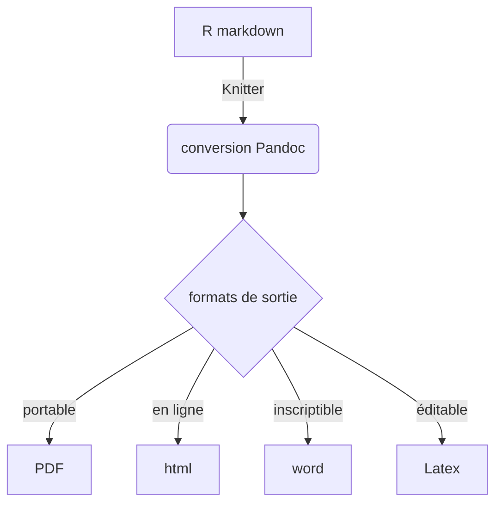

# atelier de Martin Amouzou sur l'écriture en [[markdown]] avec le [[R (logiciel)]]

introduction sur la naissance du markdown (John Gruber et [[Aaron Swartz]])

Création de code [[reproductibilité|reproductible]] avec du logiciel exécutable

versatilité du format. 

possibilité d'insérer des analyses ('chunks') dans du texte. 

Rmarkdown = document de travail



```r
# syntaxe du chunck
("'{r}"')
```

niveaux de titre, listes à puces, formatage des caractères (voir [[Mode d'emploi d'Obsidian#3.1 Qu'est-ce que Markdown ?]])

numérotation des chapitres (à placer dans l'entête)
```r
number_sections: true
```

```r
{r, echo=TRUE}
n = 'Louane'
print('Hello {} !'.format(n))
```

bouton +C = ajout d'un bouton


possibilité de lire dans le document des données externes

fonction kable() du paquet DT permet de produire une table de données améliorée par rapport à ce qui est prévu par défaut. 

## plots 

les graphiques sont les résultats de l'analyse que l'on fait dans R
permet de rendre le résultat visuel en gardant la [[reproductibilité]]

Options ; 

"echo = TRUE/FALSE"
ne pas afficher les résultats : "results = 'hide'"
Gérer la taille de figure : fig.width, fig.height

```r
{r out.withd=C('40%','30%','30%')
fig.show = 'hold'
boxplot(1:10)
plot(rnorm(10))
plot (rnorm(7)
```

Centrer l'image : environment center

````r
<center>

</center>
````


[[YAML]] : date du jour + sortie HTML

````yaml
title: "formation R markdown"
author: "Damien Belvèze"
date: '`r Sys.Date()`'
output: 
    html_document:
		number_sections: yes
	    editor_options:
	    chunck_output_type: console
always_allow_html: yes
````

# convertir Rmarkdown en markdown strict

https://rmarkdown.rstudio.com/docs/reference/md_document.html

```r
md_document(
  variant = "markdown_strict",
  preserve_yaml = TRUE,
  toc = TRUE,
  toc_depth = 3,
  number_sections = TRUE,
  standalone = FALSE,
  fig_width = 7,
  fig_height = 5,
  fig_retina = NULL,
  dev = "png",
  df_print = "default",
  includes = NULL,
  md_extensions = NULL,
  pandoc_args = NULL,
  ext = ".md"
)
```

ça a fonctionné avec la commande suivante dans la console : 

```bash
> library(rmarkdown)
> render("guide_fr.Rmd", md_document())
```
et l'ajout dans le [[YAML]] d'une métadonnée : `always_allow_html: yes` (cf. solution [ici](https://stackoverflow.com/questions/42543206/r-markdown-compile-error?noredirect=1))


