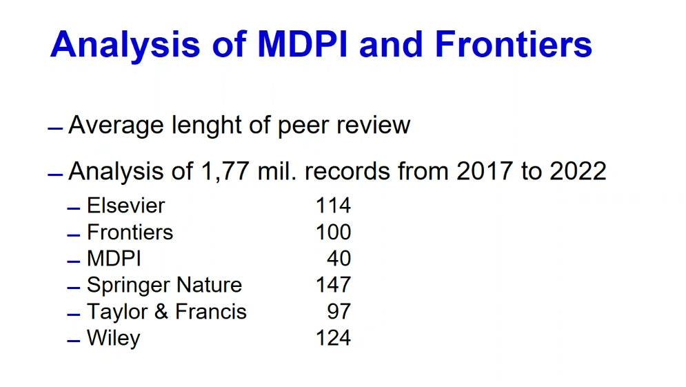

La révision par les pairs fait partie des méthodes scientifiques qui permettent de réduire les erreurs présents dans une communication scientifique notamment en soustrayant l'écrit scientifique à la subjectivité de celui, celle ou ceux qui l'ont écrit. 

>Si les scientifiques parviennent à se défaire de certains préjugés dans leur domaine de compétence, ce n’est donc pas en se purifiant l’esprit par une cure de désintéressement. C’est plutôt en adoptant une méthode critique qui permet de résoudre les problèmes grâce à de multiples conjectures et tentatives de réfutation, au sein d’un environnement institutionnel qui favorise ce que Karl Popper appelait « la coopération amicalement hostile des citoyens de la communauté du savoir »

(Etienne Klein [[@KleinFautilcroirescience2013]] et [[@Kleingoutvrai2020]], p43)

La coopération amicalement hostile de la communauté du savoir s'exprime d'abord sous la forme d'une révision par les pairs (peer-reviewing)

# temps de révision par les pairs

voir Springer Discover qui offre des temps de révision beaucoup plus courts : est-ce une pratique prédatrice pour autant ? 

(source : Lukas Plch)

traditionnellement il faut plusieurs semaines à quelques mois pour faire réviser un article. 
la pandémie de COVID a suscité un rythme de révision inédit sur les articles soumis et qui avaient pour objet le COVID-19. 

Ces articles ont été revus en moyenne en 6 jours seulement d'après un article paru dans Nature en juin 2020 ([[@PalayewPandemicpublishingposes2020]])

Cette [[communication scientifique]] de crise nécessite de la part des éditeurs la mise en place de mesures particulières : 

- prévoir un circuit de publication d'urgence en cas d'urgence de santé (avec des listes de vérification spécifiques)
- confier les révisions à des chercheurs qui sont déjà entraînés et expérimentés
- encourager la libre-diffusion des savoirs sur les sujets connexes (plus les textes seront accessibles et plus facilement les pairs auront des éléments de comparaison ou une connaissance contextuelle du sujet)
- constituer des bases spécifiques sur un sujet (par exemple LitCov pour le coronavirus) qui feront l'objet de révisions par des chercheurs tiers
- financer davantage de revues de littérature sur les articles parus sur le sujet pour évaluer les résultats

La réduction des temps de relecture peut également être imposée aux reviewers pour des raisons beaucoup moins avouables que la mise à disposition rapide des résultats. Dans le cas de la voie dorée avec paiement d'[[APC]], plus l'éditeur publie vite et plus il gagne de l'argent ([[@dicosmoOpenAccessStatus2023]]) 

Certains Pure Players de l'Open Access se présentent ainsi avec un temps de révision moyen très restreint (37 jours pour MDPI par exemple) par rapport au temps mesuré chez Elsevier (185 jours). Le directeur de MDPI s'en défend en disant que le délai relativement court de révision dans ses journaux tient au fait que le processus est facilité par plus de 6000 salariés dans le monde ([[@ansedePublicFundsBeing2023]]). 

# Révision ouverte par les pairs

[[Open Peer Review]]

# Biais présents chez les reviewers

De récents travaux de recherche montrent que des articles mettant en cause les failles de certaines institutions financières, en dépit de leur qualité intrinsèque, auront des difficultés à être publiées dans la mesure où les reviewers sont souvent rattachés à ces institutions par des [[conflit  d'intérêt|conflits d'intérêt]]. 
(cf. par exemple [[@BeckConflictsinterestmay2021]])

# connivences entre auteurs et reviewers

nouvelle tendance dans les méconduites scientifiques, le fake peer review "les auteurs avaient suggéré à l’éditeur des noms de relecteurs avec de fausses adresses qui renvoyaient à des comptes e-mail de chercheurs amis, soit peut-être à leurs propres comptes" ([[@larousserieInconduitesScientifiquesSont2023]])
On lit dans le rapport d'Informatics Europe sur l'Open Access que le fait pour les auteurs de suggérer leurs reviewers à l'éditeur est relativement nouveau (lié au Plan S) ([[@dicosmoOpenAccessStatus2023]]). Quel contrôle est effectué sur les possibles connivences entre auteurs et reviewers dans ce cas ?

voir aussi [[revues népotiques]]

# Opportunités et limites de la révision par les pairs ouverte
.

## Science Ouverte, révision par les pairs et réplication des expériences

La Science Ouverte permet de disposer du code ainsi que des données, de sorte que les reviewers se voient désormais incités à faire tourner du code sur leur machine et à répliquer l'expérience pour vérifier que les données sont intègres. Cette possibilité leur coûte un surcroît de travail, alors que la révision par les pairs s'inscrit dans un emploi du temps de chercheur déjà bien rempli et se pratique sans rémunération. Tous les reviewers n'acceptent pas, pour des raisons de temps, de jouer ce rôle (https://fediscience.org/@ct_bergstrom/111077265291261923)

Pour aller plus loin, voir présentation de Gallezot sur l'open science et la révision par les pairs 

![[pdf/20200615_Gallezot_peer_review.pdf]]

# Révision par les pairs opérée par des intelligences artificielles

marque des journaux de piètre qualité : les articles sont relus par des [[grands modèles de langage|intelligences artificielles]] 
https://sciences.social/@Research_FTW/115038406964861660

