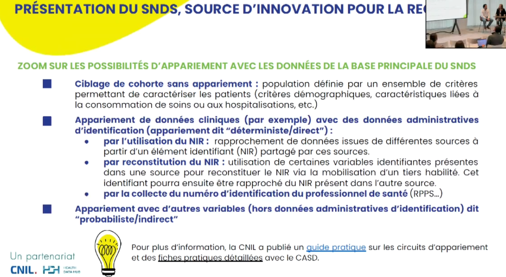
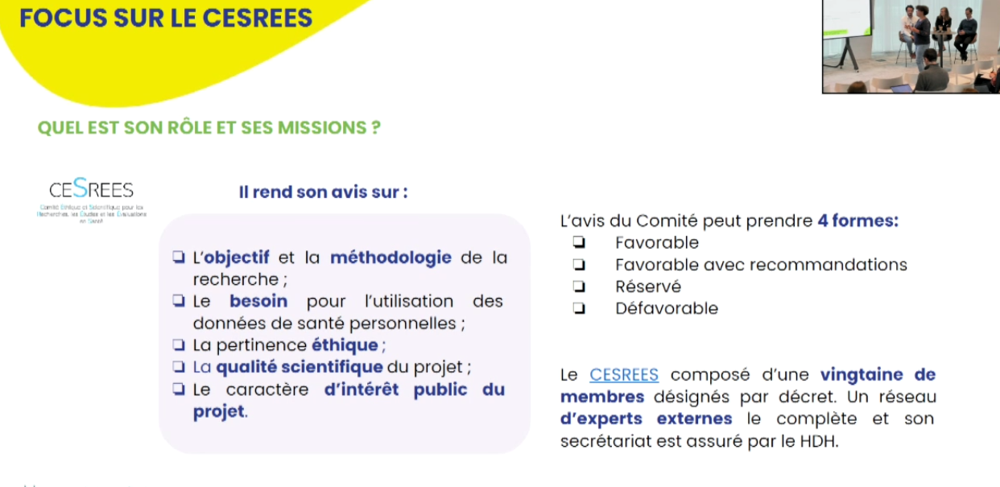

https://gplexpert.com/ pour élaborer un système fils de GPLExpert
logiciel Goupile, alternative à Limesurvey pour les questionnaires confidentiels

au départ le SNDS ne comporte que les données issus des hôpitaux, puis en 1999 rassemblement de tous les parcours de soin des Français
2016 : SNDS "central" rassemble différentes composantes qui donnent une vision longitudinale : données précédentes + causes de décès (données INSERM) + échantillon  des données issues des régimes complémentaires d'assurance + données des MDPH (pour le handicap) + données sur les dépendances. 

2019 : SNDS central voit son périmètre élargi, le SNDS devient une collection de bases qui proviennent de la sécurité sociale : tous les actes qui font l'objet d'une prise en charge par la solidarité nationale. 

2022 : élargissement du SNDS aux bases SIVAC et SIVEX (bases pandémie [[Covid-19]])

Base de données de santé la plus importante au monde : tous les parcours de soin de la population (données [[pseudonymat|pseudonymisées]])

Cette base en revanche est très pauvre en données issues d'[[études cliniques]]. On sait que tel pseudonyme a fait un IRM, mais on n'a pas les conclusions de l'IRM.
Difficile d'appréhender les facteurs de risque à partir de ces bases de données. 

# conférence du 24 septembre 2024 sur l'accès aux données de santé depuis le SNDS

## cadre juridique applicable au traitement de données SNDS

règles : [[RGPD]] + en droit français la loi CNIL modifiée par le RGPD (marges et conditions supplémentaires par rapport au RGPD : maintien d'une formalité préalable pour le [[traitement des données]] de santé)

 règles RIPH

règles spécifiques au traitement de données issues du SNDS (loi du 26 janvier 2016 : chaînage entre les données de l'assurance maladie et données provenant des hôpitaux)
arrêté du 22 mars 2017 relatif au référentiel du traitement des données du SNDS

## appariements

appariment sur le n° NIR (sécurité sociale), parfois de manière moins stable sur l'identité (nom, prénom) du patient, parfois sur des éléments communs entre deux jeux de données (dates d'hospitalisation + pathologies communes) ou autres variables identifiantes. 
appariement étendu au moyen d'[[IA]]. Si l'appariement est possible c'est que les données ne sont que [[pseudonymat|pseudonymisées]]
n° d'accrochage : permet de rassembler le NIR et les données cliniques. si le n° d'accrochage est fuité, l'attaquant n'a pas accès aux données ni aux NIR.

## 4 modalités d'accès

Accès [[open data]] pour des données [[anonymisées]]

Question de la finalité de l'accès
pour tout traitement de données de santé, la finalité doit être d'intérêt public (bénéfice du projet, intégrité scientifique, l'intérêt public peut être poursuivi par des acteurs privés) 
Pour le SNDS il faut que l'intérêt public s'inscrive dans les finalités autorisées (surveillance sanitaire, information sur la santé, connaissance des dépenses de santé) et ne pas être dans les finalités interdites (exclusion de garanties d'assurance, promotion de produits pharmaceutiques)

- accès permanents
- accès ponctuels (pour projet de recherche)
- accès pour alimenter un entrepôt 

On ne peut pas refuser que ses données n'alimente la base du SNDS. 
Réutilisation de la base de données. Soit on a accès uniquement aux données de la base principale, ces données seront pseudonymisées. 
En cas d'appariement (on vient avec ses propres données), dans ce cas, il faut informer individuellement les personnes ou recourir à une dérogation pour obtenir une information collective. 
Dans ce cas le droit d'opposition est possible sauf si l'accès est permanent. 
C'est le DPD qui réutilise les données qui doit recevoir la demande de traitement. 

bulles SNDS : espaces de traitement sécurisés pour traiter les données SNDS, leurs gestionnaires s'engagent sur certaines contraintes de sécurité, elles sont homologuées tous les trois ans
Les organismes (actuellement 30) qui peuvent obtenir l'homologation sont listées. Cet accès aux données ne peut servir qu'à répondre aux missions de l'organisme en question pour des accès permanents, les données demandées doivent être proportionnelles aux besoins. 
L'organisme doit transmettre la liste des traitements au SNDS. Les organismes doivent transmettre le rapport d'évaluation des traitements mis en oeuvre, faute de quoi, la CNIL peut suspendre l'accès permanent à cet organisme. 

**Accès sur projet de recherche**

procédures simplifiées ("méthodologies de référence") (MR cf. [[MR004]] et [[MR003]]). Cela permet de n'avoir pas à rencontrer le SNDS. Le chercheur sur le site de la CNIL fait un engagement de conformité de sa méthode de recherche par rapport à la méthodologie de référence. Cet engagement peut servir à plusieurs projets de recherche

en dehors des MR, passer par une procédure d'authentification spécifique. 

La CNIL est saisie après le CESREES via le SNDS. Autorisation tacite. Si le CESREES rend un avis défavorable ou favorable sous réserves, la CNIL est dégagée de ses délais de réponse et une non réponse au bout de 2 ans ne vaudra pas acceptation. Il est donc très recommandé de ne pas saisir la CNIL sans avoir reçu un avis favorable du CESREES. La CNIL n'a jamais autorisé un traitement qui aurait reçu un avis réservé ou a fortiori défavorable de la part du CESREES.

Depuis 2019, il est possible d'enrichir un entrepôt de données de santé avec des données SNDS. 10 autorisations ont été délivrées par la [[CNIL]] entre 2019 et 2024. 
Cela a généré 2 types d'entrepôts : 

- enrichissement d'un entrepôt avec des données SNDS
- entrepôts uniquement composé de données SNDS (actuellement uniquement l'entrepôt Magellan)

projet de recherche : 
comment fonctionne le CESRESS : 

85% des projets qui reçoivent un avis réservé au premier examen obtiennent en fin de compte un avis favorable. 
Le CESREES est composé d'une vingtaine de membres + 40 spécialistes qui peuvent intervenir en renfort (cliniciens, méthdologistes). 
rédiger un template (entre 15 et 20 pages)
Sont scrutées les finalités, la méthodologie, la cohérence entre la méthodologie et les finalités, les populations, la cohérence entre la méthodologie et les populations. 

Ajouter à ce template rempli un résumé scientifique et l'[[AIPD]]. 

système fils : doit être homologué, demande une grosse [[maintenance]] pour être rendu moins vulnérable aux attaques peut être beaucoup plus dispendieux que de faire des demandes régulières au SNDS. La constitution d'un système fils ne doit pas être un recours systématique.

Modalités d'informations et de transparence

Si on est sur des données du SNDS (MR007 et MR008) cette information est collective et peut être faite via le site web du responsable du traitement. 

$\newline$
# bibliographie
$\newline$

