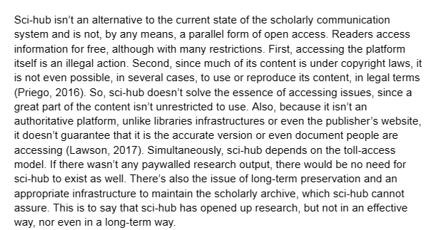

[[bibliothèques pirates|bibliothèque pirate]], maintenue par la chercheuse Kazakhe Alexandra Elbakyan, permettant d'accéder à des articles scientifiques sous droit. 

# pérennité et lien avec l'open access

source : https://osf.io/mer5n/

