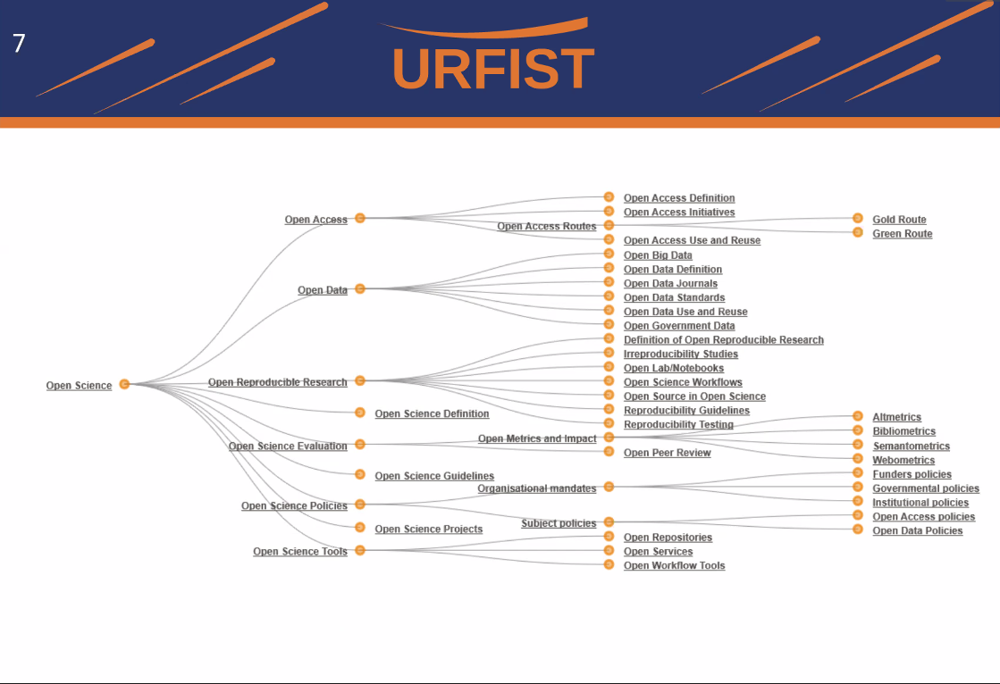
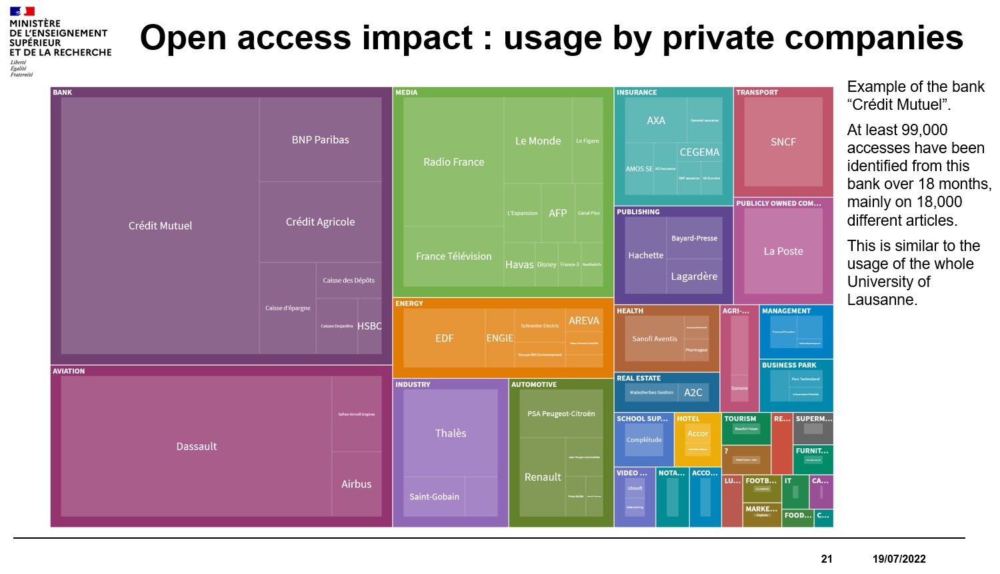

voir [[Evénements sur la Science Ouverte]]

>La **science ouverte est la diffusion sans entrave** des publications et des [[données de la recherche]]. Elle s'appuie sur l'opportunité que représente la mutation numérique pour développer l'accès **ouvert** aux publications et – autant que possible – aux données de la recherche

([Ouvrir la science](https://www.ouvrirlascience.fr/plan-national-pour-la-science-ouverte/))

>« La science ouverte est la diffusion sans entrave des résultats, des méthodes et des produits de la recherche scientifique. Elle s’appuie sur l’opportunité que représente la mutation numérique pour développer l’accès ouvert aux publications et – autant que possible – aux données, aux codes sources et aux méthodes de la recherche. Elle permet à la recherche financée sur fonds publics de conserver la maîtrise des résultats qu’elle produit. Elle construit un écosystème dans lequel la science est plus transparente, plus solidement étayée et reproductible, plus efficace et cumulative. Elle induit une démocratisation de l’accès aux savoirs, utile à l’enseignement, à la formation, à l’économie, aux politiques publiques, aux citoyens et à la société dans son ensemble. Elle constitue enfin un levier pour l’intégrité scientifique et favorise la confiance des citoyens dans la science. »

([Deuxième Plan National Pour la Science Ouverte, 2022](https://www.ouvrirlascience.fr/deuxieme-plan-national-pour-la-science-ouverte/))

diffusion sans entraves des résultats, des méthodes et des données de la science ouverte (c'est de la science fait correctement)
ça s'applique à plein d'objets différents : méthodes, outils, différents produits de la recherche

Important levier de croissance pour les Etats : c'est pourquoi la licence privilégiée est CC:by et non CC:by-nc

Mots-clé :

- accès ouvert
- maîtrise
- reproductibilité
- démocratisation
- intégrité scientifique

## Les grands axes

voir [[Open Science mindmap]] (made with markmap.js and [[ChatGPT]])

## publication en open access

la liberté d'accès aux résultats de la science est vue comme un levier de croissance important par la commission européenne qui encourage et finance la transition vers une production intégralement en open access. 
Les grandes entreprises font un usage plus important que par le passé des publications ouvertes. D'après des chiffres publiés par Marin Dacos en 2022, l'usage de publications en open access par le Crédit Mutuel est aussi important quantitativement que le téléchargement d'articles en open access de l'ensemble des chercheurs de Lausanne

[[thèses en open access]]

### Les moyens de l'ouverture des publications

#### Green OA

#### Gold OA

### Les résistances

#### Résistances aux mandats Open Access

inconvénients des mandats open access sur les chercheurs et chercheuses en tant qu'individus publiants exprimés par [BJörn Brems](https://mastodon.social/@brembs/113083522698446538)

## Science ouverte à l'échelle mondiale

UNESCO recommendations on Open science
International Science Council
DORA
Données : existence de la research data alliance (RDA), cf. Chemistry Interest Group

## Science ouverte à l'échelle européenne

Horizon Europe : Open Access immédiat ; une publication qui a été financées doit pouvoir être en open access au moment de sa publication

Données : "aussi ouvertes que possible, aussi fermées que nécessaire"

## Plan S
Initiative de financeurs (dont ANR) pour un OA immédiat des publications
refus des [[APC]] dans les [[éditeurs hybrides|revues hybrides]]
Financement des APC dans les revues Full OA
Obligation de dépôt en archive ouverte et stratégie de rétention des droits

## A l'échelle française

**Ministère de la recherche français:**
- comité Science ouverte
- Données [research data gouv](https://www.ouvrirlascience.fr) (avril 2022, opéré par l'INRAE, le "Hal des données")

**ANR :**
- OA immédiat aux publis via éligibilité des APC dans les revues full open access et diffusion sans embargo dans [[HAL]] (rétention des droits)
- Plan de gestion obligatoire

**CNRS :**
- HAL
- Opidor
- Approches plus qualitatives dans l'évaluation que quantitatives

# compétences requises par la Science Ouverte

Côté responsable de gestions numériques

voir [[Wikimedia et Science Ouverte]]
voir également enquête LIBER / ADBU [[@vandergraafOpenScienceServices2023]]

# Les postes en matière de Science Ouverte

|                                                  Coordinateur ou ambassadeur en Science Ouverte / Service de première ligne                                                   |                                       data librarian / Service de seconde ligne                                       |     |
| :---------------------------------------------------------------------------------------------------------------------------------------------------------------------------: | :-------------------------------------------------------------------------------------------------------------------: | --- |
|                                                          Aide à la rédaction des AAP sur les aspects Science Ouverte                                                          |                                                                                                                       |     |
|                                                               entretien avec le coordinateur du projet lauréat                                                                |                          Entretien en cas de besoin avec le ou les responsables des données                           |     |
|                                              mise au point d'une stratégie de dissémination des résultats (articles et données)                                               |                                                                                                                       |     |
|                                                                Gestion des risques de perte ou vol des données                                                                |  Conseil technique dans la sécurisation des données, gestion des accès, chiffrement, lien avec FSD pour les [[ZRR]]   |     |
|                                     Anticipation des problèmes déontologiques ou juridiques (données personnelles, propriété des données)                                     | Aide pour l'anonymisation des données, compréhension des licences pour les données ODBL, Etalab et pour les logiciels |     |
|                    Définition d'un budget prévisionnel pour les coûts de la science ouverte (anonymisation, sauvegarde, stockage, traitement des données)                     |                   Veille partagée avec le coordinateur sur les offres de prestation dans ce domaine                   |     |
|                                                                    Identification des services pertinents                                                                     |                                         Suivi de certains tickets (DPO, DSI)                                          |     |
|                                                            Présentation des exigences en matière de SO aux équipes                                                            |                                                                                                                       |     |
|                                                   Accompagnement sur le suivi de ces exigences au fur et à mesure du projet                                                   |               Accompagnement sur les aspects disciplinaires (pour au moins une famille de disciplines)                |     |
|                                                                 identifications d'entrepôts pour l'archivage                                                                  |                                   Veille partagée avec le coordinateur sur le sujet                                   |     |
| Assistance, notamment juridique, pour la publication des résultats de recherche, informations sur les APC, sur les contrats Publish&Read, sur les accords transformants, etc. |                                                                                                                       |     |
|                                                 Aide à la recherche de revues où publier ( vs predatory open access journals)                                                 |                                                                                                                       |     |
|                                                                               relecture des PGD                                                                               |                  Réponse aux coordinateur sur tel ou tel point du PGD susceptible de poser question                   |     |
|                                                                                                                                                                               |  Conseils en matière de reproductibilité des résultats (conditions de la reproductibilité), test de reproductibilité  |     |
|                                                           Développement de l'usage des carnets de notes numériques                                                            |                                  Formation à l'usage des carnets de note numériques                                   |     |
|                                                       Indications générales sur l'archivage des logiciels de recherche                                                        |                    Aide pour la description du logiciel de recherche, valorisation de ce logiciel                     |     |
|                                                    Conseils généraux sur les espaces numériques de travail pour chercheurs                                                    |   Aide avec les espaces numériques de travail et de gestion des données pour chercheurs, par exemple [[git-annex]]    |     |
|                                                                                                                                                                               |                        Aide à la visualisation de données (Quarto + Observablq, R Shiny, etc)                         |     |
|                                                                    Alignement des identifiants chercheurs                                                                     |                  Usage d'identifiants ouverts pour un [[projet de recherche]] (par exemple Wikidata)                  |     |

# qui sont vraiment les acteurs de la science ouverte : top-down ou bottom-up 

bonnes pratiques recommandées par la communauté pour améliorer les résultats de la science ou injonctions imposées par les financeurs et les Etats : concept flou de "Science Reform" désignant la SO 

> En effet, le terme réforme peut prêter à confusion, surtout dans un contexte où il évoque souvent une transformation imposée par le haut. Cela dit, dans le cadre de la table ronde à laquelle notre réseau participe, ce mot, qui apparaît dans le titre, reflète une réflexion sur les moyens d’établir une collaboration entre les réseaux de reproductibilité et la communauté de métarecherche, dans le but de favoriser l’amélioration des pratiques de recherche.  
  Il ne s’agit donc pas d’une réforme institutionnelle imposé du haut, mais d’une transformation portée par les communautés elles-mêmes, à partir du terrain.

(mail envoyé sur la liste recherche-reproductible le 26 juin 2025)

# Les bienfaits de la science ouverte en débat

La science ouverte répond certes à un besoin de partage des résultats et des données par et pour les scientifiques du monde entier, mais elle est aussi encouragée par les institutions en tant que levier de croissance. 

A ce titre, des chercheurs reprochent à la Science Ouverte de ne pas permettre de s'opposer à une réutilisation de leurs publications à des fins qu'ils désapprouvent, au nombre desquelles : 
- une exploitation par des intelligences artificielles sur le fonctionnement desquelles il n'existe aucune régulation
- des politiques de croissance ([[Produit Intérieur Brut|PIB]]) et le renforcement d'une économie [[extractivisme|extractiviste]] qui menace les équilibres planétaire. 

Les mêmes arguments sont mis en avant par les développeurs pour critiquer les licences appliquées au logiciel libre ([[critique du logiciel libre]]) cf. La licence Hippocrate.

De là, ces collectifs de chercheurs (au nombre desquels [[Camille Nous]]) qui essaient de mettre en place des [[licences éthiques]] (et plus seulement des [[licences libres]]) à géométrie variable (incluante ou excluante) pour inclure soit d'autres chercheurs ou bien les entreprises qui se sont lancées dans la [[redirection écologique]], soit pour exclure certaines entreprises ou groupes d'activité économiques [[@thomasSeReapproprierProduction2023]]. 

Les licences excluantes sont censées répondre au problème souvent posé par la licence CC:by promue par les éditeurs : Les licences ouvertes (dont la CC:by) permettent à des sociétés privées puissantes de réaliser des gains importants en entraînant des [[grands modèles de langage|intelligences artificielles]] sur ces données facilement accessibles qui ont été ouvertes au large public. 
Ces données traitées sont transformées en services payants au lieu de revenir à la communauté, c'est une forme d'[[enclosures|enclosure]]; quelle licence peut-on utiliser dans le domaine de la recherche pour promouvoir une réutilisation publique des données et des résultats de la science sans enrichir des sociétés déjà omnipotentes : 

> La nouvelle ruée vers l'or de l'IA consiste à clôturer différents champs du savoir humain, du sentiment et de l'action -tous les types de données disponibles- le tout étant pris dans une logique expansionniste de collecte sans fin. C'est devenu un pillage de l'espace public. 

(source : [[@crawfordContactPourquoiNous2016]], p144)

# les faux semblants de la science ouverte

## La croissance des APC 

faire payer le même prix aux auteurs que celui qu'on faisait payer à l'ensemble des lecteurs dans le modèle précédent : nouvelle stratégie des éditeurs commerciaux

Prolongation d'un modèle hybride sous garantie de la transformation du modèle économique de la revue : [[accords transformants]] (prennent fin en 2023)

