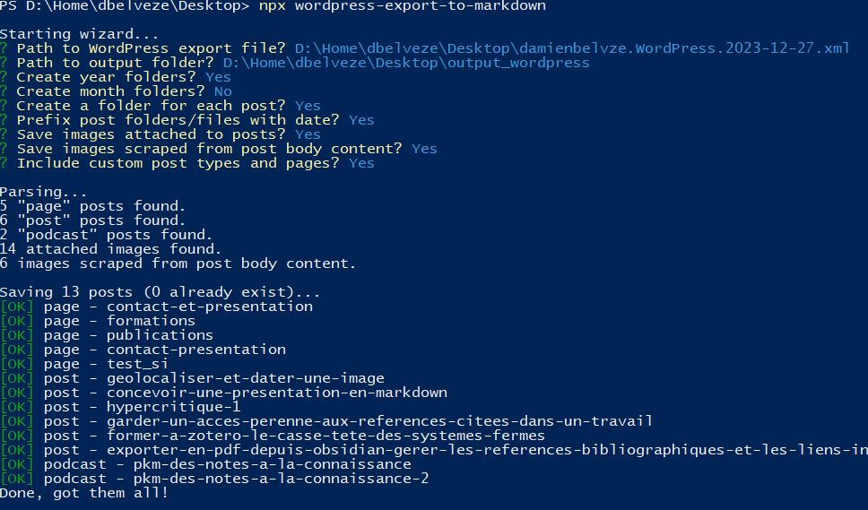

Pour le CV voir [[CV de chercheur]]

Source : https://twitter.com/Maitre_de_conf/status/1372818558263103492


# Pourquoi faire un site de chercheur

## unifier son expérience de chercheur et synthétiser ses pensées

> Par essence, le chercheur est dispersé : conférences, articles de revue, chapitres d’ouvrage, billets de blog, cours, gestion de projets, comités scientifiques ou éditoriaux, etc. C’est un métier qui implique une grande diversité de productions écrites ou orales. Ne serait-ce que pour unifier cet ensemble, garantir un point d’accès exhaustif, il est utile de disposer d’un portail faisant le lien vers tous les lieux de savoir numériques ou analogiques où nous travaillons.

(source: [[@perretDrJekyllMr2018]])

## être visible en tant que chercheur (se faire un nom)

# contenus

publications
notes de recherche (carnet de thèse)
rapport de recherche, projets de recherche
présentations, supports de cours

# un site en une demie-heure : 

codIMD + Markpage [[@eyssetteMarkpage2023]]


# Blog avec Quarto
## migration d'un CMS (i.e Wordpress) vers un site statique avec Quarto

voir tuto
- export des fichiers en XML (outil export de [[Wordpress]])
- conversion des fichiers XML en [[markdown]] avec un utilitaire pour assurer la conversion (nécessité d'installer au préalable Node.js)[[@daexteditorialstaffConvertWordPressArticles2022]]



Exemple de migration réussie des contenus d'un [[Wordpress]] vers [[Quarto]] et étapes à marquer [[@howeWordPressQuartoMigration2022]]
Autre migration réussie : https://site.dbelveze.fr (en, suivant la méthode indiquée ici : [[@zenggyuDeployingQuartoWebsite2019]])


### choix de l'hébergeur : github ou gitlab

Github déploie des pages avec Jekyll par défaut. Pour endiguer ce déploiement par défaut (puisque ce dernier sera pris en compte par Quarto, faire figurer un fichier vide .nojekyll à la racine du repo, voir exemple [ici](https://github.com/ji53ll/blog/blob/main/.nojekyll)). 

Pour déployer un site sur [[Gitlab]], il est nécessaire de créer un fichier gitlab-ci ou gitlab-cd (voir ci-dessous)

éditeur utilisé : [[VScode]] (on peut utiliser aussi [[R (logiciel)|R]])
Choix de l'instance Framagit (instance Gitlab de [[Framasoft]])

#### quarto.yml

Contenu type du fichier \_quarto.yml : 

```yml

project:
  type: website
  resources:
    - "css/"
    - "js/"
    - "*.html"
  output-dir: public
website:
  title: "website title"
  navbar:
    right:
      - about.qmd
      - icon: github
        href: https://github.com/damienbelveze
      - icon: Mastodon
        href: https://mamot.fr/deck/@dbelveze

format:
  html:
    theme: cosmo
    css: styles.css
```

Pour ajouter un menu dans la navbar : 

```yaml
right:
  - text: "More"
    menu:
      - talks.qmd
      - about.qmd 
```

source : https://github.com/quarto-dev/quarto-cli/discussions/973

#### gitlab-ci

le fichier .gitlab-ci.yml permet la compilation du code sur le serveur

```yml

variables:

# Les images suivantes permettent de faire la compilation du code Quarto sur le serveur de Framagit
  UBUNTU_VERSION: "22.04"
  QUARTO_VERSION: "1.3.361"

image: ubuntu:${UBUNTU_VERSION}

before_script:

  - apt-get update && apt-get -y install curl
  - curl -L -o ./quarto.deb https://github.com/quarto-dev/quarto-cli/releases/download/v${QUARTO_VERSION}/quarto-${QUARTO_VERSION}-linux-amd64.deb
  - dpkg -i ./quarto.deb && rm -f ./quarto.deb
  - quarto install --no-prompt extension quarto-ext/lightbox

  pages:
	script:
    - quarto render . --output-dir=public/
  
 # Les artifacts (publications) doivent être rangées dans un dossier public qui doit exister dans le répertoire.
  artifacts:
    paths:
      - public/
  only:
    - master
```

Ajouter un [[Automatisation de la veille#flux RSS|flux RSS]] : voir méthode sur le [site de Quarto](https://quarto.org/docs/websites/website-blog.html#rss-feed)

voir [[intégration continue]]
#### index.qmd

```yml
---
title: "website's main title"
subtitle: "some words as subtitle"
listing:
# Après "contents" indiquer le dossier qui contient les posts
  contents: posts
# affichage dans le flux de la homepage de l'image de couverture de chaque article, de sa date, de son titre et de ses catégories  
  fields: [image, date, title, categories]
# ordre anté-chronologique  
  sort: "date desc"
  type: default
# afficher la liste des catégories
  categories: true
# afficher un champ pour filtrer les posts par date (ascendance, descendante) ou par titre
  sort-ui: true
# afficher un champ pour filtrer les posts par chaîne de caractère
  filter-ui: true
page-layout: full
title-block-banner: true
---
```

## personnaliser un blog réalisé avec Quarto

Propositions de Daniel Tan [[@tanHowAddPersonality2022]]

## hébergeur de confiance

https://alt.framasoft.org/fr/framasite


# outils complémentaires du site

## CV HAL

voir [[CV de chercheur#CV de chercheur avec HAL]]


site web statique avec [Jeckyll](https://jekyllrb.com/docs/)

# comment créer un site collaboratif de chercheurs

Jekyll et github permettent de réaliser un site collaboratif dans lequel différents auteurs signeraient différents posts. Voir la leçon de [Programming Historians](https://programminghistorian.org/en/lessons/collaborative-blog-with-jekyll-github#set-up-your-site-for-multiple-authors) à ce sujet


