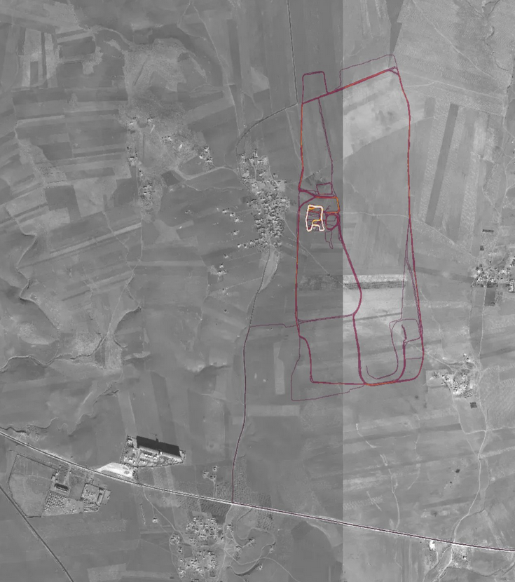

parcours de running de soldats américains en Syrie (https://medium.com/strava-engineering/the-global-heatmap-now-6x-hotter-23fc01d301de)

Application de running qui a permis de repérer des agents de la DGSE en 2018 (cf. article de Jean-Marc Manach) car leurs itinéraires de jogging quittaient et revenaient à la caserne où sont hébergés les services de renseignement extérieurs. 

Cette application a aussi servi aux assassins d'un général russe pour préparer leur opération ([[@gayteAppRunningStrava2023]])

$\newline$
# bibliographie
$\newline$

