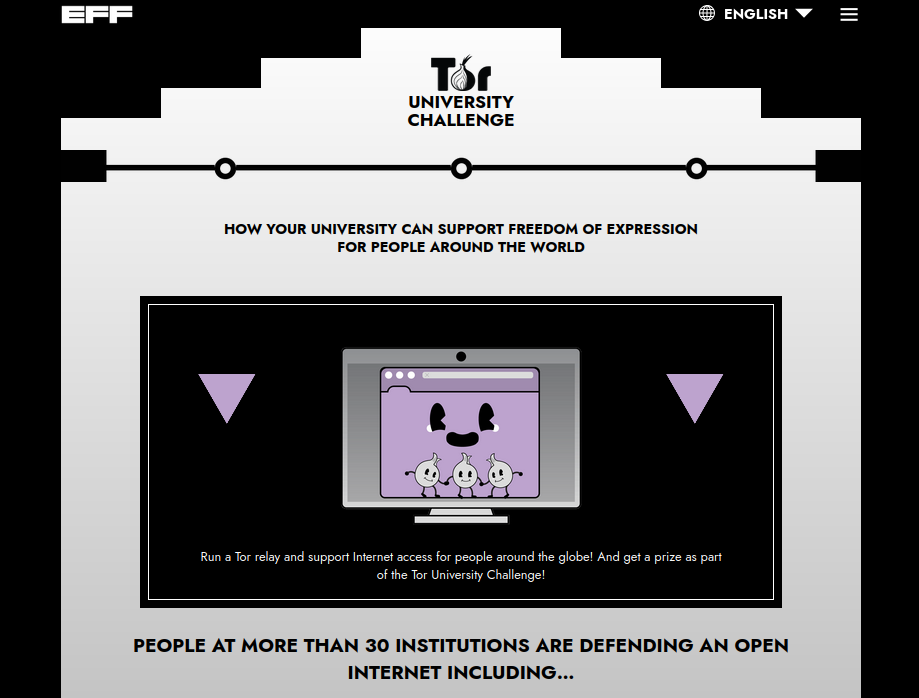
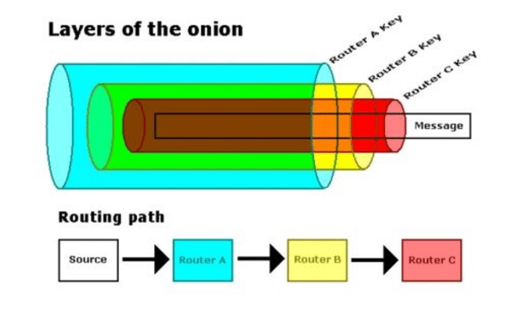
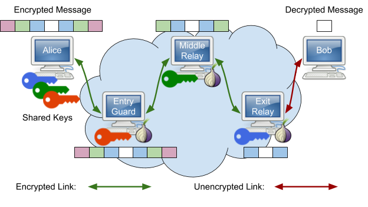
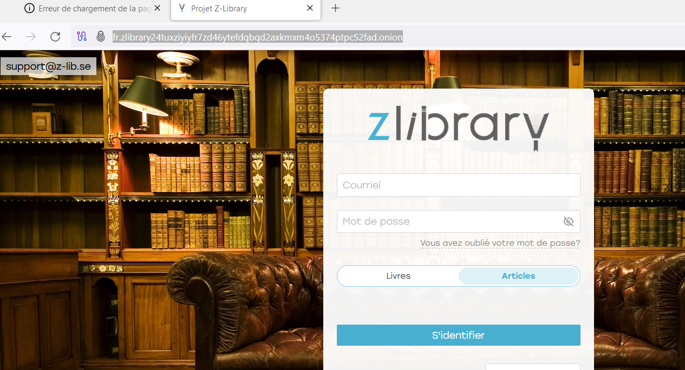
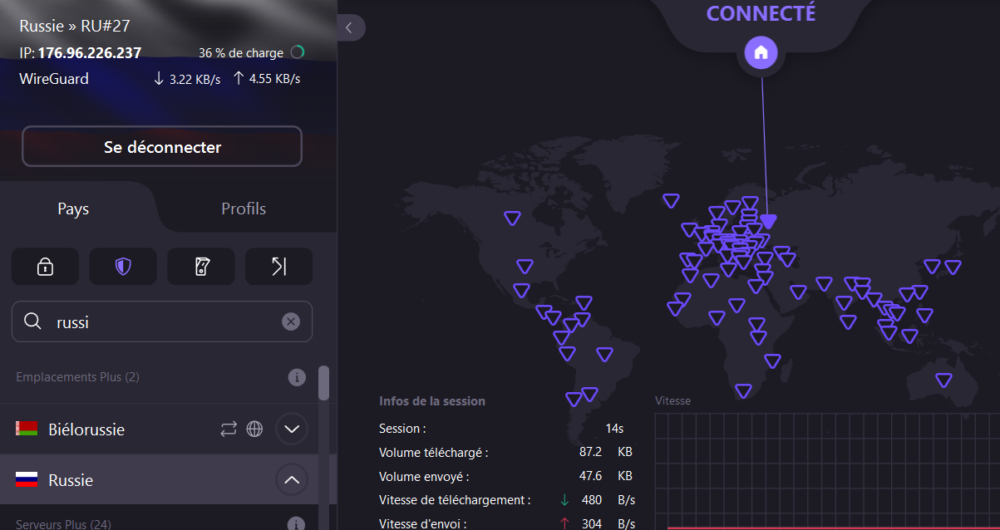
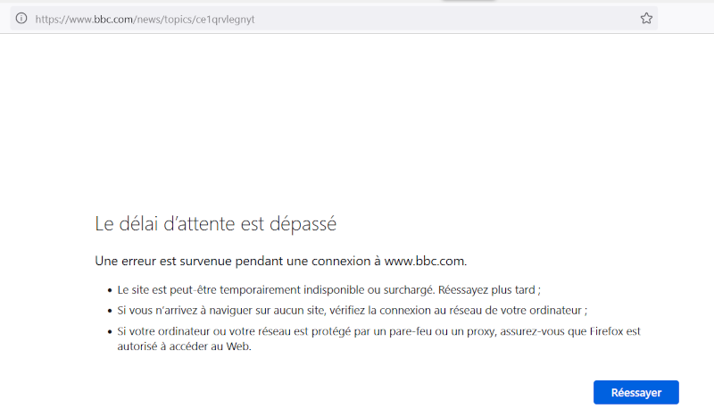
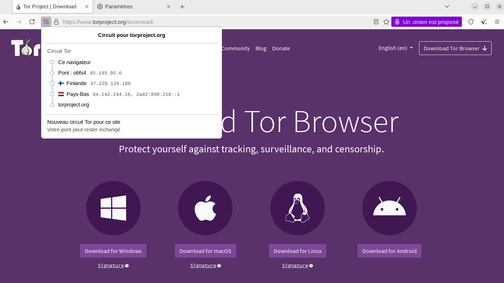
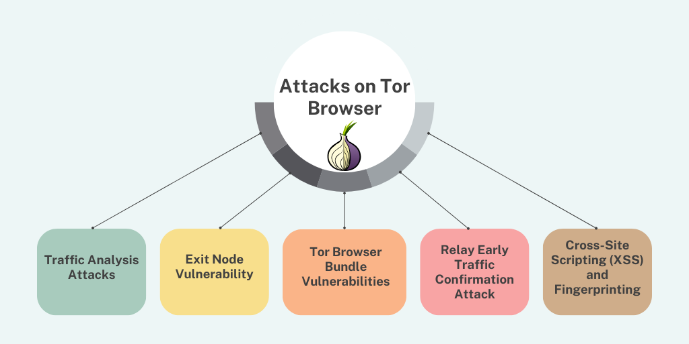

# Utiliser Tor : pourquoi, comment ?

## Stretching Numérique
### mars 2025
##### Damien Belvèze

---

## cliquer sur la touche **S** pour afficher les notes

---
Pourquoi cet atelier ?

[IFLA Statement on Privacy (2015)](https://www.ifla.org/publications/ifla-statement-on-privacy-in-the-library-environment/)

>*Data protection and privacy protection should be included as a part of the media and information literacy training for library and information service users. This should include training on tools to use to protect their privacy*

---

[article L32-3-3 du Code des Postes et Communication Électroniques](https://www.legifrance.gouv.fr/affichCodeArticle.do?idArticle=LEGIARTI000006465735&cidTexte=LEGITEXT000006070987)

note: 
Tor est un réseau parfaitement légal en France qui repose sur des serveurs dont certains sont mis à disposition bénévolement par des individus, d'autres (noeuds de sortie) sont gérés par des associations, responsables par rapport aux autorités

---

https://toruniversity.eff.org/

note: 
Universités FR frileuses à laisser des relais Tor s'installer sur leur réseau. Manque de personnels RSSI et autres pour superviser ; par défaut on empêche ces relais de fonctionner. Problématique pour les formations de journalisme (OnionShare)
Autorisation du RSSI de l'Univ Rennes pour Tor, pas pour OnionShare

Assez rare, en revanche, qu'une fac bloque sur son réseau le trafic provenant de tor, mais c'est arrivé par inadvertance (blacklist importée d'une société privée). 

---

note:
Les routeurs transmettent les paquets sans qu'il soit possible de remonter le fil de cette transmission, car les échanges entre chacun est chiffré ; ces routeurs constituent les différentes couches de l'oignon

---

note: 
Alice envoie à travers le navigateur Tor une requête vers un serveur tenu par Bob, sa requête passe par trois couche typographiques : 
- celle du noeud d'entrée
- celle du noeud intermédiaire
- celle du noeud de sortie
Seule l'IP du noeud de sortie est publique (Bob qui tient le serveur peut remonter à cette IP mais pas au-delà et pas au premier routeur utilisé par Alice)

---
Cas 1: Et si Z-library était demain censuré par nos FAI ?
http://fr.zlibrary24tuxziyiyfr7zd46ytefdqbqd2axkmxm4o5374ptpc52fad.onion/

---
Cas 2: Je vis en Russie, comment accéder au site Tor, bloqué depuis novembre 2024

---
TorProject inaccessible en Russie

note: 
La présentation a été faite à l'aide d'un VPN (ProtonVPN)
Le pont utilisé est obsf
un pont est nécessaire pour se connecter depuis un pays qui censure Tor sur son réseau. 

---
<grid drop="left">

getbridge@torproject.org

</grid>

<grid drop="right">
un pont est un relais d'entrée qui n'est pas présent dans les annuaires publics de relais
</grid>

---

note: 
Le site Tor Project était inaccessible en Russie entre décembre 2024 et mars 2025 ; la démonstration a pu être réalisée sur ce site à partir d'un VPN commercial.  

---
Mais comment télécharger Tor si le site est bloqué ?

### gettor@torproject.org 

1. envoi d'un mail à gettor
2. réception d'un mail de gettor@torproject.org 
3. renvoi du mail avec dans le corps la distribution (par ex. Linux ou Windows)
4. réception d'un mail avec des liens de téléchargements, une signature et une méthode pour vérifier la signature

---
# Limites de Tor

---
- noeuds de sortie compromis (man-in-the-middle)
- son employeur peut voir qu'Alice utilise Tor
- analyse du trafic (rythme des paquets) en amont et en aval (flux temporel)
---
# références

1. Collectif. Chapitre 39 Naviguer Sur Le Web Avec Tor | Guide d’autodéfense Numérique.
2. Döpmann, C., Marx, M., Federrath, H. & Tschorsch, F. Operating Tor Relays at Universities: Experiences and Considerations. Preprint at http://arxiv.org/abs/2106.04277 (2021).

$\newline$

