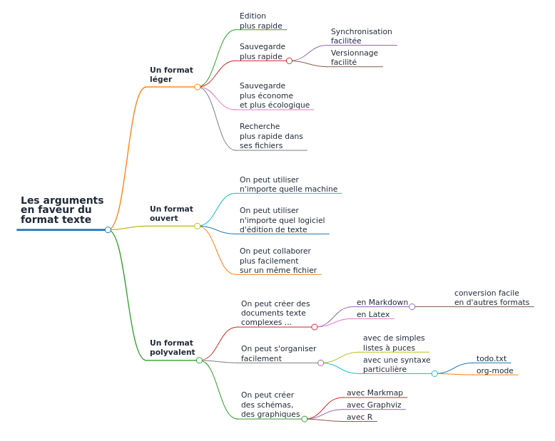

# La promotion du texte simple

un aspect négligé parce que [non rentable](https://www.arthurperret.fr/veille/2022-02-09-de-l-importance-de-vendre-le-format-texte.html)

>Mais alors, s’il est si utile, pourquoi est-ce qu’il est si peu connu ? Eh bien le problème, c’est qu’il est difficile de faire de l’argent avec. Le format texte fait partie de ces choses en informatique qui sont à la fois simples, efficaces et peu coûteuses. Or c’est précisément parce que ça ne coûte rien de l’utiliser que peu de gens sont susceptibles d’investir du temps et des moyens pour le « vendre »




applications : 

[[cartes mentales]] : markdown + mindmap = [markmap](https://markmap.js.org/) , voir par exemple ce [modèle](https://gist.github.com/eyssette/11cfb40e0a9a52804c6c5528121ada25)

texte > [[quiz]] = text2quiz

# Utiliser le texte simple quand ses collègues utilisent des traitements de texte

Voir le[billet du 25 octobre 2022](https://www.arthurperret.fr/blog/2022-10-25-markdown-traitement-de-texte-methode-pour-collaborer.html)d'[[Arthur Perret]]


# Pourquoi quitter les traitements de texte ?

incongruité des formats [[Microsoft Word]] qui additionnent des couches de code sous un fichier minimal (par exemple : "hello world")
Démonstration : 

créer un document docx avec "Hello World" (hello_world.docx)
zipper le document 
supprimer l'extension .zip (on obtient un dossier avec des fichiers et des sous-dossiers)
ouvrir le premier dossier, mettre tout en surbrillance
clic-droit ouvrir avec VScode

[méthode ici](https://superuser.com/questions/539919/view-source-equivalent-for-word-documents)

ou bien taper la commande suivante dans le terminal : 

```shell
find hello_world -type f | xargs -I {} code --new-window "{}"
```
possibilité de changer deux fois l'extension du fichier hello_world.docx : > hello_world.rar > hello_world

voir plus d'information sur le caractère délirant de ce type de formatage voir iA : [[@anonymeMarkdownSlowFade2025]]


# bibliographie

https://amethis.doctorat-bretagneloire.fr/amethis-client/formation/gestion/formation/2873